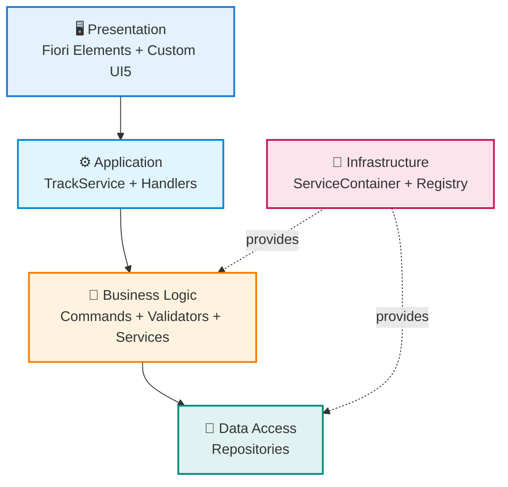
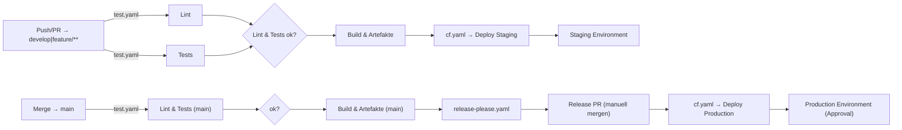

# 🕐 CAP Fiori Time Tracking

> **Eine Enterprise-Grade Zeiterfassungsanwendung mit SAP CAP, TypeScript und Fiori UI5**</br>
> Showcase für Clean Architecture, Design Patterns und Best Practices – von Entwickler für Entwickler dokumentiert! 🚀


[](https://www.typescriptlang.org/)
[](https://cap.cloud.sap)
[](https://ui5.sap.com)


---

## ✨ Highlights

- 🎯 **100% TypeScript** - Typsicheres Backend ohne ein einziges JavaScript-File
- 🏗️ **Clean Architecture** - 5-Tier-Architektur mit 10 Design Patterns (Command, Repository, Factory, Strategy, ...)
- 🎨 **Multi-App UI Strategy** - Fiori Elements Timetable, Custom Dashboard & Manage Activity Types Maintenance App
- 🧭 **SAP CAP Console** - Native Desktop-App für lokales Dev, BTP Deployment & Monitoring aus einer Oberfläche
- 🔧 **Production-Ready** - Validierung, Error Handling, strukturiertes Logging + Application Logging Service, Malware-Scanning
- 🔐 **IAS & AMS Ready** - `xs-security.json`, AMS-Policies & DCL-Deployments für Work Zone / AFS auf SAP BTP
- ☁️ **Cloud-native Deployment** - `mta.yaml` für SAP BTP (HANA, Attachments, Logging) + 12-Factor-konformes Packaging
- 📚 **Vollständig dokumentiert** - arc42-Architektur, ADRs, Inline-JSDoc
- 🧪 **Testbar** - Jest Tests + REST Client für manuelle Tests
- 📘 **API Discovery** - Swagger UI Preview für TrackService während der Entwicklung

### Screenshot

_Kurzes GIF zeigt List Report und Object Page, während ein TimeEntry live aktualisiert wird._


---

## 🚀 Quick Start

```bash
# 1. Clone & Install
git clone https://github.com/nimble-123/cap-fiori-timetracking.git
cd cap-fiori-timetracking
npm install

# 2. Start Development Server
npm run watch
```

**🌐 Browser öffnet automatisch:** `http://localhost:4004`</br>
**🔐 Login:** `max.mustermann@test.de` / Passwort: `max`</br>
**🧭 Swagger UI (Dev):** `http://localhost:4004/$api-docs/odata/v4/track/`

👉 **Ausführliche Installation:** Siehe [GETTING_STARTED.md](GETTING_STARTED.md)

---

## 🏗️ Architektur-Übersicht

**5-Tier Clean Architecture** mit klarer Separation of Concerns:



**🎯 44 Pattern-Klassen** organisiert in 6 Kategorien:

- **Commands** (11) - Business Operations (CRUD, Generation, Balance)
- **Validators** (7) - Fachliche Validierung
- **Services** (7) - Domain Logic (TimeCalc, User, Holiday, Balance)
- **Repositories** (7) - Data Access Layer
- **Strategies** (2) - Generation Algorithms (Monthly, Yearly)
- **Factories** (2) - Object Creation (TimeEntry, Handler)

**+ 1 ServiceContainer (DI), 1 HandlerRegistry, 1 HandlerRegistrar, 1 Builder**
**+ 1 DateUtil, 1 Logger, 14 Barrel Exports**

📖 **Deep Dive:** [ARCHITECTURE.md](docs/ARCHITECTURE.md) (vollständige arc42-Dokumentation)

---

## 🧩 Key Features

- 🕐 **Zeiterfassung** - CRUD für TimeEntries mit automatischer Berechnung (Brutto/Netto/Über-/Unterstunden)
- 📅 **Bulk-Generation** - Monatlich oder Jährlich inkl. Feiertage (API-Integration für 16 Bundesländer)
- 💰 **Balance-Tracking** - Monatssaldi, kumulierter Gesamtsaldo, Criticality-Indikatoren
- 🧰 **Customizing Singleton** - Pflege aller globalen Defaults (Arbeitszeiten, EntryTypes, Schwellenwerte, Integrations-URLs)
- 📎 **Dokumentenanhänge** - Upload & Download via SAP CAP Attachments Plugin (`@cap-js/attachments`) inkl. Fiori Attachment Facet
- 🔐 **Business Rules** - Validierung, Eindeutigkeit (1 Entry/User/Tag), Change Detection
- 🎨 **Multi-App UI** - Timetable & Manage Activity Types (Fiori Elements) plus Custom UI5 Dashboard
- 🏗️ **10 Design Patterns** - Command, Repository, Factory, Strategy, Validator, Handler, Registry, Registrar, Builder, ServiceContainer (DI)

📖 **Details:** [ARCHITECTURE.md](docs/ARCHITECTURE.md) - Komplette Bausteinsicht, Laufzeitsicht, Qualitätsszenarien

---

## 📂 Project Structure

<details>
<summary>Modulare 5-Tier-Architektur mit klarer Trennung der Verantwortlichkeiten:</summary>

```
cap-fiori-timetracking/
│
├── 📱 app/                                # Frontend Applications (TypeScript UI5)
│   │
│   ├── timetable/                         # Fiori Elements List Report App
│   │   ├── webapp/
│   │   │   ├── Component.ts               # UI5 Component (TypeScript)
│   │   │   ├── manifest.json              # App Descriptor
│   │   │   └── i18n/                      # Internationalization
│   │   └── annotations.cds                # UI Annotations
│   │
│   ├── manage-activity-types/             # Fiori Elements Basic App für Stammdatenpflege
│   │   └── webapp/                        # UI5 Application (TypeScript, Basic V4)
│   │
│   └── timetracking/                      # Custom UI5 Dashboard App
│       ├── webapp/
│       │   ├── controller/                # MVC Controller (TypeScript)
│       │   ├── view/                      # XML Views
│       │   ├── model/                     # Client Models
│       │   └── Component.ts
│       └── annotations.cds
│
├── 💾 db/                                 # Data Model & Master Data
│   │
│   ├── data-model.cds                     # Core Domain Model
│   │   ├── Users, Projects, TimeEntries
│   │   └── ActivityTypes, EntryTypes, Region (CodeLists)
│   └── data/                              # CSV Test & Master Data
│
├── ⚙️ srv/                                # Backend Service Layer (100% TypeScript!)
│   │
│   ├── service-model.cds                  # Top-Level Service Model
│   ├── index.ts                           # Top-Level Barrel Export
│   │
│   └── track-service/                     # TrackService - Complete Service Module
│       │
│       ├── track-service.cds              # OData Service Definition
│       ├── track-service.ts               # 🎬 Orchestrator
│       ├── index.cds                      # Service Entry Point
│       ├── index.ts                       # Service Entry Point
│       │
│       ├── annotations/                   # 📝 UI Annotations
│       │   │
│       │   ├── annotations.cds            # Main Annotations File
│       │   │
│       │   ├── common/                    # Common Annotations
│       │   │   ├── authorization.cds
│       │   │   ├── capabilities.cds
│       │   │   ├── field-controls.cds
│       │   │   ├── labels.cds
│       │   │   └── value-helps.cds
│       │   │
│       │   └── ui/                        # UI-spezifisch pro Entity
│       │       ├── activities-ui.cds
│       │       ├── balance-ui.cds
│       │       ├── projects-ui.cds
│       │       ├── timeentries-ui.cds
│       │       ├── users-ui.cds
│       │       └── customizing-ui.cds
│       │
│       └── handler/                       # 🔧 Business Logic & Infrastructure
│           │
│           ├── index.ts                   # Handler Entry Point
│           │
│           ├── container/                 # 🏗️ Dependency Injection
│           │   ├── ServiceContainer.ts    # DI Container
│           │   │   - 6 Kategorien: Repos, Services, Validators, Strategies, Commands, Factories
│           │   │   - Type-safe Resolution mit Generics
│           │   │   - Auto-Wiring aller Dependencies
│           │   └── index.ts               # Barrel Export
│           │
│           ├── registry/                  # 📋 Event Handler Registry
│           │   ├── HandlerRegistry.ts     # Handler-Registrierung
│           │   │   - Unterstützt: before, on, after
│           │   │   - Fluent API & Logging
│           │   ├── HandlerRegistrar.ts    # Handler-Registrierung
│           │   └── index.ts               # Barrel Export
│           │
│           ├── setup/                     # 🏗️ Setup & Initialization
│           │   ├── HandlerSetup.ts        # Builder Pattern für Handler Setup
│           │   └── index.ts               # Barrel Export
│           │
│           ├── handlers/                  # 🎯 Event Handler (Separation of Concerns)
│           │   ├── TimeEntryHandlers.ts   # CRUD
│           │   ├── GenerationHandlers.ts  # Bulk-Generierung
│           │   ├── BalanceHandlers.ts     # Balance-Abfragen
│           │   └── index.ts               # Barrel Export
│           │
│           ├── commands/                  # 🎯 Command Pattern
│           │   ├── balance/               # Balance Commands
│           │   │   ├── GetMonthlyBalanceCommand.ts
│           │   │   ├── GetCurrentBalanceCommand.ts
│           │   │   ├── GetRecentBalancesCommand.ts
│           │   │   ├── GetVacationBalanceCommand.ts
│           │   │   └── GetSickLeaveBalanceCommand.ts
│           │   ├── generation/            # Generation Commands
│           │   │   ├── GenerateMonthlyCommand.ts
│           │   │   ├── GenerateYearlyCommand.ts
│           │   │   └── GetDefaultParamsCommand.ts
│           │   ├── time-entry/            # TimeEntry Commands
│           │   │   ├── CreateTimeEntryCommand.ts
│           │   │   ├── UpdateTimeEntryCommand.ts
│           │   │   └── RecalculateTimeEntryCommand.ts
│           │   └── index.ts               # Barrel Export
│           │
│           ├── services/                  # 💼 Domain Services
│           ├── repositories/              # 💾 Data Access Layer
│           ├── validators/                # ✅ Business Validation
│           ├── strategies/                # 📋 Generation Algorithms
│           ├── factories/                 # 🏭 Object Creation
│           └── utils/                     # 🛠️ Utilities (DateUtils, Logger)
│
├── mta.yaml                               # ☁️ Multi-Target Application Descriptor (SAP BTP)
├── @cds-models/                           # 🎯 Auto-generierte TypeScript Types
├── docs/                                  # 📚 Dokumentation
│   ├── ARCHITECTURE.md                    # arc42 Architektur
│   └── ADR/                               # Architecture Decision Records
├── test/                                  # 🧪 Tests
└── package.json, tsconfig.json, etc.
```

</details>
</br>

**📖 Detaillierte Struktur & Diagramme:** Siehe [ARCHITECTURE.md - Kapitel 5](docs/ARCHITECTURE.md#5-bausteinsicht)

---

## 📚 Dokumentation

### 📖 Für Einsteiger

| Dokument                                     | Inhalt                                     | Wann lesen?           |
| -------------------------------------------- | ------------------------------------------ | --------------------- |
| **[GETTING_STARTED.md](GETTING_STARTED.md)** | Installation, Quick Start, Troubleshooting | ⭐ **Start hier!**    |
| **[README.md](README.md)** (diese Datei)     | Executive Summary, Highlights, Navigation  | Überblick verschaffen |

### 🏗️ Für Architekten & Entwickler

| Dokument                                    | Inhalt                                     | Wann lesen?                            |
| ------------------------------------------- | ------------------------------------------ | -------------------------------------- |
| **[ARCHITECTURE.md](docs/ARCHITECTURE.md)** | arc42-Dokumentation (12 Kapitel)           | Deep Dive in Architektur               |
| **[ADR-Verzeichnis](docs/ADR/)**            | 12 Architecture Decision Records           | Warum wurden Entscheidungen getroffen? |
| **[CONTRIBUTING.md](CONTRIBUTING.md)**      | Code Style, Commit Conventions, PR-Process | Bevor du Code beiträgst                |

### 🤖 AI-Unterstützung & Prompts

- **Prompt-Katalog:** `.github/prompts/` – YAML-Prompts nach [GitHub Models Guideline](https://docs.github.com/en/github-models/use-github-models/storing-prompts-in-github-repositories).
- **Rollenspezifische Einstiegspunkte:**
  - Product Owner: `product-owner-feature-brief`, `product-owner-story-outline`
  - Reviewer & QA: `review-coach`, `test-strategy-designer`
  - Architektur & Wissensaufbau: `architecture-deep-dive`, `adr-drafting-assistant`
  - Betrieb & Support: `bug-triage-investigator`, `release-notes-curator`
- **MCP-Server:** In `.vscode/mcp.json` vorkonfiguriert – `cds-mcp` (CAP Docs), `@sap-ux/fiori-mcp-server` (Fiori UX Guidance), `@ui5/mcp-server` (UI5 SDK). Installiere `cds-mcp` global (`npm install -g @cap-js/mcp-server`), die anderen starten via `npx`.
- **Workflow-Tipps:** Siehe [GETTING_STARTED.md](GETTING_STARTED.md#-ai-prompts--llm-workflows) für Beispiele, wie die Prompts in Discovery, Delivery und Review eingesetzt werden.

### 🎯 arc42-Kapitel Schnellzugriff

| Kapitel     | Inhalt                                              | Link                                                               |
| ----------- | --------------------------------------------------- | ------------------------------------------------------------------ |
| **Kap. 1**  | Aufgabenstellung, Qualitätsziele, Stakeholder       | [Einführung](docs/ARCHITECTURE.md#1-einführung-und-ziele)          |
| **Kap. 2**  | Technische Randbedingungen, Konventionen            | [Randbedingungen](docs/ARCHITECTURE.md#2-randbedingungen)          |
| **Kap. 3**  | Fachlicher/Technischer Kontext (C4-Diagramme)       | [Kontext](docs/ARCHITECTURE.md#3-kontextabgrenzung)                |
| **Kap. 4**  | Lösungsstrategie, Architektur-Treiber               | [Lösungsstrategie](docs/ARCHITECTURE.md#4-lösungsstrategie)        |
| **Kap. 5**  | Bausteinsicht (5 Ebenen, 10 Patterns)               | [Bausteinsicht](docs/ARCHITECTURE.md#5-bausteinsicht)              |
| **Kap. 6**  | Laufzeitsicht (Sequence-Diagramme)                  | [Laufzeitsicht](docs/ARCHITECTURE.md#6-laufzeitsicht)              |
| **Kap. 7**  | Verteilungssicht (Dev/Cloud/Docker)                 | [Verteilung](docs/ARCHITECTURE.md#7-verteilungssicht)              |
| **Kap. 8**  | Querschnittliche Konzepte (DI, Validation, Logging) | [Querschnitte](docs/ARCHITECTURE.md#8-querschnittliche-konzepte)   |
| **Kap. 9**  | Entscheidungen (ADR-Übersicht)                      | [Entscheidungen](docs/ARCHITECTURE.md#9-architekturentscheidungen) |
| **Kap. 10** | Qualitätsszenarien mit Metriken                     | [Qualität](docs/ARCHITECTURE.md#10-qualitätsanforderungen)         |
| **Kap. 11** | Risiken & Technische Schulden                       | [Risiken](docs/ARCHITECTURE.md#11-risiken-und-technische-schulden) |
| **Kap. 12** | Glossar (40+ Begriffe)                              | [Glossar](docs/ARCHITECTURE.md#12-glossar)                         |

---

## 🛠️ Development Scripts

| Befehl                         | Zweck                                              | Wann verwenden?                         |
| ------------------------------ | -------------------------------------------------- | --------------------------------------- |
| `npm run watch`                | Dev-Server mit Auto-Reload                         | ⭐ **Hauptbefehl für Development**      |
| `npm run build`                | TypeScript kompilieren                             | Vor Commit (prüft Syntax)               |
| `npm run format`               | Prettier Formatierung                              | **Vor jedem Commit (Pflicht!)**         |
| `npm run generate-entry-point` | Service Entry Points für Dev Tools (dev-cap-tools) | Nach neuen Services/Commands (optional) |
| `npm test`                     | Jest Tests ausführen                               | Nach Code-Änderungen                    |

📖 **Vollständiger Workflow:** Siehe [GETTING_STARTED.md](GETTING_STARTED.md#-wichtige-npm-scripts)

---

## 🧭 SAP CAP Console

- **Installation:** Lade die native Desktop-App (Windows/macOS) über [SAP Tools](https://tools.hana.ondemand.com/#cloud-capconsole) herunter.
- **Projekt-Erkennung:** Die Konsole scannt laufende CAP-Projekte (JavaScript & Java) und listet sie automatisch; Projekte lassen sich „merken“ oder manuell über „Add Project“ einbinden.
- **Monitoring & Insights:** Visualisiert Module aus der `mta.yaml`, zeigt Status/CPU/RAM, Live-Logs und bietet Log-Level-Switching, sofern das Projekt das CAP-Console-Plugin (`@cap-js/console`) enthält – bei uns bereits installiert.
- **Deployments:** Geführter Dialog für SAP BTP Cloud Foundry (Entitlements prüfen, Services anlegen, In-App- oder CLI-Deploy). Standardverbindungen können hinterlegt werden.
- **Environments & Security:** Environment-Profile (.cds/\*.yaml, siehe `.cds/trial.yaml.example`) ermöglichen schnellen Wechsel zwischen lokal, Dev und Prod; SSH-Tunnel für Plugin-Zugriff lassen sich pro App steuern – Security-Hinweise beachten.
- **Limitierungen:** Aktuell kein Support für µ-Services, MTX oder Kyma; fokus auf CAP auf BTP Cloud Foundry.

Die Konsole ergänzt unsere lokalen Tools (REST Client, Swagger UI) und wird in Onboarding-Sessions für Troubleshooting und First Deployments empfohlen.

---

## 🔁 Inner Loop Development

1. **Watch & Hot Reload**
   `npm run watch` setzt auf `cds watch`/`cds-tsx` und nutzt CAPs Entwicklungsprofil mit lokalen Mock-Services (SQLite, Mock Auth). Damit bleibt die Schleife auch offline („airplane mode“) schnell.
2. **CAP Console & REST Client**
   Die CAP Console (s.o.) liefert Monitoring, Deploy-Wizard und Log-Level Switching. REST Client Files in `tests/` und Swagger UI (`/$api-docs/…`) ergänzen manuelle Checks.
3. **Typsicherheit & Linting**
   `@cap-js/cds-typer` aktualisiert Typen automatisch bei `.cds`-Änderungen. `npm run build` + ESLint/Prettier (`npx eslint …`, `npx prettier --check …`) sichern Stil & Regeln. `npm run generate-entry-point` liefert bei Bedarf aktualisierte Entry Points für Tooling.
4. **Tests & Coverage**
   `npm test` bzw. `npm run test:watch` decken Jest-Suites ab; Coverage liegt unter `coverage/`. Neue Businesslogik → neue Tests in `tests/`.
5. **Optional Rapid UI Feedback**
   UI5 Tooling (`npm run watch -- --open`) oder Live-Logs in der CAP Console unterstützen schnelles UI-Tuning, bevor es in den äußeren Loop (PR/CI) geht.

> Ziel: Schleife „Ändern → Beobachten → Validieren“ in wenigen Minuten halten, bevor Features in den äußeren Loop (PR, CI, Deployment) gehen.

---

## ⚙️ Automatisierung & DevOps

- **CI/CD Tests & Build** (`.github/workflows/test.yaml`): Läuft auf Push/PR für `develop`, `main` und `feature/**`; Lint & Unit Tests werden getrennt (fail-fast) ausgeführt. Erst wenn beide Jobs erfolgreich sind, erstellt der Build-Job (`cds-typer`, `npm run build`) Artefakte (`gen/`, `@cds-models/`) und Coverage/JUnit-Reports.
- **Release Automation** (`.github/workflows/release-please.yaml`): Reagiert über `workflow_run` auf erfolgreiche `main`-Builds. Sie aktualisiert/erstellt den Release-PR, aber setzt Tags und GitHub Releases erst nach dem Merge dieses PRs (vgl. [ADR-0017](docs/ADR/0017-release-automation-mit-release-please.md)).
- **Cloud Foundry Deploy** (`.github/workflows/cf.yaml` + Composite Action `cf-setup`): Automatischer Staging-Rollout nach erfolgreichem `develop`-Build, Production-Deployment nach erfolgreicher Release-Automation (oder via Dispatch). Beide Jobs hängen an GitHub-Environments (`Staging`, `Production`) – Production wartet auf die manuelle Freigabe der Reviewer und nutzt dieselben cf/mbt-Toolchains wie lokal.



> Lokale Voraussetzung für Deployments: `cf` CLI ≥8 mit MultiApps-Plugin (`cf install-plugin multiapps`) und `mbt` CLI (`npm install -g mbt`). Die GitHub-Action installiert diese Tools automatisch, lokal müssen sie manuell eingerichtet werden.

---

## 🌐 CAP Plugins & Calesi Pattern

- **Calesi („CAP-level Service Integrations“)** steht für das stetig wachsende CAP-Plugin-Ökosystem (GraphQL, OData V2, WebSockets, OpenTelemetry, Attachments, Messaging, Notifications, Audit Logging, …).
- Durch CAPs offene Architektur nutzen wir Plugins wie `@cap-js/attachments` oder `@cap-js/console` ohne Vendor-Lock-in und erweitern das System modular.
- Eigene Erweiterungen folgen dem gleichen Muster (`cds add …`, registrieren im ServiceContainer) und können bei Bedarf als Reuse-Pakete geteilt werden.
- Siehe [CAP Plugins](https://cap.cloud.sap/docs/plugins/) und [ADR-0018](docs/ADR/0018-mta-deployment-cloud-foundry.md) für den Umgang mit Infrastruktur-Add-ons.

---

## ☁️ Cloud Deployment (SAP BTP)

- `mta.yaml` bündelt CAP Service (`gen/srv`), HANA-DB-Deployer (`gen/db`), das UI Content Module (`cap-fiori-timetracking-app-deployer`) und bindet Attachments-, Malware-Scanning-, Connectivity-, Destination-, Application-Logging- sowie den Application-Frontend-Service für das Hosting der Fiori Apps.
- Vor dem Deploy die benötigten Instanzen anlegen (einmalig pro Subaccount):

  ```bash
  cf create-service hana hdi-shared cap-fiori-timetracking-db
  cf create-service objectstore standard cap-fiori-timetracking-attachments
  cf create-service malwarescanning standard cap-fiori-timetracking-malware-scanner
  cf create-service application-logs standard cap-fiori-timetracking-logging
  cf create-service connectivity lite cap-fiori-timetracking-connectivity
  cf create-service destination lite cap-fiori-timetracking-destination
  cf create-service app-front developer cap-fiori-timetracking-app-front
  ```

- Der Application Frontend Service liefert einen Managed App Router inklusive statischem Hosting für die Fiori Apps; die Destinations aus `cap-fiori-timetracking-app-deployer` werden dort automatisch hinterlegt.
- Build & Deploy via Cloud MTA Build Tool (benötigt `cf` CLI + MultiApps Plugin, `mbt` CLI sowie ein JDK ≥17 für das `@sap/ams-dev` Build-Plugin – lokal z. B. Temurin 17):

  ```bash
  npm ci
  npm run clean        # optional, entfernt alte Artefakte
  npm run build:mta
  npm run deploy:cf
  ```

- Das CAP Runtime Binding auf `application-logging`, `malware-scanner`, `connectivity` und `destination` ist in `package.json → cds.requires` hinterlegt; lokale Entwicklung nutzt Mock-Auth, in BTP greifen die Service-Bindings automatisch. `connectivity` + `destination` stellen die 3rd-Party Holiday API via Destination zur Verfügung. Der Build-/Run-Split erfüllt zentrale 12-Factor-Prinzipien und qualifiziert die Lösung als cloud-native Application.

---

## 🤝 Contributing

Willst du zum Projekt beitragen? **Awesome!** 🎉

### Schnell-Guide

1. **Fork & Clone** das Repository
2. **Branch erstellen**: `git checkout develop && git checkout -b feature/my-feature`
3. **Code schreiben** (siehe [CONTRIBUTING.md](CONTRIBUTING.md) für Style Guidelines)
4. **Tests + Format**: `npm test && npm run format`
5. **Commit**: `git commit -m "feat: add awesome feature"` ([Conventional Commits](https://www.conventionalcommits.org/))
6. **Push & PR**: `git push origin feature/my-feature` → Pull Request gegen `develop`

### Wichtige Regeln

- ✅ TypeScript ohne `any`-Types
- ✅ Design Patterns befolgen (Command, Repository, Factory, ...)
- ✅ JSDoc für alle public APIs
- ✅ Prettier vor Commit (`npm run format`)
- ✅ Conventional Commits (`feat:`, `fix:`, `docs:`, ...)

📖 **Vollständige Guidelines:** Siehe [CONTRIBUTING.md](CONTRIBUTING.md)

---

## 📦 Release-Prozess

- Automatisierte Release-PRs entstehen über [release-please](https://github.com/googleapis/release-please-action) auf Basis unserer Conventional Commits.
- Die Konfiguration (`release-please-config.json`, `.release-please-manifest.json`) hält Root- und UI5-App-Versionen (`app/timetable`, `app/timetracking`, `app/manage-activity-types`) sowie `mta.yaml` über `extra-files` synchron.
- Solange der Release-PR offen ist, bleibt das Release unveröffentlicht. Erst der Merge nach `main` erzeugt Tag & Changelog; eine npm-Publikation ist nicht vorgesehen.
- Vor der ersten Ausführung im CI empfiehlt sich ein lokaler Dry-Run:
  ```bash
  npx release-please release-pr --config-file release-please-config.json --manifest-file .release-please-manifest.json --dry-run
  ```
- Visualer Ablauf (vereinfacht):
  ```mermaid
  gitGraph
    commit id: "main"
    branch develop
    checkout develop
    commit id: "feat: holiday API cache"
    commit id: "test: cover holiday cache"
    branch feature/holiday-sync
    checkout feature/holiday-sync
    commit id: "feat: adjust UI"
    checkout develop
    merge feature/holiday-sync
    commit id: "refactor: cleanup"
    checkout main
    merge develop
    branch release-please/main
    checkout release-please/main
    commit id: "chore: release v1.1.0"
    checkout main
    merge release-please/main tag: "v1.1.0"
    commit id: "ci: deploy production"
  ```

---

## 📊 Projekt-Stats

**45 Pattern-Klassen + 14 Barrel Exports:**

- 11 Commands (CRUD, Generation, Balance)
- 7 Validators (Domain-spezifisch)
- 7 Repositories (Data Access)
- 7 Services (Domain Logic + Customizing)
- 2 Strategies (Algorithms)
- 2 Factories (TimeEntry + Handler)
- 1 ServiceContainer (DI mit 6 Kategorien)
- 1 HandlerRegistry (Event-Driven)
- 1 HandlerRegistrar
- 1 HandlerSetup (Builder mit Fluent API)
- 3 Handler-Klassen
- 1 Logger
- 1 DateUtils

---

## 🌐 Links & Ressourcen

### Interne Dokumentation

- 📖 [ARCHITECTURE.md](docs/ARCHITECTURE.md) - Vollständige arc42-Dokumentation
- 🚀 [GETTING_STARTED.md](GETTING_STARTED.md) - Installation & Quick Start
- 🤝 [CONTRIBUTING.md](CONTRIBUTING.md) - Contribution Guidelines
- 📋 [ADR-Verzeichnis](docs/ADR/) - Architecture Decision Records

### Externe Ressourcen

- **SAP CAP**: [cap.cloud.sap](https://cap.cloud.sap) - Official CAP Documentation
- **SAPUI5**: [ui5.sap.com](https://ui5.sap.com) - UI5 SDK & Samples
- **TypeScript**: [typescriptlang.org](https://www.typescriptlang.org) - TypeScript Handbook
- **Fiori Guidelines**: [experience.sap.com/fiori-design](https://experience.sap.com/fiori-design) - Design Principles
- **Feiertage-API**: [feiertage-api.de](https://feiertage-api.de) - German Public Holidays

---

## 📜 License

[**MIT License**](./LICENSE) - Do whatever you want with this code! 🚀

---

## 🙏 Acknowledgments

- **SAP CAP Team** - Für das großartige Framework
- **UI5 Team** - Für Fiori Elements & UI5
- **TypeScript Team** - Für typsichere Entwicklung
- **Open Source Community** - Für Inspiration & Best Practices

---

**Happy Coding!** 🚀

_Built with ❤️ and TypeScript in 2025_

```

```
