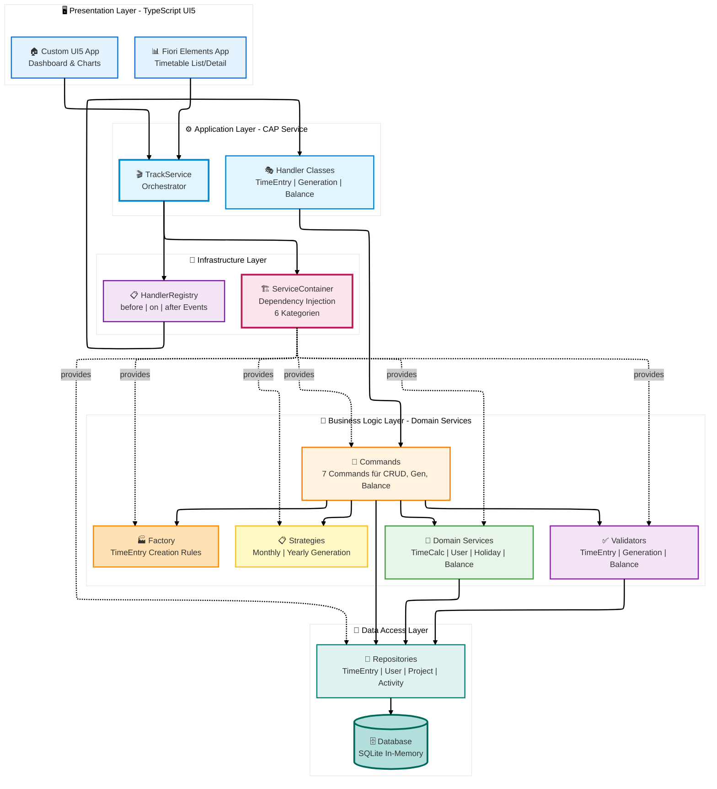
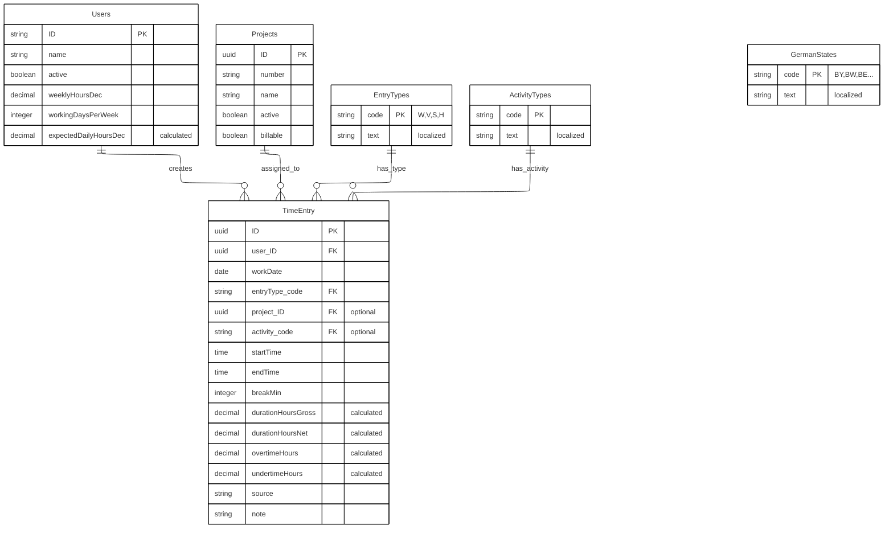
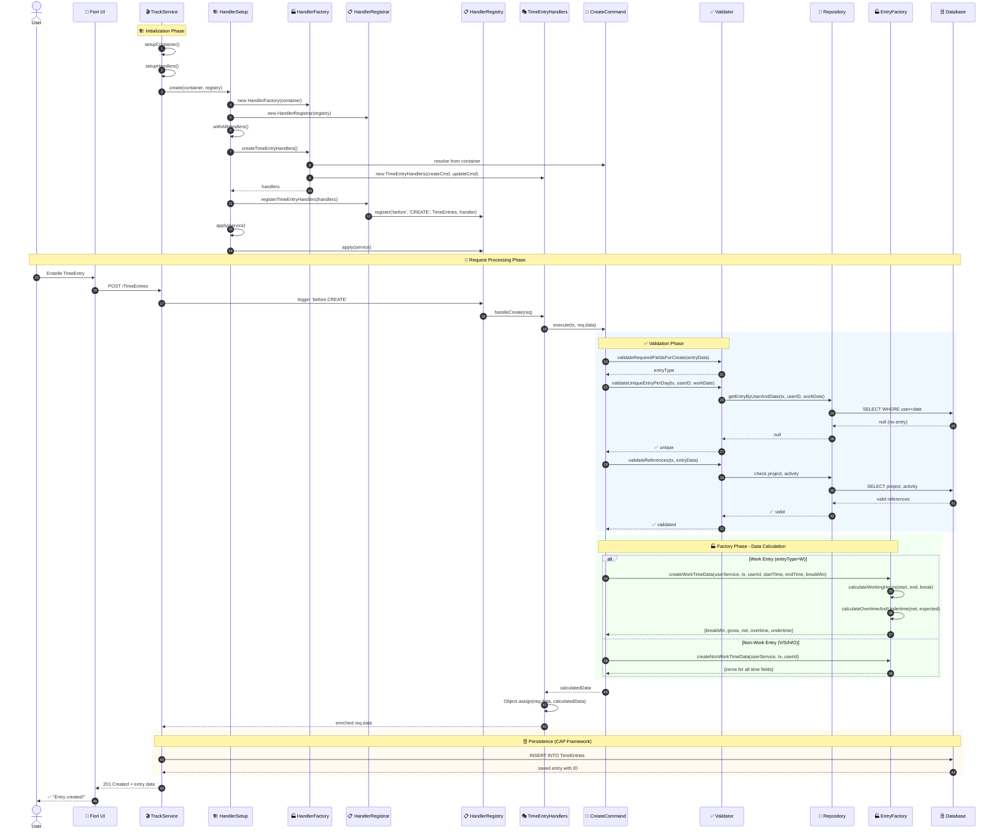
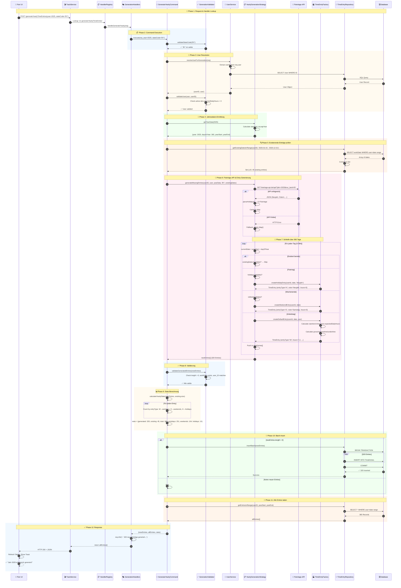

# 🕐 CAP Fiori Time Tracking Application

Eine professionelle Zeiterfassungsanwendung basierend auf **SAP CAP** (Cloud Application Programming Model) mit **TypeScript** und **Fiori UI5** Frontend. Dieses Projekt zeigt dir, wie moderne Enterprise-Anwendungen mit **Clean Architecture**, **Design Patterns** und **Best Practices** gebaut werden – von Entwickler für Entwickler dokumentiert! 🚀

## 🎯 Was macht diese App besonders?

- ✅ **100% TypeScript** - Komplettes Backend in TypeScript (kein JavaScript!)
- ✅ **Clean Architecture** - ServiceContainer, HandlerRegistry & Design Patterns
- ✅ **SOLID Principles** - Jede Klasse hat genau eine Verantwortung
- ✅ **Enterprise-Ready** - Feiertags-API, Zeitberechnungen, Balance-Tracking
- ✅ **Fiori Elements & Custom UI5** - Beide Welten in einer App
- ✅ **Production-Grade** - Validierung, Error Handling, Logging

---

## 🏗️ Solution Architecture

Diese App folgt einer **modernen 3-Tier-Architektur** mit Clean Architecture Principles. Jede Schicht hat klare Verantwortlichkeiten und ist unabhängig testbar:



---

## 📁 Project Structure

Die Struktur ist bewusst modular aufgebaut - jede Komponente hat ihre klar definierte Rolle:

```
cap-fiori-timetracking/
│
├── 📱 app/                          # Frontend Applications (TypeScript UI5)
│   ├── timetable/                   # Fiori Elements List Report App
│   │   ├── webapp/
│   │   │   ├── Component.ts         # UI5 Component (TypeScript)
│   │   │   ├── manifest.json        # App Descriptor
│   │   │   └── i18n/                # Internationalization
│   │   └── annotations.cds          # UI Annotations
│   │
│   └── timetracking/                # Custom UI5 Dashboard App
│       ├── webapp/
│       │   ├── controller/          # MVC Controller (TypeScript)
│       │   ├── view/                # XML Views
│       │   ├── model/               # Client Models
│       │   └── Component.ts
│       └── annotations.cds
│
├── 💾 db/                           # Data Model & Master Data
│   ├── data-model.cds               # Core Domain Model
│   │   ├── Users, Projects, TimeEntries
│   │   └── ActivityTypes, EntryTypes, GermanStates (CodeLists)
│   └── data/                        # CSV Test & Master Data
│
├── ⚙️ srv/                           # Backend Service Layer (100% TypeScript!)
│   │
│   ├── service-model.cds            # Top-Level Service Model
│   │
│   └── track-service/               # TrackService - Complete Service Module
│       │
│       ├── track-service.cds        # OData Service Definition
│       ├── track-service.ts         # 🎬 Orchestrator
│       ├── index.cds                # Service Entry Point
│       │
│       ├── annotations/             # 📝 UI Annotations
│       │   ├── annotations.cds      # Main Annotations File
│       │   ├── common/              # Common Annotations
│       │   │   ├── authorization.cds
│       │   │   ├── capabilities.cds
│       │   │   ├── field-controls.cds
│       │   │   ├── labels.cds
│       │   │   └── value-helps.cds
│       │   └── ui/                  # UI-spezifisch pro Entity
│       │       ├── activities-ui.cds
│       │       ├── balance-ui.cds
│       │       ├── projects-ui.cds
│       │       ├── timeentries-ui.cds
│       │       └── users-ui.cds
│       │
│       └── handler/                 # 🔧 Business Logic & Infrastructure
│           │
│           ├── index.ts             # Handler Entry Point
│           │
│           ├── container/           # 🏗️ Dependency Injection
│           │   ├── ServiceContainer.ts  # DI Container
│           │   │   - 6 Kategorien: Repos, Services, Validators, Strategies, Commands, Factories
│           │   │   - Type-safe Resolution mit Generics
│           │   │   - Auto-Wiring aller Dependencies
│           │   └── index.ts             # Barrel Export
│           │
│           ├── registry/            # 📋 Event Handler Registry
│           │   ├── HandlerRegistry.ts   # Handler-Registrierung
│           │   │   - Unterstützt: before, on, after
│           │   │   - Fluent API & Logging
│           │   ├── HandlerRegistrar.ts  # Handler-Registrierung
│           │   └── index.ts
│           │
│           ├── setup/               # 🏗️ Setup & Initialization
│           │   ├── HandlerSetup.ts      # Builder Pattern für Handler Setup
│           │   └── index.ts
│           │
│           ├── handlers/            # 🎯 Event Handler (Separation of Concerns)
│           │   ├── TimeEntryHandlers.ts     # CRUD
│           │   ├── GenerationHandlers.ts    # Bulk-Generierung
│           │   ├── BalanceHandlers.ts       # Balance-Abfragen
│           │   └── index.ts
│           │
│           ├── commands/            # 🎯 Command Pattern (7 Commands!)
│           │   ├── balance/                 # Balance Commands
│           │   │   ├── GetMonthlyBalanceCommand.ts
│           │   │   ├── GetCurrentBalanceCommand.ts
│           │   │   └── GetRecentBalancesCommand.ts
│           │   ├── generation/              # Generation Commands
│           │   │   ├── GenerateMonthlyCommand.ts
│           │   │   └── GenerateYearlyCommand.ts
│           │   ├── time-entry/              # TimeEntry Commands
│           │   │   ├── CreateTimeEntryCommand.ts
│           │   │   └── UpdateTimeEntryCommand.ts
│           │   └── index.ts                 # Barrel Export
│           │
│           ├── services/            # 💼 Domain Services
│           │   ├── TimeCalculationService.ts   # Static Utilities
│           │   ├── UserService.ts              # User Management
│           │   ├── HolidayService.ts           # API Integration mit Cache
│           │   ├── TimeBalanceService.ts       # Balance Calculations
│           │   └── index.ts
│           │
│           ├── repositories/        # 💾 Data Access (4 Repositories)
│           │   ├── TimeEntryRepository.ts
│           │   ├── UserRepository.ts
│           │   ├── ProjectRepository.ts
│           │   ├── ActivityTypeRepository.ts
│           │   └── index.ts
│           │
│           ├── validators/          # ✅ Validation (3 Validators)
│           │   ├── TimeEntryValidator.ts
│           │   ├── GenerationValidator.ts
│           │   ├── BalanceValidator.ts
│           │   └── index.ts
│           │
│           ├── strategies/          # 📋 Strategy Pattern
│           │   ├── MonthlyGenerationStrategy.ts
│           │   └── YearlyGenerationStrategy.ts
│           │   └── index.ts
│           │
│           ├── factories/           # 🏭 Factory Pattern
│           │   ├── TimeEntryFactory.ts
│           │   ├── HandlerFactory.ts
│           │   └── index.ts
│           │
│           └── utils/               # 🛠️ Utility Classes
│               ├── DateUtils.ts
│               └── index.ts
│
├── @cds-models/                     # 🎯 Auto-generierte TypeScript Types
│   ├── TrackService/
│   └── io/nimble/
│
└── package.json, tsconfig.json, etc.
```

---

## 💾 Data Model

Das Datenmodell ist bewusst einfach gehalten, aber dennoch mächtig:



### 🔑 Key Features des Datenmodells

- **Automatische Berechnung**: Brutto-/Nettozeiten, Über-/Unterstunden werden server-seitig berechnet
- **Eindeutigkeit**: Nur ein Entry pro User/Tag (wird im Repository validiert)
- **Flexible Entry Types**: Work (W), Vacation (V), Sick Leave (S), Holiday (H) über CodeList
- **Project Assignment**: Optional, nur aktive Projekte werden zugelassen
- **Activity Tracking**: Kategorisierung der Tätigkeiten für Reporting
- **Managed Fields**: `createdAt`, `createdBy`, `modifiedAt`, `modifiedBy` automatisch via `@sap/cds/common`
- **Localization**: EntryTypes, ActivityTypes, GermanStates mit i18n-Support (de/en)
- **Computed Fields**: `expectedDailyHoursDec` wird automatisch aus `weeklyHoursDec` / `workingDaysPerWeek` berechnet

---

## 🎨 Design Patterns - Das Herzstück

Diese App ist ein **Showcase** für moderne Design Patterns. Hier arbeiten 10 verschiedene Patterns perfekt zusammen:

```mermaid
---
config:
  layout: elk
  elk:
    mergeEdges: true
    nodePlacementStrategy: LINEAR_SEGMENTS
  theme: neo
---
classDiagram
    class ServiceContainer {
        +build(entities)
        +getService(key)
        +getCommand(key)
        +getRepository(key)
        +getValidator(key)
        +getStrategy(key)
        +getFactory(key)
    }
    class HandlerRegistry {
        +register(config)
        +apply(service)
        -handlers: HandlerConfig[]
    }
    class HandlerRegistrar {
        -registry: HandlerRegistry
        +registerTimeEntryHandlers(handlers)
        +registerGenerationHandlers(handlers)
        +registerBalanceHandlers(handlers)
        +registerAllHandlers(handlers)
    }
    class HandlerFactory {
        -container: ServiceContainer
        +createTimeEntryHandlers()
        +createGenerationHandlers()
        +createBalanceHandlers()
        +createAllHandlers()
    }
    class HandlerSetup {
        -factory: HandlerFactory
        -registrar: HandlerRegistrar
        +create(container, registry)
        +withTimeEntryHandlers()
        +withGenerationHandlers()
        +withBalanceHandlers()
        +withAllHandlers()
        +apply(service)
    }
    class TimeEntryHandlers {
        -createCommand: CreateTimeEntryCommand
        -updateCommand: UpdateTimeEntryCommand
        +handleCreate(req)
        +handleUpdate(req)
        +handleDelete(req)
    }
    class GenerationHandlers {
        -monthlyCommand: GenerateMonthlyCommand
        -yearlyCommand: GenerateYearlyCommand
        +handleGenerateMonthly(req)
        +handleGenerateYearly(req)
    }
    class BalanceHandlers {
        -monthlyBalanceCommand: GetMonthlyBalanceCommand
        -currentBalanceCommand: GetCurrentBalanceCommand
        -recentBalancesCommand: GetRecentBalancesCommand
        +handleGetMonthlyBalance(req)
        +handleGetCurrentBalance(req)
        +handleReadMonthlyBalances(req)
    }
    class CommandPattern {
        <<interface>>
        +execute(tx, data)
    }
    class CreateTimeEntryCommand {
        -validator: TimeEntryValidator
        -userService: UserService
        -factory: TimeEntryFactory
        -repository: TimeEntryRepository
        +execute(tx, data)
    }
    class UpdateTimeEntryCommand {
        -validator: TimeEntryValidator
        -repository: TimeEntryRepository
        +execute(tx, data)
    }
    class GenerateMonthlyCommand {
        -validator: GenerationValidator
        -strategy: MonthlyGenerationStrategy
        -repository: TimeEntryRepository
        +execute(tx, params)
    }
    class GenerateYearlyCommand {
        -validator: GenerationValidator
        -strategy: YearlyGenerationStrategy
        -holidayService: HolidayService
        -repository: TimeEntryRepository
        +execute(tx, params)
    }
    class RepositoryPattern {
        <<interface>>
        +create(tx, data)
        +update(tx, id, data)
        +findById(tx, id)
        +delete(tx, id)
    }
    class TimeEntryRepository {
        +create(tx, entry)
        +update(tx, id, data)
        +findById(tx, id)
        +getEntryByUserAndDate(tx, userId, date, excludeId?)
        +insertBatch(tx, entries)
    }
    class UserRepository {
        +findByEmail(email)
        +findById(id)
    }
    class ValidatorPattern {
        <<interface>>
        +validate(tx, data)
    }
    class TimeEntryValidator {
        -projectRepo: ProjectRepository
        -activityRepo: ActivityTypeRepository
        -timeEntryRepo: TimeEntryRepository
        +validate(tx, data)
        +validateUniqueEntryPerDay(tx, userId, date, excludeId?)
        +hasRelevantChanges(old, new)
    }
    class GenerationValidator {
        -userRepo: UserRepository
        +validateUser(tx, userId)
        +validateStateCode(stateCode)
        +validateYear(year)
    }
    class BalanceValidator {
        +validateYearMonth(year, month)
        +validateMonthCount(count)
    }
    class StrategyPattern {
        <<interface>>
        +generate(tx, params)
    }
    class MonthlyGenerationStrategy {
        +generate(tx, user, year, month)
    }
    class YearlyGenerationStrategy {
        +generate(tx, user, year, holidays)
    }
    class FactoryPattern {
        <<interface>>
        +create(params)
    }
    class TimeEntryFactory {
        +createWorkTimeData(userService, tx, userId, startTime, endTime, breakMin)
        +createNonWorkTimeData(userService, tx, userId)
        +createDefaultEntry(userId, date, user)
        +createWeekendEntry(userId, date)
        +createHolidayEntry(userId, date, holidayName)
    }
    class DomainServices {
        <<service layer>>
    }
    class UserService {
        -userRepo: UserRepository
        +getCurrentUser(req)
        +getExpectedDailyHours(user)
    }
    class HolidayService {
        -cache: Map
        +getHolidays(year, stateCode)
    }
    class TimeBalanceService {
        -timeEntryRepo: TimeEntryRepository
        +calculateMonthlyBalance(tx, userId, year, month)
        +getCurrentBalance(tx, userId)
    }
    class TimeCalculationService {
        +timeToMinutes(timeString)
        +roundToTwoDecimals(value)
        +calculateWorkingHours(startTime, endTime, breakMinutes)
        +calculateOvertimeAndUndertime(actualHours, expectedHours)
    }
    ServiceContainer --> CommandPattern : provides
    ServiceContainer --> RepositoryPattern : provides
    ServiceContainer --> ValidatorPattern : provides
    ServiceContainer --> StrategyPattern : provides
    ServiceContainer --> FactoryPattern : provides
    ServiceContainer --> DomainServices : provides
    HandlerSetup --> HandlerFactory : uses
    HandlerSetup --> HandlerRegistrar : uses
    HandlerFactory --> ServiceContainer : uses
    HandlerFactory --> TimeEntryHandlers : creates
    HandlerFactory --> GenerationHandlers : creates
    HandlerFactory --> BalanceHandlers : creates
    HandlerRegistrar --> HandlerRegistry : uses
    HandlerRegistrar --> TimeEntryHandlers : registers
    HandlerRegistrar --> GenerationHandlers : registers
    HandlerRegistrar --> BalanceHandlers : registers
    TimeEntryHandlers --> CreateTimeEntryCommand : delegates
    TimeEntryHandlers --> UpdateTimeEntryCommand : delegates
    GenerationHandlers --> GenerateMonthlyCommand : delegates
    GenerationHandlers --> GenerateYearlyCommand : delegates
    BalanceHandlers --> GetMonthlyBalanceCommand : delegates
    BalanceHandlers --> GetCurrentBalanceCommand : delegates
    BalanceHandlers --> GetRecentBalancesCommand : delegates
    CommandPattern <|.. CreateTimeEntryCommand : implements
    CommandPattern <|.. UpdateTimeEntryCommand : implements
    CommandPattern <|.. GenerateMonthlyCommand : implements
    CommandPattern <|.. GenerateYearlyCommand : implements
    CreateTimeEntryCommand --> TimeEntryValidator : uses
    CreateTimeEntryCommand --> UserService : uses
    CreateTimeEntryCommand --> TimeEntryFactory : uses
    CreateTimeEntryCommand --> TimeEntryRepository : uses
    UpdateTimeEntryCommand --> TimeEntryValidator : uses
    UpdateTimeEntryCommand --> TimeEntryRepository : uses
    GenerateMonthlyCommand --> GenerationValidator : uses
    GenerateMonthlyCommand --> MonthlyGenerationStrategy : uses
    GenerateMonthlyCommand --> TimeEntryRepository : uses
    GenerateYearlyCommand --> GenerationValidator : uses
    GenerateYearlyCommand --> YearlyGenerationStrategy : uses
    GenerateYearlyCommand --> HolidayService : uses
    GenerateYearlyCommand --> TimeEntryRepository : uses
    RepositoryPattern <|.. TimeEntryRepository : implements
    RepositoryPattern <|.. UserRepository : implements
    ValidatorPattern <|.. TimeEntryValidator : implements
    ValidatorPattern <|.. GenerationValidator : implements
    ValidatorPattern <|.. BalanceValidator : implements
    StrategyPattern <|.. MonthlyGenerationStrategy : implements
    StrategyPattern <|.. YearlyGenerationStrategy : implements
    FactoryPattern <|.. TimeEntryFactory : implements
    TimeEntryValidator --> ProjectRepository : uses
    TimeEntryValidator --> ActivityTypeRepository : uses
    TimeEntryValidator --> TimeEntryRepository : uses
    GenerationValidator --> UserRepository : uses
    TimeEntryFactory --> TimeCalculationService : uses
    UserService --> UserRepository : uses
    TimeBalanceService --> TimeEntryRepository : uses
```



### 🏗️ 1. ServiceContainer Pattern (Dependency Injection)

**Datei:** `srv/handler/container/ServiceContainer.ts`

Der **ServiceContainer** ist unser DI-Container. Er verwaltet **alle** Dependencies zentral:

```typescript
// Beim Service-Start
const container = new ServiceContainer();
container.build(entities); // Auto-Wiring!

// Type-safe Resolution
const userService = container.getService<UserService>('user');
const createCommand = container.getCommand<CreateTimeEntryCommand>('createTimeEntry');
```

**Features:**

- 🎯 6 Kategorien: Repositories, Services, Validators, Strategies, Commands, Factories
- 🔗 Auto-Wiring von Dependencies
- 🛡️ Type-Safe mit Generics
- 🧪 Perfekt für Unit Tests

### 📋 2. HandlerRegistry Pattern

**Datei:** `srv/handler/registry/HandlerRegistry.ts`

Strukturierte Event-Handler-Registrierung mit **before/on/after** Support:

```typescript
registry.register({
  type: 'before',
  event: 'CREATE',
  entity: TimeEntries,
  handler: handlers.handleCreate.bind(handlers),
  description: 'Validate and enrich time entry before creation',
});

registry.apply(service);
```

### 🎯 3. Command Pattern (7 Commands!)

**Dateien:** `srv/handler/commands/*.ts`

Commands kapseln komplexe Business Operations:

| Command                    | Zweck                                          |
| -------------------------- | ---------------------------------------------- |
| `CreateTimeEntryCommand`   | Validierung, User-Lookup, Factory, Calculation |
| `UpdateTimeEntryCommand`   | Change Detection, Recalculation                |
| `GenerateMonthlyCommand`   | Monat generieren mit Stats                     |
| `GenerateYearlyCommand`    | Jahr mit Feiertagen                            |
| `GetMonthlyBalanceCommand` | Monatssaldo mit Criticality                    |
| `GetCurrentBalanceCommand` | Kumulierter Gesamtsaldo                        |
| `GetRecentBalancesCommand` | Historische Balances (6 Monate)                |

### 🏭 4. Factory Pattern (2 Factories!)

#### **TimeEntryFactory** - Domain Object Creation

**Datei:** `srv/handler/factories/TimeEntryFactory.ts`

Kennt alle Business Rules und erstellt perfekt berechnete TimeEntry-Objekte:

```typescript
// Work-Time Data (wird im Command verwendet)
const workData = await TimeEntryFactory.createWorkTimeData(userService, tx, userId, startTime, endTime, breakMin);
// → Berechnet automatisch: gross, net, overtime, undertime

// Non-Work-Time Data (Urlaub, Krankheit)
const nonWorkData = await TimeEntryFactory.createNonWorkTimeData(userService, tx, userId);

// Komplette Entries für Generierung
const workEntry = TimeEntryFactory.createDefaultEntry(userId, date, user);
const weekendEntry = TimeEntryFactory.createWeekendEntry(userId, date);
const holidayEntry = TimeEntryFactory.createHolidayEntry(userId, date, 'Neujahr');
```

#### **HandlerFactory** - Handler Instance Creation

**Datei:** `srv/handler/factories/HandlerFactory.ts`

Erstellt Handler-Instanzen mit Dependencies aus dem ServiceContainer:

```typescript
class HandlerFactory {
  constructor(private container: ServiceContainer) {}

  createTimeEntryHandlers(): TimeEntryHandlers {
    return new TimeEntryHandlers(
      this.container.getCommand<CreateTimeEntryCommand>('createTimeEntry'),
      this.container.getCommand<UpdateTimeEntryCommand>('updateTimeEntry'),
    );
  }

  createAllHandlers() {
    return {
      timeEntry: this.createTimeEntryHandlers(),
      generation: this.createGenerationHandlers(),
      balance: this.createBalanceHandlers(),
    };
  }
}
```

**Features:**

- 🏭 Kapselt Handler-Instanziierung
- 🔗 Löst Dependencies aus Container auf
- 🧪 Perfekt für Unit Tests

### 📋 5. Registrar Pattern

**Datei:** `srv/handler/registry/HandlerRegistrar.ts`

Trennt Registrierungslogik von der Business-Logik:

```typescript
class HandlerRegistrar {
  constructor(private registry: HandlerRegistry) {}

  registerTimeEntryHandlers(handlers: TimeEntryHandlers): void {
    this.registry.register({
      type: 'before',
      event: 'CREATE',
      entity: TimeEntries,
      handler: handlers.handleCreate.bind(handlers),
      description: 'Validate and enrich time entry before creation',
    });
    // ... weitere Registrierungen
  }

  registerAllHandlers(handlers: { ... }): void {
    this.registerTimeEntryHandlers(handlers.timeEntry);
    this.registerGenerationHandlers(handlers.generation);
    this.registerBalanceHandlers(handlers.balance);
  }
}
```

**Features:**

- 📋 Strukturierte Registrierung
- 🎯 Separation of Concerns
- 🔄 Wiederverwendbar

### 🏗️ 6. Builder Pattern (Fluent API)

**Datei:** `srv/handler/setup/HandlerSetup.ts`

Builder mit Fluent API für elegantes Handler-Setup:

```typescript
class HandlerSetup {
  static create(container: ServiceContainer, registry: HandlerRegistry): HandlerSetup {
    return new HandlerSetup(container, registry);
  }

  withTimeEntryHandlers(): this {
    this.handlers.timeEntry = this.factory.createTimeEntryHandlers();
    this.registrar.registerTimeEntryHandlers(this.handlers.timeEntry);
    return this;
  }

  withAllHandlers(): this {
    return this.withTimeEntryHandlers().withGenerationHandlers().withBalanceHandlers();
  }

  apply(service: ApplicationService): void {
    this.registry.apply(service);
  }
}
```

**Usage in TrackService:**

```typescript
private setupHandlers(): void {
  this.registry = new HandlerRegistry();

  HandlerSetup
    .create(this.container, this.registry)
    .withAllHandlers()
    .apply(this);
}
```

**Features:**

- ⛓️ Chainable API
- 🎨 Sehr elegant und lesbar
- 🔧 Flexibel - kann selektiv Handler hinzufügen
- 🧩 Kombiniert Factory + Registrar

### 📋 7. Strategy Pattern

**Dateien:** `srv/handler/strategies/*.ts`

Das **Strategy Pattern** ermöglicht austauschbare Algorithmen für unterschiedliche Generierungsszenarien. Jede Strategy kapselt einen spezifischen Algorithmus und ist unabhängig austauschbar:

```typescript
/**
 * MonthlyGenerationStrategy - Generiert alle Arbeitstage eines Monats
 */
export class MonthlyGenerationStrategy {
  generateMissingEntries(userID: string, user: User, existingDates: Set<string>): TimeEntry[] {
    const monthData = DateUtils.getCurrentMonthData();
    const newEntries: TimeEntry[] = [];

    for (let day = 1; day <= monthData.daysInMonth; day++) {
      const currentDate = new Date(monthData.year, monthData.month, day);

      // Skip Wochenenden & existierende Einträge
      if (!DateUtils.isWorkingDay(currentDate, user.workingDaysPerWeek)) {
        continue;
      }

      const dateStr = DateUtils.formatDate(currentDate);
      if (existingDates.has(dateStr)) continue;

      // Factory erstellt perfekt berechnete Entries
      newEntries.push(TimeEntryFactory.createDefaultEntry(userID, dateStr, user));
    }

    return newEntries;
  }
}
```

**Features:**

- 🔄 Austauschbare Algorithmen ohne Code-Änderung
- 🎯 Jede Strategy kennt ihre spezifische Business-Logik
- 🏭 Nutzt Factory für konsistente Entry-Erstellung
- 📅 Weekend-Detection und Date-Utilities
- ⚡ Performance-optimiert mit Sets für Lookup

### 💾 8. Repository Pattern (4 Repositories)

**Dateien:** `srv/handler/repositories/*.ts`

Das **Repository Pattern** abstrahiert den Datenzugriff und kapselt alle SQL-Operationen. Jede Entity hat ihr eigenes Repository mit domain-spezifischer Logik:

```typescript
/**
 * TimeEntryRepository - Datenzugriff für TimeEntries
 */
export class TimeEntryRepository {
  private TimeEntries: any;

  constructor(entities: any) {
    this.TimeEntries = entities.TimeEntries;
  }

  /**
   * Lädt Eintrag nach User/Datum
   */
  async getEntryByUserAndDate(
    tx: Transaction,
    userId: string,
    workDate: string,
    excludeId?: string,
  ): Promise<TimeEntry | null> {
    const whereClause: any = { user_ID: userId, workDate };
    if (excludeId) whereClause.ID = { '!=': excludeId };

    const entry = await tx.run(SELECT.one.from(this.TimeEntries).where(whereClause));
    return entry || null; // 🎯 Kein throw! Pure Datenabfrage
  }

  /**
   * Batch-Insert für Performance
   */
  async insertBatch(tx: Transaction, entries: TimeEntry[]): Promise<void> {
    await tx.run(INSERT.into(this.TimeEntries).entries(entries));
  }
}
```

**Features:**

- 💾 Komplette Abstraktion der Datenschicht
- 🔍 Domain-spezifische Queries (z.B. `getEntryByUserAndDate`)
- ⚡ Performance-Optimierung mit Batch-Operations
- 🎯 Reiner Datenzugriff ohne Business Logic (Separation of Concerns!)
- 🧪 Perfekt mockbar für Unit Tests

**Unsere 4 Repositories:**

- `TimeEntryRepository` - CRUD + Queries + Batch Insert
- `UserRepository` - User-Lookup by Email/ID
- `ProjectRepository` - Validierung aktiver Projekte
- `ActivityTypeRepository` - Validierung von Activity Codes

### ✅ 9. Validator Pattern (3 Validators)

**Dateien:** `srv/handler/validators/*.ts`

Das **Validator Pattern** kapselt komplexe Validierungslogik in wiederverwendbare Klassen. Jeder Validator fokussiert sich auf eine spezifische Domäne:

```typescript
/**
 * TimeEntryValidator - Validierung für TimeEntry-Operationen
 */
export class TimeEntryValidator {
  constructor(
    private projectRepository: ProjectRepository,
    private activityTypeRepository: ActivityTypeRepository,
    private timeEntryRepository: TimeEntryRepository,
  ) {}

  /**
   * Validiert Pflichtfelder für CREATE
   */
  validateRequiredFieldsForCreate(entryData: Partial<TimeEntry>): string {
    const { user_ID, workDate, startTime, endTime, entryType } = entryData;

    if (!user_ID) throw new Error('user ist erforderlich.');
    if (!workDate) throw new Error('workDate ist erforderlich.');

    const type = entryType || 'WORK';

    // Bei Arbeitszeit sind Start-/Endzeit erforderlich
    if (type === 'WORK' && (!startTime || !endTime)) {
      throw new Error('startTime und endTime sind bei Arbeitszeit erforderlich.');
    }

    return type;
  }

  /**
   * Validiert Referenzen (Projekt, Activity)
   */
  async validateReferences(tx: Transaction, entryData: Partial<TimeEntry>): Promise<void> {
    // Projekt-Validierung nur wenn angegeben
    if (entryData.project_ID) {
      await this.projectRepository.validateProjectExists(tx, entryData.project_ID);
    }

    // Activity-Validierung nur wenn angegeben
    if (entryData.activity_code) {
      await this.activityTypeRepository.validateActivityExists(tx, entryData.activity_code);
    }
  }
}
```

**Features:**

- ✅ Zentralisierte Validierungslogik
- 🎯 Domain-spezifische Rules (TimeEntry vs. Generation vs. Balance)
- 🔗 Nutzt Repositories für DB-basierte Validierung
- 🛡️ Konsistente Error Messages
- 🧪 Isoliert testbar ohne CAP Framework

**Unsere 3 Validators:**

- `TimeEntryValidator` - Entry-Validierung + Change Detection
- `GenerationValidator` - User, StateCode, Year Validierung
- `BalanceValidator` - Year/Month Plausibilitätsprüfung

### 🎭 10. Handler Pattern (3 Handler-Klassen)

**Dateien:** `srv/handler/handlers/*.ts`

Das **Handler Pattern** trennt Event-Handling von Business-Logik. Handler sind die "Orchestratoren" die auf CAP-Events reagieren und die eigentliche Arbeit an Commands delegieren:

```typescript
/**
 * TimeEntryHandlers - Handler für TimeEntry CRUD-Operationen
 */
export class TimeEntryHandlers {
  constructor(
    private createCommand: CreateTimeEntryCommand,
    private updateCommand: UpdateTimeEntryCommand,
  ) {}

  /**
   * Handler: TimeEntry erstellen (before CREATE)
   * Delegiert Business Logic an Command
   */
  async handleCreate(req: any): Promise<void> {
    try {
      const tx = cds.transaction(req) as any;
      const calculatedData = await this.createCommand.execute(tx, req.data);

      // Berechnete Daten in Request übernehmen
      // CAP Framework macht dann automatisch den INSERT
      Object.assign(req.data, calculatedData);
    } catch (error: any) {
      req.reject(error.code || 400, error.message);
    }
  }

  /**
   * Handler: TimeEntry aktualisieren (before UPDATE)
   */
  async handleUpdate(req: any): Promise<void> {
    try {
      const tx = cds.transaction(req) as any;
      const calculatedData = await this.updateCommand.execute(tx, req.data);
      Object.assign(req.data, calculatedData);
    } catch (error: any) {
      req.reject(error.code || 400, error.message);
    }
  }
}
```

**Features:**

- 🎭 Klare Trennung: Handler = Orchestration, Command = Business Logic
- 🔗 Dependency Injection der Commands
- 🛡️ Zentrales Error Handling
- 📋 Gruppierung nach Domäne (CRUD / Generation / Balance)
- 🎯 Thin Layer - nur Delegation, keine Business Logic

**Unsere 3 Handler-Klassen:**

- `TimeEntryHandlers` - CRUD Operations (CREATE/UPDATE/DELETE)
- `GenerationHandlers` - Bulk-Generierung (Monthly/Yearly)
- `BalanceHandlers` - Balance-Abfragen (Monthly/Current/Recent)

---

## 🔍 Wichtiger Unterschied: CREATE vs. Generation

**CREATE (CRUD Operation):**

- Handler enriched nur die Daten im `req.data`
- **CAP Framework** übernimmt automatisch den INSERT
- Kein expliziter Repository-Aufruf im Command
- Standard CAP CRUD-Flow mit `before CREATE` Handler

**Generation (Bulk Operations):**

- Command erzeugt komplettes Array von Entries
- **Expliziter** `repository.insertBatch()` Aufruf
- Direkter DB-Zugriff für Performance (Batch-Insert)
- Umgeht CAP CRUD-Events für bessere Performance

### 🎬 Das große Zusammenspiel - Sequence Diagram

So arbeiten alle Patterns bei einem CREATE-Request zusammen:



---

### 🎬 Yearly TimeEntry Generation - Complete Flow

So läuft die **komplette Jahresgenerierung** ab - vom UI-Button-Click bis zur fertigen Datenbank-Einträge mit Feiertagen:



### 🎯 Key Takeaways der Jahresgenerierung

| Phase                    | Dauer     | Highlights                                   |
| ------------------------ | --------- | -------------------------------------------- |
| **1. Request Routing**   | ~5ms      | Registry löst Handler auf                    |
| **2. Validation**        | ~10ms     | User, StateCode, Year validiert              |
| **3. User Resolution**   | ~20ms     | DB-Query für User-Stammdaten                 |
| **4. Year Data**         | ~1ms      | 365 Tage, Schaltjahr-Check                   |
| **5. Existing Entries**  | ~50ms     | DB-Query: Welche Tage bereits vorhanden?     |
| **6. Holiday API**       | ~200ms    | **Externe API** für 13 Feiertage (BY)        |
| **7. Loop 365 Tage**     | ~100ms    | Weekend-Check, Holiday-Lookup, Factory       |
| **8. Validation**        | ~50ms     | 320 neue Entries validieren                  |
| **9. Stats Calculation** | ~10ms     | Workdays/Weekends/Holidays zählen            |
| **10. Batch Insert**     | ~500ms    | **320 INSERTs** in Transaction               |
| **11. Load All Entries** | ~100ms    | 365 Entries aus DB laden                     |
| **12. Response**         | ~50ms     | JSON serialisieren, UI Update                |
| **GESAMT**               | **~1,1s** | Komplettes Jahr mit Feiertagen generiert! 🎉 |

### 🔍 Special Features

- **🎉 Feiertags-API Integration**: Echte deutsche Feiertage von `feiertage-api.de`
- **💾 Cache**: Holidays werden pro Jahr/Bundesland gecacht
- **🔄 Idempotenz**: Existierende Entries werden übersprungen
- **🏭 Factory Pattern**: Unterschiedliche Entry-Typen (Work/Weekend/Holiday)
- **📊 Rich Stats**: Detaillierte Auswertung mit Criticality
- **⚡ Batch Insert**: 320 Entries in einer Transaction
- **🛡️ Error Handling**: API-Fallback bei Fehlern

---

## 🚀 Quick Start

### Prerequisites

```bash
# Node.js LTS (v18+)
node --version

# CAP Development Kit
npm install -g @sap/cds-dk

# TypeScript
npm install -g typescript
```

### Installation & Start

```bash
# 1. Dependencies installieren
npm install

# 2. TypeScript kompilieren
npm run build

# 3. Server starten (mit Live Reload)
npm run watch
```

Die App läuft auf: **http://localhost:4004**

### Development Scripts

```bash
npm run watch    # Development mit Auto-Reload
npm run build    # TypeScript kompilieren
npm run format   # Code formatieren (Prettier)
npm run lint     # Linting (ESLint)
```

---

## 🎯 Features & Funktionen

### ✅ Zeiterfassung

- **CRUD Operations** für TimeEntries
- **Automatische Berechnung** von Brutto/Netto/Über-/Unterstunden
- **Work vs. NonWork** Entries (Urlaub, Krank, Feiertag)
- **Projekt & Activity** Zuordnung
- **Draft Support** für komfortable Bearbeitung

### 📅 Bulk-Generierung

- **`generateMonthlyTimeEntries()`** - Alle Arbeitstage des Monats
- **`generateYearlyTimeEntries(year, stateCode)`** - Komplettes Jahr mit:
  - Wochenenden (automatisch erkannt)
  - Feiertage (API für alle 16 Bundesländer)
  - Arbeitsfreie Tage

### 💰 Balance-Tracking

- **`getMonthlyBalance(year, month)`** - Saldo pro Monat
- **`getCurrentBalance()`** - Kumulierter Gesamtsaldo
- **`MonthlyBalances`** - Virtuelle Entity mit letzten 6 Monaten
- **Criticality Indicators** - Visuelles Feedback (🟢 Grün / 🔴 Rot)

### 🔐 Business Rules

- **Expected Daily Hours** - Automatisch aus Weekly Hours berechnet
- **Feiertags-Integration** - Bundeslandspezifisch (feiertage-api.de)
- **Validierung** - Projekt, Activity, Entry-Type auf allen Ebenen
- **Change Detection** - Neuberechnung nur bei relevanten Änderungen
- **Eindeutigkeit** - Nur ein Entry pro User/Tag

---

## 📚 Dokumentation & Ressourcen

- **[REFACTORING.md](srv/track-service/REFACTORING.md)** - Detaillierte Refactoring-Dokumentation
- **CDS Annotations** - Siehe `srv/annotations/`
- **UI5 Apps** - Siehe `app/timetable/` und `app/timetracking/`
- **Data Model** - Siehe `db/data-model.cds`

### Externe Ressourcen

- **CAP Docs**: [cap.cloud.sap](https://cap.cloud.sap)
- **UI5 Docs**: [ui5.sap.com](https://ui5.sap.com)
- **TypeScript**: [typescriptlang.org](https://www.typescriptlang.org)
- **Fiori Guidelines**: [experience.sap.com/fiori-design](https://experience.sap.com/fiori-design)

---

## 🎓 Learnings & Best Practices

### Was du hier lernen kannst:

1. ✅ **Clean Architecture** in der Praxis
2. ✅ **Design Patterns** richtig anwenden (10 Patterns!)
3. ✅ **TypeScript** in CAP Services (100% typed!)
4. ✅ **Dependency Injection** ohne Framework
5. ✅ **Event-Driven Architecture** mit Registry
6. ✅ **Builder Pattern** mit Fluent API
7. ✅ **SOLID Principles** im echten Code
8. ✅ **Testbare Architektur** durch Separation of Concerns
9. ✅ **Fiori Elements** vs. Custom UI5

### Best Practices die wir umsetzen:

- 🎯 **Single Responsibility** - Jede Klasse macht genau eine Sache
- 🔗 **Dependency Injection** - Keine `new` in Business Logic
- 🛡️ **Type Safety** - TypeScript überall
- 📝 **Documentation** - JSDoc für alle APIs
- ✅ **Error Handling** - Try-Catch überall
- 📊 **Logging** - Strukturiert mit Emojis
- 🧪 **Testability** - Alles mockbar durch DI

---

## 🖥️ Frontend Applications

Wir haben zwei verschiedene UI5-Apps, die zeigen, wie unterschiedlich man an Fiori-Entwicklung rangehen kann:

### 📋 Timetable App (Fiori Elements) - Der schnelle Weg

Die "No-Code"-Variante! Fiori Elements generiert automatisch eine komplette App aus deinen Annotations:

- **List Report & Object Page** für TimeEntries - alles automatisch generiert
- **Draft-enabled** für komfortable Bearbeitung mit "Speichern" und "Verwerfen"
- **Smart Controls** mit automatischer Validierung aus dem Backend
- **Responsive Design** out-of-the-box für Desktop/Tablet/Mobile
- **TypeScript Component** für eigene Extensions
- **Filterbar & Search** automatisch aus Annotations

Die meiste Arbeit passiert in den `annotations.cds` Files. Wenig Code, viel Power! 💪

**Technische Details:**

- **App-Typ**: Fiori Elements List Report & Object Page
- **UI5 Version**: Latest (definiert in `ui5.yaml`)
- **TypeScript**: `webapp/Component.ts` für Extensions
- **Annotations**: `app/timetable/annotations.cds` definiert komplettes UI
- **Features**: Draft, Filterbar, Search, ValueHelp (F4), Side Effects

**Beispiel Annotations** (aus `annotations.cds`):

```cds
annotate TrackService.TimeEntries with @(
    UI.LineItem: [
        { Value: workDate, Label: '{i18n>workDate}' },
        { Value: user.name, Label: '{i18n>user}' },
        { Value: project.name, Label: '{i18n>project}' },
        { Value: durationHoursNet, Label: '{i18n>netHours}' },
        { Value: overtimeHours, Label: '{i18n>overtime}' }
    ],
    UI.HeaderInfo: {
        TypeName: '{i18n>timeEntry}',
        TypeNamePlural: '{i18n>timeEntries}',
        Title: { Value: workDate }
    }
);
```

### 📊 Timetracking Dashboard (Custom UI5) - Der flexible Weg

Hier haben wir die volle Kontrolle mit Custom UI5 Development:

- **Übersichtsdashboard** mit KPIs und Statistiken
- **Custom XML Views** mit spezieller UX
- **MVC Pattern** mit TypeScript Controllers
- **Chart Integration** für coole Visualisierungen (sap.viz / sap.suite)
- **Client-side Models** für Performance
- **Eigene Navigation** und Routing
- **TypeScript End-to-End** für Type Safety auch im Frontend

Hier kannst du richtig kreativ werden und UI bauen, wie DU es willst! 🎨

**Technische Details:**

- **App-Typ**: Custom UI5 Application (TypeScript)
- **MVC Pattern**: Controller in TypeScript, Views in XML
- **Models**: OData V4 Model + JSON Models für Client-State
- **Routing**: Manifest-based Routing mit TypeScript Router
- **Custom Controls**: Eigene Controls für Dashboard-Widgets

**Projekt-Struktur:**

```
timetracking/webapp/
├── controller/          # TypeScript Controllers
│   ├── BaseController.ts
│   ├── App.controller.ts
│   └── Home.controller.ts
├── view/               # XML Views
│   ├── App.view.xml
│   └── Home.view.xml
├── model/              # Client Models & Formatters
├── css/                # Custom Styles
├── i18n/               # Internationalization
├── Component.ts        # UI5 Component
└── manifest.json       # App Descriptor
```

**TypeScript Controller Beispiel:**

```typescript
import BaseController from './BaseController';
import ODataModel from 'sap/ui/model/odata/v4/ODataModel';

export default class Home extends BaseController {
  public onInit(): void {
    const model = this.getOwnerComponent().getModel() as ODataModel;
    this.loadDashboardData(model);
  }

  private async loadDashboardData(model: ODataModel): Promise<void> {
    // Load balance, recent entries, stats...
  }
}
```

### 🎨 UI5 & Fiori Features - Das UI rockt auch!

**Responsive & Smart:**

- **Responsive Design** mit sap.m Controls - läuft auf Desktop, Tablet, Phone
- **Smart Forms** mit automatischer Validierung aus Backend-Annotations
- **Value Helps (F4)**: Dropdown für Projects, Users, Activities mit Search
- **Flexible Column Layout**: Fiori 3 Standard für List/Detail Navigation
- **Device Adaptation**: Passt sich automatisch an Bildschirmgröße an

**UX & Accessibility:**

- **Accessibility (a11y) Compliant**: WCAG 2.1 Standards
- **Keyboard Navigation**: Alles mit Tab/Enter/Space bedienbar
- **Screen Reader Support**: ARIA Labels überall
- **High Contrast Themes**: Automatisch supported

**Fiori Design System:**

- **SAP Fiori Guidelines**: Wir folgen den SAP Design Principles
- **Semantic Colors**: Green für Überstunden, Red für Unterstunden
- **Icons & Emojis**: Intuitive Symbolik (🕐 für Zeit, 📊 für Reports)
- **Consistent UX**: Same Look & Feel wie alle SAP Fiori Apps

---

## 📊 Projekt-Stats

- 7 Commands in 3 Kategorien (Balance, Generation, TimeEntry)
- 3 Validators (Domain-spezifisch)
- 4 Repositories (1 pro Entity)
- 4 Services (Domain Logic)
- 2 Strategies (Algorithms)
- 2 Factories (TimeEntry + Handler Creation)
- 1 ServiceContainer (DI mit 6 Kategorien)
- 1 HandlerRegistry (Event-Driven Architecture)
- 1 HandlerRegistrar (Handler-Registrierung)
- 1 HandlerSetup (Builder mit Fluent API)
- 3 Handler-Klassen (Separation of Concerns)
- 1 DateUtils (Utility Functions)
- **12 Barrel Exports (index.ts)** für saubere Imports 📦

**= 30 Pattern-Klassen + 12 Barrel Exports!** Alle sauber strukturiert und testbar! 🚀

---

## 🤝 Contributing

Du willst bei diesem Projekt mitmachen? **Awesome!** 🎉 Hier ist dein Guide:

### 🐛 Bug Reports & Feature Requests

Hast du einen Bug gefunden oder eine coole Idee?

1. **Check erst die Issues** - Vielleicht gibt's das schon!
2. **Öffne ein Issue** mit aussagekräftiger Beschreibung
3. **Bei Bugs**: Steps to reproduce + erwartetes vs. tatsächliches Verhalten
4. **Bei Features**: Use Case + Business Value beschreiben

### 🔧 Code Contributions

#### 1️⃣ Setup

```bash
# Fork & Clone
git clone https://github.com/YOUR_USERNAME/cap-fiori-timetracking.git
cd cap-fiori-timetracking

# Install & Build
npm install
npm run build

# Start Development
npm run watch
```

#### 2️⃣ Neue Handler hinzufügen

**Beispiel:** Du willst einen `ReportHandler` für PDF-Exports hinzufügen:

```typescript
// srv/handler/handlers/ReportHandlers.ts
import { ServiceContainer } from '../container/ServiceContainer';

export class ReportHandlers {
  constructor(private container: ServiceContainer) {}

  async handleGenerateReport(req: any): Promise<void> {
    const command = this.container.getCommand<GenerateReportCommand>('generateReport');
    const result = await command.execute(req.data);
    return result;
  }
}
```

**Schritte:**

1. **Command erstellen**: `srv/handler/commands/ReportCommands.ts`
2. **Im Container registrieren**: `ServiceContainer.ts` → `buildCommands()`
3. **Handler-Klasse erstellen**: `srv/handler/handlers/ReportHandlers.ts`
4. **In track-service.ts registrieren**:
   ```typescript
   private registerReportHandlers(registry: HandlerRegistry): void {
     const handlers = new ReportHandlers(this.container);
     registry.register({
       type: 'on',
       event: 'generateReport',
       entity: Reports,
       handler: handlers.handleGenerateReport.bind(handlers),
       description: 'Generate PDF report'
     });
   }
   ```
5. **Tests schreiben** (wenn vorhanden)
6. **Dokumentieren** in `REFACTORING.md`

#### 3️⃣ Code Style & Quality

Wir nutzen:

```bash
npm run lint      # ESLint für Code Quality
npm run format    # Prettier für Formatting
npm run build     # TypeScript Compilation Check
```

**Wichtig:**

- ✅ **TypeScript everywhere** - keine `any`-Types!
- ✅ **JSDoc für alle public APIs**
- ✅ **Sprechende Variablennamen** (keine `x`, `temp`, `data1`)
- ✅ **Single Responsibility** - jede Funktion macht genau EINE Sache
- ✅ **DRY Principle** - kein Copy-Paste-Code
- ✅ **Error Handling** - try-catch mit aussagekräftigen Messages

#### 4️⃣ Commit Messages

Wir folgen [Conventional Commits](https://www.conventionalcommits.org/):

```bash
feat: add PDF export for monthly reports
fix: correct overtime calculation for leap years
docs: update README with new handler registration
refactor: extract validation logic into separate validator
test: add unit tests for TimeBalanceService
```

**Types:**

- `feat:` - Neues Feature
- `fix:` - Bug Fix
- `docs:` - Dokumentation
- `refactor:` - Code-Verbesserung ohne Funktionsänderung
- `test:` - Tests hinzufügen
- `chore:` - Build, Dependencies, etc.

#### 5️⃣ Pull Request

1. **Branch erstellen**: `git checkout -b feat/my-awesome-feature`
2. **Changes committen**: Mehrere kleine Commits sind besser als ein großer!
3. **Push**: `git push origin feat/my-awesome-feature`
4. **PR öffnen** mit:
   - **Was** hast du geändert?
   - **Warum** war die Änderung nötig?
   - **Wie** hast du es getestet?
   - Screenshots (falls UI-Change)

### 📖 Dokumentation verbessern

Auch Doku-Beiträge sind **super willkommen**!

- **README.md** - Hauptdokumentation
- **Code-Kommentare** - JSDoc für schwierige Logik
- **Annotations** - CDS Annotation Labels verbessern

### 🎓 Du bist neu bei CAP/TypeScript?

**Kein Problem!** Hier sind gute Einstiegspunkte:

- 🟢 **Easy**: Typo-Fixes, Doku-Verbesserungen
- 🟡 **Medium**: Neue Validatoren, Tests schreiben
- 🔴 **Hard**: Neue Commands/Strategies, Architecture Changes

Schau nach Issues mit dem Label `good-first-issue`!

### 💬 Fragen?

Öffne ein Issue oder schreib einen Comment! Die Community hilft gerne! 🙌

---

## 📝 License

MIT License - Do whatever you want with this code! 🚀

---

## 🙏 Acknowledgments

- **SAP CAP Team** - Für das großartige Framework
- **UI5 Team** - Für Fiori Elements & UI5
- **TypeScript Team** - Für typsichere Entwicklung
- **Open Source Community** - Für Inspiration & Best Practices

---

**Happy Coding! 🚀**

_Built with ❤️ and TypeScript in 2025_

---
