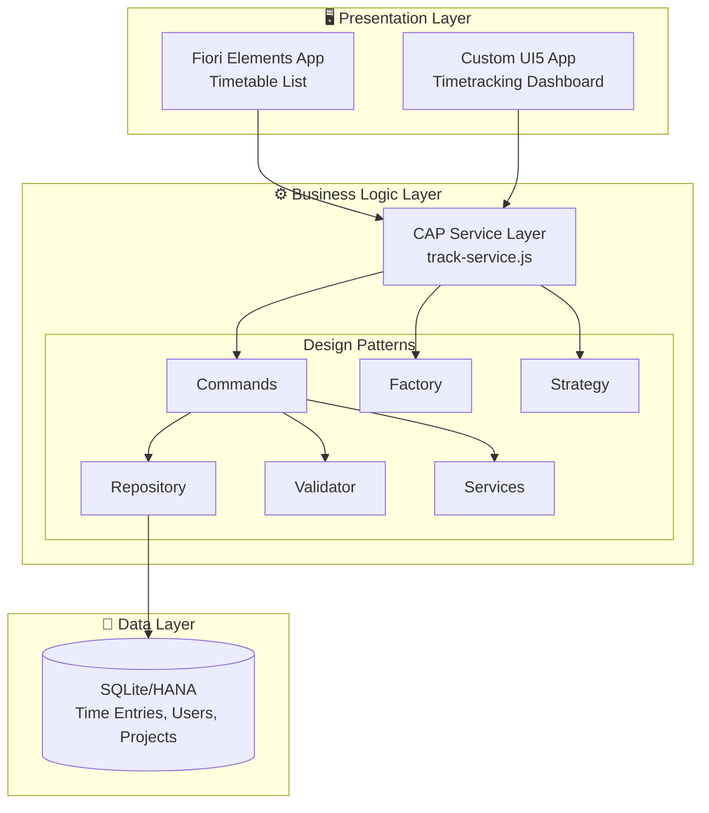
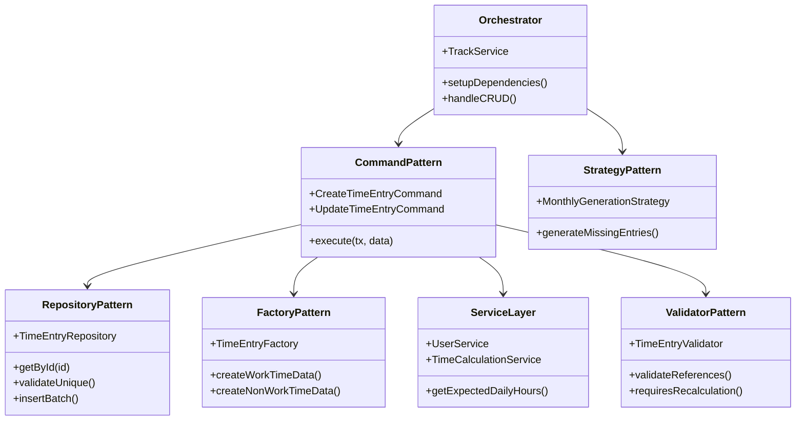
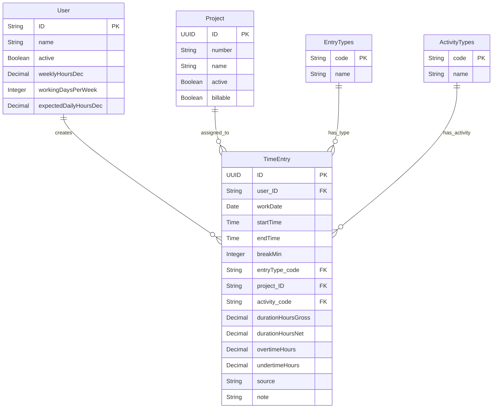

# 🕐 CAP Fiori Time Tracking Application

Eine moderne Zeiterfassungsanwendung basierend auf SAP CAP (Cloud Application Programming Model) mit Fiori UI5 Frontend. Das Projekt demonstriert Clean Code Prinzipien, moderne Design Patterns und eine saubere Architektur.

## 🏗️ Solution Architecture

Diese Anwendung folgt einer klassischen 3-Tier-Architektur mit modernen Design Patterns:



## 📁 Project Structure

```
cap-fiori-timetracking/
├── 📱 app/                 # Frontend Applications
│ ├── timetable/            # Fiori Elements List/Detail App
│ └── timetracking/         # Custom UI5 Dashboard App
├── 💾 db/                  # Data Model & Test Data
│ ├── data-model.cds        # Domain Entities
│ └── data/                 # CSV Test Data
├── ⚙️ srv/                 # Backend Services
│ ├── track-service.cds     # OData Service Definition
│ ├── track-service.js      # Service Implementation (Orchestrator)
│ ├── services/             # 🔧 Business Logic Services
│ ├── repositories/         # 💾 Data Access Layer
│ ├── validators/           # ✅ Validation Logic
│ ├── factories/            # 🏭 Object Creation
│ ├── strategies/           # 📋 Algorithm Strategies
│ ├── commands/             # 🎯 Command Pattern
│ └── annotations/          # 📝 UI Annotations
└── package.json
```

## 🎯 Design Patterns Implementation

Das Backend folgt konsequent bewährten Design Patterns für maximale Wartbarkeit und Testbarkeit:



### 🔧 Service Layer

- **`TimeCalculationService`**: Statische Utility-Methoden für Zeitberechnungen
- **`UserService`**: User-Management und Expected Daily Hours Logic

### 💾 Repository Pattern

- **`TimeEntryRepository`**: Komplette Abstraktion des Datenzugriffs
- Einfach austauschbar für verschiedene Datenquellen
- Perfekt für Unit Testing mit Mocks

### 🏭 Factory Pattern

- **`TimeEntryFactory`**: Zentrale Objekterstellung für verschiedene Entry-Typen
- Work-Time vs. Non-Work-Time (Urlaub/Krankheit)
- Standard-Entries für automatische Generierung

### 🎯 Command Pattern

- **`CreateTimeEntryCommand`**: Kapselt komplette CREATE-Operation
- **`UpdateTimeEntryCommand`**: Kapselt komplette UPDATE-Operation
- Jede Operation als eigenständiges, testbares Objekt

### 📋 Strategy Pattern

- **`MonthlyGenerationStrategy`**: Austauschbare Generierungsalgorithmen
- Einfach erweiterbar für andere Zeiträume (wöchentlich, jährlich)

### ✅ Validator Pattern

- **`TimeEntryValidator`**: Zentrale Validierungslogik
- Trennt Validierung sauber von Business Logic

## 💾 Data Model

Das Datenmodell ist bewusst einfach gehalten, aber dennoch mächtig:



### 🔑 Key Features

- **Automatische Berechnung**: Brutto-/Nettozeiten, Über-/Unterstunden
- **Eindeutigkeit**: Nur ein Entry pro User/Tag
- **Flexible Entry Types**: Work, Vacation, Sick Leave
- **Project Assignment**: Optional, nur aktive Projekte
- **Activity Tracking**: Kategorisierung der Tätigkeiten

## 🖥️ Frontend Applications

### 📋 Timetable App (Fiori Elements)

- **List & Detail Pages** für TimeEntries
- **Draft-enabled** für komfortable Bearbeitung
- **Smart Controls** mit Validierung
- **Responsive Design** für Desktop/Mobile

### 📊 Timetracking Dashboard (Custom UI5)

- **Übersichtsdashboard** mit KPIs
- **Custom Controls** für spezielle UX
- **Chart Integration** für Visualisierungen
- **TypeScript** für Type Safety

## 🚀 Getting Started

### Prerequisites

- Node.js 18+
- SAP CAP CLI: `npm i -g @sap/cds-dk`
- Optional: SAP Business Application Studio

### Development Setup

```bash
# Clone & Install
git clone <repository>
cd cap-fiori-timetracking
npm install

# Start Development Server
cds watch
# or via VS Code Task: Terminal > Run Task > cds watch

# Access Applications
# Fiori Launchpad: http://localhost:4004
# Service Endpoints: http://localhost:4004/$metadata
```

### 🧪 Testing

```bash
# Run all tests
npm test

# Linting & Formatting
npm run lint
npm run format
```

## 🔧 Technical Highlights

### Modern JavaScript/TypeScript

- **ES6+ Features**: Classes, Destructuring, Async/Await
- **Clean Code**: Single Responsibility, DRY, SOLID Principles
- **Type Safety**: TypeScript in Frontend
- **JSDoc**: Comprehensive API Documentation

### CAP Best Practices

- **Service-oriented Architecture**
- **Draft-enabled Entities** für UX
- **Localization Support** (i18n)
- **Annotation-driven UI**
- **Unbound Actions** für Complex Operations

### Performance & Scalability

- **Lazy Loading** in Repository Pattern
- **Batch Operations** für Mass Data
- **Efficient Queries** mit CDS QL
- **Caching Strategy** für User Data

## 🎨 UI5 & Fiori Features

- **Responsive Design** mit sap.m Controls
- **Smart Forms** mit Validation
- **Value Help** für Lookups
- **Flexible Column Layout**
- **Device Adaptation**
- **Accessibility (a11y) Compliant**

## 🔒 Security & Authorization

- **Field-level Security** via Annotations
- **Role-based Access Control**
- **Input Validation** auf allen Layern
- **SQL Injection Prevention** durch CDS
- **CSRF Protection** out-of-the-box

## 📈 Monitoring & Observability

- **Structured Logging** mit Console Emojis 😎
- **Error Handling** mit aussagekräftigen Messages
- **Performance Tracking** möglich
- **Health Checks** über CAP

---

**Happy Coding!** 🚀 Bei Fragen einfach ein Issue erstellen oder den Code direkt anschauen - er ist selbstdokumentierend geschrieben.
