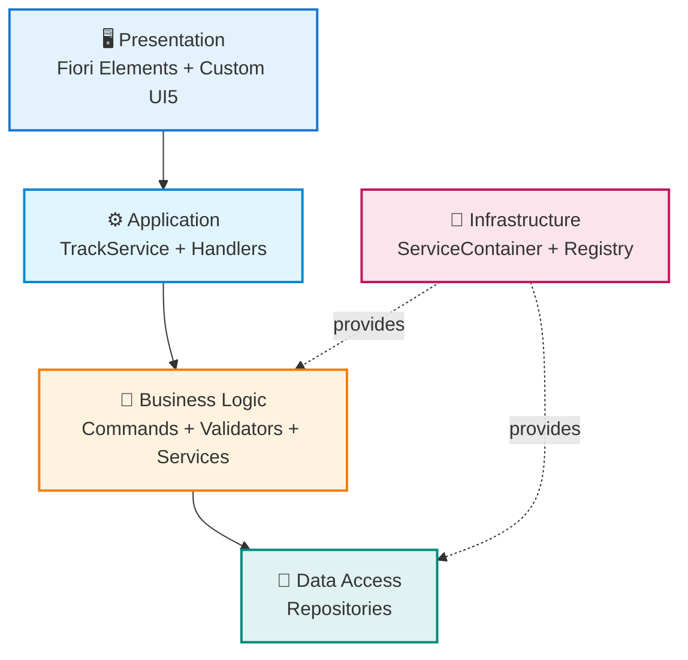

# 🕐 CAP Fiori Time Tracking

> **Eine Enterprise-Grade Zeiterfassungsanwendung mit SAP CAP, TypeScript und Fiori UI5**  
> Showcase für Clean Architecture, Design Patterns und Best Practices – von Entwickler für Entwickler dokumentiert! 🚀

[](https://www.typescriptlang.org/)
[](https://cap.cloud.sap)
[](https://ui5.sap.com)
[](LICENSE)

---

## ✨ Highlights

- 🎯 **100% TypeScript** - Typsicheres Backend ohne ein einziges JavaScript-File
- 🏗️ **Clean Architecture** - 5-Tier-Architektur mit 10 Design Patterns (Command, Repository, Factory, Strategy, ...)
- 🎨 **Dual UI Strategy** - Fiori Elements (annotations-driven) + Custom UI5 (TypeScript)
- 🔧 **Production-Ready** - Validierung, Error Handling, strukturiertes Logging, Holiday-API Integration
- 📚 **Vollständig dokumentiert** - arc42-Architektur, ADRs, Inline-JSDoc
- 🧪 **Testbar** - Jest Tests + REST Client für manuelle Tests
- 📘 **API Discovery** - Swagger UI Preview für TrackService während der Entwicklung

---

## 🚀 Quick Start

```bash
# 1. Clone & Install
git clone https://github.com/nimble-123/cap-fiori-timetracking.git
cd cap-fiori-timetracking
npm install

# 2. Start Development Server
npm run watch
```

**🌐 Browser öffnet automatisch:** `http://localhost:4004`  
**🔐 Login:** `max.mustermann@test.de` / Passwort: `max`
**🧭 Swagger UI (Dev):** `http://localhost:4004/$api-docs/odata/v4/track/`

👉 **Ausführliche Installation:** Siehe [GETTING_STARTED.md](GETTING_STARTED.md)

---

## 🏗️ Architektur-Übersicht

**5-Tier Clean Architecture** mit klarer Separation of Concerns:



**🎯 44 Pattern-Klassen** organisiert in 6 Kategorien:

- **Commands** (11) - Business Operations (CRUD, Generation, Balance)
- **Validators** (7) - Fachliche Validierung
- **Services** (7) - Domain Logic (TimeCalc, User, Holiday, Balance)
- **Repositories** (7) - Data Access Layer
- **Strategies** (2) - Generation Algorithms (Monthly, Yearly)
- **Factories** (2) - Object Creation (TimeEntry, Handler)

**+ 1 ServiceContainer (DI), 1 HandlerRegistry, 1 HandlerRegistrar, 1 Builder**  
**+ 1 DateUtil, 1 Logger, 14 Barrel Exports**

📖 **Deep Dive:** [ARCHITECTURE.md](docs/ARCHITECTURE.md) (vollständige arc42-Dokumentation)

---

## 🧩 Key Features

- 🕐 **Zeiterfassung** - CRUD für TimeEntries mit automatischer Berechnung (Brutto/Netto/Über-/Unterstunden)
- 📅 **Bulk-Generation** - Monatlich oder Jährlich inkl. Feiertage (API-Integration für 16 Bundesländer)
- 💰 **Balance-Tracking** - Monatssaldi, kumulierter Gesamtsaldo, Criticality-Indikatoren
- 🧰 **Customizing Singleton** - Pflege aller globalen Defaults (Arbeitszeiten, EntryTypes, Schwellenwerte, Integrations-URLs)
- 📎 **Dokumentenanhänge** - Upload & Download via SAP CAP Attachments Plugin (`@cap-js/attachments`) inkl. Fiori Attachment Facet
- 🔐 **Business Rules** - Validierung, Eindeutigkeit (1 Entry/User/Tag), Change Detection
- 🎨 **Dual UI** - Fiori Elements (annotations-driven) + Custom UI5 (TypeScript)
- 🏗️ **10 Design Patterns** - Command, Repository, Factory, Strategy, Validator, Handler, Registry, Registrar, Builder, ServiceContainer (DI)

📖 **Details:** [ARCHITECTURE.md](docs/ARCHITECTURE.md) - Komplette Bausteinsicht, Laufzeitsicht, Qualitätsszenarien

---

## 📂 Project Structure

<details>
<summary>Modulare 5-Tier-Architektur mit klarer Trennung der Verantwortlichkeiten:</summary>

```
cap-fiori-timetracking/
│
├── 📱 app/                                # Frontend Applications (TypeScript UI5)
│   │
│   ├── timetable/                         # Fiori Elements List Report App
│   │   ├── webapp/
│   │   │   ├── Component.ts               # UI5 Component (TypeScript)
│   │   │   ├── manifest.json              # App Descriptor
│   │   │   └── i18n/                      # Internationalization
│   │   └── annotations.cds                # UI Annotations
│   │
│   └── timetracking/                      # Custom UI5 Dashboard App
│       ├── webapp/
│       │   ├── controller/                # MVC Controller (TypeScript)
│       │   ├── view/                      # XML Views
│       │   ├── model/                     # Client Models
│       │   └── Component.ts
│       └── annotations.cds
│
├── 💾 db/                                 # Data Model & Master Data
│   │
│   ├── data-model.cds                     # Core Domain Model
│   │   ├── Users, Projects, TimeEntries
│   │   └── ActivityTypes, EntryTypes, GermanStates (CodeLists)
│   └── data/                              # CSV Test & Master Data
│
├── ⚙️ srv/                                # Backend Service Layer (100% TypeScript!)
│   │
│   ├── service-model.cds                  # Top-Level Service Model
│   ├── index.ts                           # Top-Level Barrel Export
│   │
│   └── track-service/                     # TrackService - Complete Service Module
│       │
│       ├── track-service.cds              # OData Service Definition
│       ├── track-service.ts               # 🎬 Orchestrator
│       ├── index.cds                      # Service Entry Point
│       ├── index.ts                       # Service Entry Point
│       │
│       ├── annotations/                   # 📝 UI Annotations
│       │   │
│       │   ├── annotations.cds            # Main Annotations File
│       │   │
│       │   ├── common/                    # Common Annotations
│       │   │   ├── authorization.cds
│       │   │   ├── capabilities.cds
│       │   │   ├── field-controls.cds
│       │   │   ├── labels.cds
│       │   │   └── value-helps.cds
│       │   │
│       │   └── ui/                        # UI-spezifisch pro Entity
│       │       ├── activities-ui.cds
│       │       ├── balance-ui.cds
│       │       ├── projects-ui.cds
│       │       ├── timeentries-ui.cds
│       │       ├── users-ui.cds
│       │       └── customizing-ui.cds
│       │
│       └── handler/                       # 🔧 Business Logic & Infrastructure
│           │
│           ├── index.ts                   # Handler Entry Point
│           │
│           ├── container/                 # 🏗️ Dependency Injection
│           │   ├── ServiceContainer.ts    # DI Container
│           │   │   - 6 Kategorien: Repos, Services, Validators, Strategies, Commands, Factories
│           │   │   - Type-safe Resolution mit Generics
│           │   │   - Auto-Wiring aller Dependencies
│           │   └── index.ts               # Barrel Export
│           │
│           ├── registry/                  # 📋 Event Handler Registry
│           │   ├── HandlerRegistry.ts     # Handler-Registrierung
│           │   │   - Unterstützt: before, on, after
│           │   │   - Fluent API & Logging
│           │   ├── HandlerRegistrar.ts    # Handler-Registrierung
│           │   └── index.ts               # Barrel Export
│           │
│           ├── setup/                     # 🏗️ Setup & Initialization
│           │   ├── HandlerSetup.ts        # Builder Pattern für Handler Setup
│           │   └── index.ts               # Barrel Export
│           │
│           ├── handlers/                  # 🎯 Event Handler (Separation of Concerns)
│           │   ├── TimeEntryHandlers.ts   # CRUD
│           │   ├── GenerationHandlers.ts  # Bulk-Generierung
│           │   ├── BalanceHandlers.ts     # Balance-Abfragen
│           │   └── index.ts               # Barrel Export
│           │
│           ├── commands/                  # 🎯 Command Pattern
│           │   ├── balance/               # Balance Commands
│           │   │   ├── GetMonthlyBalanceCommand.ts
│           │   │   ├── GetCurrentBalanceCommand.ts
│           │   │   ├── GetRecentBalancesCommand.ts
│           │   │   ├── GetVacationBalanceCommand.ts
│           │   │   └── GetSickLeaveBalanceCommand.ts
│           │   ├── generation/            # Generation Commands
│           │   │   ├── GenerateMonthlyCommand.ts
│           │   │   ├── GenerateYearlyCommand.ts
│           │   │   └── GetDefaultParamsCommand.ts
│           │   ├── time-entry/            # TimeEntry Commands
│           │   │   ├── CreateTimeEntryCommand.ts
│           │   │   ├── UpdateTimeEntryCommand.ts
│           │   │   └── RecalculateTimeEntryCommand.ts
│           │   └── index.ts               # Barrel Export
│           │
│           ├── services/                  # 💼 Domain Services
│           ├── repositories/              # 💾 Data Access Layer
│           ├── validators/                # ✅ Business Validation
│           ├── strategies/                # 📋 Generation Algorithms
│           ├── factories/                 # 🏭 Object Creation
│           └── utils/                     # 🛠️ Utilities (DateUtils, Logger)
│
├── @cds-models/                           # 🎯 Auto-generierte TypeScript Types
├── docs/                                  # 📚 Dokumentation
│   ├── ARCHITECTURE.md                    # arc42 Architektur
│   └── ADR/                               # Architecture Decision Records
├── test/                                  # 🧪 Tests
└── package.json, tsconfig.json, etc.
```

</details>
</br>

**📖 Detaillierte Struktur & Diagramme:** Siehe [ARCHITECTURE.md - Kapitel 5](docs/ARCHITECTURE.md#5-bausteinsicht)

---

## 📚 Dokumentation

### 📖 Für Einsteiger

| Dokument                                     | Inhalt                                     | Wann lesen?           |
| -------------------------------------------- | ------------------------------------------ | --------------------- |
| **[GETTING_STARTED.md](GETTING_STARTED.md)** | Installation, Quick Start, Troubleshooting | ⭐ **Start hier!**    |
| **[README.md](README.md)** (diese Datei)     | Executive Summary, Highlights, Navigation  | Überblick verschaffen |

### 🏗️ Für Architekten & Entwickler

| Dokument                                    | Inhalt                                     | Wann lesen?                            |
| ------------------------------------------- | ------------------------------------------ | -------------------------------------- |
| **[ARCHITECTURE.md](docs/ARCHITECTURE.md)** | arc42-Dokumentation (12 Kapitel)           | Deep Dive in Architektur               |
| **[ADR-Verzeichnis](docs/ADR/)**            | 12 Architecture Decision Records           | Warum wurden Entscheidungen getroffen? |
| **[CONTRIBUTING.md](CONTRIBUTING.md)**      | Code Style, Commit Conventions, PR-Process | Bevor du Code beiträgst                |

### 🎯 arc42-Kapitel Schnellzugriff

| Kapitel     | Inhalt                                              | Link                                                               |
| ----------- | --------------------------------------------------- | ------------------------------------------------------------------ |
| **Kap. 1**  | Aufgabenstellung, Qualitätsziele, Stakeholder       | [Einführung](docs/ARCHITECTURE.md#1-einführung-und-ziele)          |
| **Kap. 2**  | Technische Randbedingungen, Konventionen            | [Randbedingungen](docs/ARCHITECTURE.md#2-randbedingungen)          |
| **Kap. 3**  | Fachlicher/Technischer Kontext (C4-Diagramme)       | [Kontext](docs/ARCHITECTURE.md#3-kontextabgrenzung)                |
| **Kap. 4**  | Lösungsstrategie, Architektur-Treiber               | [Lösungsstrategie](docs/ARCHITECTURE.md#4-lösungsstrategie)        |
| **Kap. 5**  | Bausteinsicht (5 Ebenen, 10 Patterns)               | [Bausteinsicht](docs/ARCHITECTURE.md#5-bausteinsicht)              |
| **Kap. 6**  | Laufzeitsicht (Sequence-Diagramme)                  | [Laufzeitsicht](docs/ARCHITECTURE.md#6-laufzeitsicht)              |
| **Kap. 7**  | Verteilungssicht (Dev/Cloud/Docker)                 | [Verteilung](docs/ARCHITECTURE.md#7-verteilungssicht)              |
| **Kap. 8**  | Querschnittliche Konzepte (DI, Validation, Logging) | [Querschnitte](docs/ARCHITECTURE.md#8-querschnittliche-konzepte)   |
| **Kap. 9**  | Entscheidungen (ADR-Übersicht)                      | [Entscheidungen](docs/ARCHITECTURE.md#9-architekturentscheidungen) |
| **Kap. 10** | Qualitätsszenarien mit Metriken                     | [Qualität](docs/ARCHITECTURE.md#10-qualitätsanforderungen)         |
| **Kap. 11** | Risiken & Technische Schulden                       | [Risiken](docs/ARCHITECTURE.md#11-risiken-und-technische-schulden) |
| **Kap. 12** | Glossar (40+ Begriffe)                              | [Glossar](docs/ARCHITECTURE.md#12-glossar)                         |

---

## 🛠️ Development Scripts

| Befehl                         | Zweck                      | Wann verwenden?                    |
| ------------------------------ | -------------------------- | ---------------------------------- |
| `npm run watch`                | Dev-Server mit Auto-Reload | ⭐ **Hauptbefehl für Development** |
| `npm run build`                | TypeScript kompilieren     | Vor Commit (prüft Syntax)          |
| `npm run format`               | Prettier Formatierung      | **Vor jedem Commit (Pflicht!)**    |
| `npm run generate-entry-point` | CDS-Typen generieren       | Nach CDS-Model-Änderungen          |
| `npm test`                     | Jest Tests ausführen       | Nach Code-Änderungen               |

📖 **Vollständiger Workflow:** Siehe [GETTING_STARTED.md](GETTING_STARTED.md#-wichtige-npm-scripts)

---

## 🤝 Contributing

Willst du zum Projekt beitragen? **Awesome!** 🎉

### Schnell-Guide

1. **Fork & Clone** das Repository
2. **Branch erstellen**: `git checkout -b feat/my-feature`
3. **Code schreiben** (siehe [CONTRIBUTING.md](CONTRIBUTING.md) für Style Guidelines)
4. **Tests + Format**: `npm test && npm run format`
5. **Commit**: `git commit -m "feat: add awesome feature"` ([Conventional Commits](https://www.conventionalcommits.org/))
6. **Push & PR**: `git push origin feat/my-feature`

### Wichtige Regeln

- ✅ TypeScript ohne `any`-Types
- ✅ Design Patterns befolgen (Command, Repository, Factory, ...)
- ✅ JSDoc für alle public APIs
- ✅ Prettier vor Commit (`npm run format`)
- ✅ Conventional Commits (`feat:`, `fix:`, `docs:`, ...)

📖 **Vollständige Guidelines:** Siehe [CONTRIBUTING.md](CONTRIBUTING.md)

---

## 📊 Projekt-Stats

**45 Pattern-Klassen + 14 Barrel Exports:**

- 11 Commands (CRUD, Generation, Balance)
- 7 Validators (Domain-spezifisch)
- 7 Repositories (Data Access)
- 7 Services (Domain Logic + Customizing)
- 2 Strategies (Algorithms)
- 2 Factories (TimeEntry + Handler)
- 1 ServiceContainer (DI mit 6 Kategorien)
- 1 HandlerRegistry (Event-Driven)
- 1 HandlerRegistrar
- 1 HandlerSetup (Builder mit Fluent API)
- 3 Handler-Klassen
- 1 Logger
- 1 DateUtils

---

## 🌐 Links & Ressourcen

### Interne Dokumentation

- 📖 [ARCHITECTURE.md](docs/ARCHITECTURE.md) - Vollständige arc42-Dokumentation
- 🚀 [GETTING_STARTED.md](GETTING_STARTED.md) - Installation & Quick Start
- 🤝 [CONTRIBUTING.md](CONTRIBUTING.md) - Contribution Guidelines
- 📋 [ADR-Verzeichnis](docs/ADR/) - Architecture Decision Records

### Externe Ressourcen

- **SAP CAP**: [cap.cloud.sap](https://cap.cloud.sap) - Official CAP Documentation
- **SAPUI5**: [ui5.sap.com](https://ui5.sap.com) - UI5 SDK & Samples
- **TypeScript**: [typescriptlang.org](https://www.typescriptlang.org) - TypeScript Handbook
- **Fiori Guidelines**: [experience.sap.com/fiori-design](https://experience.sap.com/fiori-design) - Design Principles
- **Feiertage-API**: [feiertage-api.de](https://feiertage-api.de) - German Public Holidays

---

## � License

**MIT License** - Do whatever you want with this code! 🚀

---

## 🙏 Acknowledgments

- **SAP CAP Team** - Für das großartige Framework
- **UI5 Team** - Für Fiori Elements & UI5
- **TypeScript Team** - Für typsichere Entwicklung
- **Open Source Community** - Für Inspiration & Best Practices

---

**Happy Coding!** 🚀

_Built with ❤️ and TypeScript in 2025_
