```mermaid
sequenceDiagram
    autonumber
    actor User
    participant UI as 📱 Fiori UI
    participant SVC as 🎬 TrackService
    participant REG as 📋 HandlerRegistry
    participant H as 🎭 TimeEntryHandlers
    participant CMD as 🎯 CreateCommand
    participant VAL as ✅ Validator
    participant REPO as 💾 Repository
    participant EFACT as 🏭 EntryFactory
    participant CUSTOM as ⚙️ CustomizingService
    participant DB as 🗄️ Database

    Note over User,DB: 🚀 Request Processing Phase
    User->>UI: Erstelle TimeEntry
    UI->>SVC: POST /TimeEntries

    SVC->>REG: trigger 'before CREATE'
    REG->>H: handleCreate(req)
    H->>CMD: execute(tx, req.data)

    rect rgb(240, 248, 255)
    Note over CMD,VAL: ✅ Validation Phase
    CMD->>VAL: validateRequiredFieldsForCreate(entryData)
    VAL-->>CMD: entryType

    CMD->>VAL: validateUniqueEntryPerDay(tx, userID, workDate)
    VAL->>REPO: getEntryByUserAndDate(tx, userID, workDate)
    REPO->>DB: SELECT WHERE user+date
    DB-->>REPO: null (no entry)
    REPO-->>VAL: null
    VAL-->>CMD: ✅ unique

    CMD->>VAL: validateReferences(tx, entryData)

    alt project_ID provided
        VAL->>REPO: projectRepository.findByIdActive(tx, projectId)
        REPO->>DB: SELECT Project WHERE ID+active
        DB-->>REPO: Project record
        REPO-->>VAL: Project
        VAL-->>CMD: ✅ project active
    end

    alt activity_code provided
        VAL->>REPO: activityRepository.findByCode(tx, code)
        REPO->>DB: SELECT ActivityType WHERE code
        DB-->>REPO: ActivityType record
        REPO-->>VAL: ActivityType
        VAL-->>CMD: ✅ activity exists
    end

    VAL-->>CMD: ✅ all validations passed
    end

    rect rgb(240, 255, 240)
    Note over CMD,EFACT: 🏭 Factory Phase - Data Calculation
    CMD->>CUSTOM: getTimeEntryDefaults()
    CUSTOM-->>CMD: defaults (break, sources, codes)
    alt Work Entry (entryType = defaults.workEntryTypeCode)
        CMD->>EFACT: createWorkTimeData(userService, tx, userId, startTime, endTime, breakMin)
        EFACT->>EFACT: calculateWorkingHours(start, end, break)
        EFACT->>EFACT: calculateOvertimeAndUndertime(net, expected)
        EFACT-->>CMD: {breakMin, gross, net, overtime, undertime}
    else Non-Work Entry (Vacation/Sick/Holiday/Off)
        CMD->>EFACT: createNonWorkTimeData(userService, tx, userId)
        EFACT-->>CMD: {zeros for all time fields}
    end
    end

    CMD-->>H: calculatedData
    H->>H: Object.assign(req.data, calculatedData)
    H-->>SVC: enriched req.data

    rect rgb(255, 250, 240)
    Note over SVC,DB: 🗄️ Persistence (CAP Framework)
    SVC->>DB: INSERT INTO TimeEntries
    DB-->>SVC: saved entry with ID
    end

    SVC-->>UI: 201 Created + entry data
    UI-->>User: ✅ "Entry created!"
```

# 🏗️ CAP Fiori Time Tracking - Architekturdokumentation (arc42)

**Version:** 1.0  
**Stand:** Oktober 2025  
**Status:** ✅ In Verwendung

Zeiterfassungsanwendung auf Basis von SAP Cloud Application Programming Model mit TypeScript Backend und Fiori UI5 Frontend. Dokumentiert nach arc42-Template.

---

## 📑 Inhaltsverzeichnis

### [1. Einführung und Ziele](#1-einführung-und-ziele)

- [1.1 Aufgabenstellung](#11-aufgabenstellung)
- [1.2 Qualitätsziele](#12-qualitätsziele)
- [1.3 Stakeholder](#13-stakeholder)

### [2. Randbedingungen](#2-randbedingungen)

- [2.1 Technische Randbedingungen](#21-technische-randbedingungen)
- [2.2 Organisatorische Randbedingungen](#22-organisatorische-randbedingungen)
- [2.3 Konventionen](#23-konventionen)

### [3. Kontextabgrenzung](#3-kontextabgrenzung)

- [3.1 Fachlicher Kontext](#31-fachlicher-kontext)
- [3.2 Technischer Kontext](#32-technischer-kontext)

### [4. Lösungsstrategie](#4-lösungsstrategie)

- [4.1 Architektur-Treiber](#41-architektur-treiber)
- [4.2 Zentrale Lösungsansätze](#42-zentrale-lösungsansätze)

### [5. Bausteinsicht](#5-bausteinsicht)

- [5.1 Whitebox Gesamtsystem](#51-whitebox-gesamtsystem)
- [5.2 Ebene 2: Application Layer](#52-ebene-2-application-layer)
- [5.3 Ebene 3: Business Logic Layer](#53-ebene-3-business-logic-layer)
- [5.4 Ebene 4: Data Model](#54-ebene-4-data-model)
- [5.5 Ebene 5: Infrastructure Layer](#55-ebene-5-infrastructure-layer)
- [5.6 Ebene 6: User Interface Layer](#56-ebene-6-user-interface-layer)

### [6. Laufzeitsicht](#6-laufzeitsicht)

- [6.1 TimeEntry CREATE - Vollständiger Flow](#61-timeentry-create---vollständiger-flow)
- [6.2 Yearly Generation - Kompletter Ablauf](#62-yearly-generation---kompletter-ablauf)

### [7. Verteilungssicht](#7-verteilungssicht)

- [7.1 Infrastruktur Ebene 1: Entwicklungsumgebung](#71-infrastruktur-ebene-1-entwicklungsumgebung)
- [7.2 Infrastruktur Ebene 2: Cloud Foundry Production](#72-infrastruktur-ebene-2-cloud-foundry-production)
- [7.3 Infrastruktur Ebene 3: Docker Deployment](#73-infrastruktur-ebene-3-docker-deployment)

### [8. Querschnittliche Konzepte](#8-querschnittliche-konzepte)

- [8.1 Dependency Injection (ServiceContainer)](#81-dependency-injection-servicecontainer)
- [8.2 Validierung](#82-validierung)
- [8.3 Zeitberechnungen](#83-zeitberechnungen)
- [8.4 Error Handling](#84-error-handling)
- [8.5 Internationalisierung (i18n)](#85-internationalisierung-i18n)
- [8.6 Caching](#86-caching)
- [8.7 Performance](#87-performance)
- [8.8 Dokumentanhänge (Attachments Plugin)](#88-dokumentanhänge-attachments-plugin)
- [8.9 OpenAPI & Swagger UI](#89-openapi--swagger-ui)

### [9. Architekturentscheidungen](#9-architekturentscheidungen)

- [ADR-Übersicht](#adr-übersicht)
- [11 Architecture Decision Records](#11-architecture-decision-records)

### [10. Qualitätsanforderungen](#10-qualitätsanforderungen)

- [10.1 Qualitätsbaum](#101-qualitätsbaum)
- [10.2 Qualitätsszenarien](#102-qualitätsszenarien)

### [11. Risiken und technische Schulden](#11-risiken-und-technische-schulden)

- [11.1 Risiken](#111-risiken)
- [11.2 Technische Schulden](#112-technische-schulden)
- [11.3 Bekannte Probleme](#113-bekannte-probleme)

### [12. Glossar](#12-glossar)

- [Fachbegriffe A-Z](#glossar-von-a-z)
- [Design Patterns](#design-patterns-1)
- [Technische Begriffe](#technische-begriffe)

---

## 🔗 Navigation

- **← Zurück:** [README](../README.md) - Executive Summary
- **→ Weiter:** [GETTING_STARTED](../GETTING_STARTED.md) - Installation & Quick Start
- **📚 Mehr:** [CONTRIBUTING](../CONTRIBUTING.md) - Contribution Guidelines
- **📋 ADRs:** [ADR-Verzeichnis](ADR/) - Architecture Decision Records

---

## 1. Einführung und Ziele

### 1.1 Aufgabenstellung

**Geschäftliches Problem:**

Mitarbeiter in Unternehmen müssen ihre Arbeitszeiten dokumentieren für:

- Projektabrechnung und Controlling
- Personalabteilung (Urlaub, Krankheit, Überstunden)
- Gesetzliche Arbeitszeiterfassung

**Fachliche Anforderungen:**

| Kategorie              | Anforderungen                                                     |
| ---------------------- | ----------------------------------------------------------------- |
| **Zeitbuchung**        | Erfassung von Start-/Endzeit, Pausen, Projekt-Zuordnung           |
| **Berechnungen**       | Automatische Ermittlung von Brutto-/Nettozeit, Über-/Unterstunden |
| **Massenoperationen**  | Monatliche oder jährliche Vorgenerierung von Arbeitstagen         |
| **Saldoverwaltung**    | Zeitkonto-Tracking über Monate hinweg                             |
| **Abwesenheiten**      | Urlaub, Krankheit, Feiertage (bundeslandabhängig)                 |
| **Projektcontrolling** | Buchung auf Projekte und Tätigkeitsarten                          |

**Zielgruppe:**

- Mitarbeiter (täglich)
- Projektleiter (wöchentlich für Auswertungen)
- Personalabteilung (monatlich)
- Entwickler (als Referenzimplementierung)

---

### 1.2 Qualitätsziele

Die Top-5-Qualitätsziele nach Priorität:

| Prio | Qualitätsziel     | Konkrete Metrik                                  | Begründung                                 |
| ---- | ----------------- | ------------------------------------------------ | ------------------------------------------ |
| 1    | **Wartbarkeit**   | Neue Funktionen in max. 2 Arbeitstagen umsetzbar | Häufige Änderungswünsche durch Business    |
| 2    | **Testbarkeit**   | Alle Geschäftslogik-Klassen isoliert testbar     | Hohe Code-Qualität ohne Regressions-Risiko |
| 3    | **Performance**   | Jahresgenerierung < 2 Sekunden                   | Nutzer-Akzeptanz bei Massenoperationen     |
| 4    | **Typsicherheit** | 100% TypeScript, keine any-Types                 | Fehler zur Compile-Zeit statt Laufzeit     |
| 5    | **Bedienbarkeit** | Neue Buchung in < 30 Sekunden                    | Tägliche Nutzung muss schnell sein         |

**Qualitätsszenarien (Beispiele):**

- **QS-1 (Wartbarkeit):** Ein Entwickler kann eine neue Balance-Berechnung (z.B. für Gleitzeit) in 2 Tagen hinzufügen, indem er einen neuen Command und Service erstellt.
- **QS-2 (Testbarkeit):** Alle 10 Commands können mit Mock-Dependencies isoliert getestet werden ohne CAP-Server.
- **QS-3 (Performance):** Generierung von 365 Tagen inkl. Feiertags-API-Aufruf dauert max. 2 Sekunden.

---

### 1.3 Stakeholder

| Rolle                    | Kontakt            | Erwartungshaltung                          | Relevanz    |
| ------------------------ | ------------------ | ------------------------------------------ | ----------- |
| **Entwickler**           | Development Team   | Saubere Architektur, gute Doku, TypeScript | ⭐⭐⭐ Hoch |
| **Mitarbeiter**          | End Users          | Schnelle, einfache Zeitbuchung             | ⭐⭐⭐ Hoch |
| **Projektleiter**        | Management         | Projekt-Zeitauswertungen                   | ⭐⭐ Mittel |
| **HR**                   | Personalabteilung  | Urlaubstage, Krankentage                   | ⭐⭐ Mittel |
| **Software-Architekten** | Architecture Board | Referenzimplementierung für CAP+TypeScript | ⭐⭐ Mittel |
| **Operations**           | IT-Betrieb         | Einfaches Deployment, Monitoring           | ⭐ Niedrig  |

---

## 2. Randbedingungen

### 2.1 Technische Randbedingungen

| Randbedingung                  | Beschreibung                                          | Auswirkung                                                    |
| ------------------------------ | ----------------------------------------------------- | ------------------------------------------------------------- |
| **SAP CAP Framework**          | Cloud Application Programming Model (Node.js-basiert) | Architektur muss CAP-Events verwenden                         |
| **TypeScript >= 5.0**          | Vollständig typisierte Codebase                       | Strikte Type-Checks aktiviert                                 |
| **UI5 >= 1.120**               | SAP UI5 für Frontend-Anwendungen                      | Fiori Guidelines einhalten                                    |
| **Node.js >= 18 LTS**          | Laufzeitumgebung                                      | Verwendung von ES2022-Features möglich                        |
| **OData V4**                   | REST-Protokoll für UI-Backend-Kommunikation           | Komplexe Queries via $expand/$filter                          |
| **@cap-js/attachments**        | Offizielles CAP Attachments Plugin für Dateiablagen   | Standardisierte Upload/Download-Flows, Metadaten & Persistenz |
| **SQLite (Dev) / HANA (Prod)** | Datenbank-Technologien                                | SQL muss kompatibel sein                                      |

**Entwicklungswerkzeuge:**

- **VS Code** als primäre IDE
- **ESLint + Prettier** für Code-Qualität (verpflichtend)
- **Jest** für Unit-Tests
- **Git** für Versionskontrolle

---

### 2.2 Organisatorische Randbedingungen

| Randbedingung     | Beschreibung                                                           |
| ----------------- | ---------------------------------------------------------------------- |
| **Team**          | 1-3 Entwickler (Fullstack CAP/UI5)                                     |
| **Methodik**      | Agile Entwicklung, 2-Wochen-Sprints                                    |
| **Code Reviews**  | Mandatory für alle Pull Requests                                       |
| **Dokumentation** | ADRs (Architecture Decision Records) für alle wichtigen Entscheidungen |
| **Deployment**    | CI/CD-ready, automatisierte Builds                                     |

---

### 2.3 Konventionen

**Code-Konventionen:**

- **Sprache:** Englisch für Code, Deutsch für Doku
- **Naming:** camelCase (Variables), PascalCase (Classes), kebab-case (Files)
- **Commits:** Conventional Commits (`feat:`, `fix:`, `docs:`)
- **File Structure:** Barrel Exports (`index.ts`) für jedes Verzeichnis
- **JSDoc:** Pflicht für alle public APIs

**Architektur-Konventionen:**

- Dependency Injection über ServiceContainer (keine direkten `new`-Aufrufe)
- Business-Logik nur in Commands
- Daten-Zugriff nur über Repositories
- Handler sind "thin orchestrators"

---

## 3. Kontextabgrenzung

### 3.1 Fachlicher Kontext

**Externe Kommunikationspartner:**

```mermaid
---
config:
  layout: elk
  elk:
    mergeEdges: true
  theme: neo
---
graph LR
    User[👤 Mitarbeiter] -->|erfasst Zeiten| App[⚙️ TimeTracking App]
    App -->|ruft Feiertage ab| API[🎉 feiertage-api.de]
    App -->|könnte exportieren nach| HR[📊 HR-System]
    App -->|könnte importieren von| PM[📋 Projekt-Management]

    style App fill:#e1f5ff,stroke:#0288d1,stroke-width:3px
    style API fill:#fff3e0,stroke:#f57c00,stroke-width:2px
    style HR fill:#f3e5f5,stroke:#8e24aa,stroke-width:2px
    style PM fill:#e8f5e9,stroke:#43a047,stroke-width:2px
```



**Status-Modell & Workflow:**

- `TimeEntryStatuses` bildet den bearbeitbaren Status-Lebenszyklus (`O`pen, `P`rocessed, `D`one, `R`eleased) inklusive erlaubter Transitionen (`from_code` / `to_code`) und UI-Freigaben (`allowDoneAction`, `allowReleaseAction`) ab.
- `TimeEntries.status_code` assoziiert jede Buchung mit genau einem Status. Änderungen am Eintrag erzwingen automatisch den `Processed`-Status; eine finale Freigabe (`Released`) erfolgt ausschließlich über dedizierte Actions.
- Das `Customizing`-Singleton liefert alle verwendeten Status-Codes als Konfiguration, sodass Mandanten eigene Codes pflegen können, ohne Business-Logik anfassen zu müssen.
- Neue Statusaktionen `markTimeEntriesDone` und `releaseTimeEntries` sorgen für Bulk-Updates über die OData-API und respektieren die Stammdaten-Transitionen sowie Sperren für endgültig freigegebene Einträge.

**Schnittstellen-Beschreibung:**

| Partner                            | Eingabe                      | Ausgabe                          | Protokoll    |
| ---------------------------------- | ---------------------------- | -------------------------------- | ------------ |
| **Mitarbeiter**                    | Zeitbuchungen, Abfrage Saldo | Berechnete Zeiten, Balance-Daten | UI5 Frontend |
| **feiertage-api.de**               | Jahr, Bundesland             | JSON mit Feiertagen              | REST/HTTPS   |
| **HR-System** (zukünftig)          | -                            | CSV/Excel Export                 | File         |
| **Projekt-Management** (zukünftig) | Projekt-Stammdaten           | -                                | REST API     |

---

### 3.2 Technischer Kontext

**Deployment-Übersicht:**

```mermaid
C4Context
    Person(user, "Endanwender", "Mitarbeiter erfasst Zeiten")

    System_Boundary(app, "CAP Fiori TimeTracking") {
        Container(ui1, "Timetable App", "Fiori Elements", "List/Detail für Einträge")
        Container(ui2, "Dashboard App", "Custom UI5", "Übersicht & Charts")
        Container(srv, "TrackService", "TypeScript CAP", "OData V4 Service")
        ContainerDb(db, "Database", "SQLite/HANA", "Persistierung")
    }

    System_Ext(holidays, "Feiertage-API", "feiertage-api.de", "Deutsche Feiertage")

    Rel(user, ui1, "verwendet", "HTTPS")
    Rel(user, ui2, "verwendet", "HTTPS")
    Rel(ui1, srv, "OData V4", "HTTPS")
    Rel(ui2, srv, "OData V4", "HTTPS")
    Rel(srv, db, "SQL Queries", "JDBC")
    Rel(srv, holidays, "REST API", "HTTPS")
```



**Technologie-Mapping:**

| Komponente        | Technologie        | Port/URL              | Verantwortlichkeit       |
| ----------------- | ------------------ | --------------------- | ------------------------ |
| **Timetable App** | UI5 Fiori Elements | :4004/timetable/      | Annotations-basiertes UI |
| **Dashboard App** | UI5 Custom         | :4004/timetracking/   | Freies Dashboard-Design  |
| **TrackService**  | CAP TypeScript     | :4004/odata/v4/track/ | Business-Logik           |
| **Database**      | SQLite             | In-Memory             | Datenhaltung             |
| **Feiertage-API** | REST               | feiertage-api.de/api/ | Externe Datenquelle      |

**Wichtige Datenformate:**

- **OData V4**: JSON für Entity-Daten
- **CDS Types**: Auto-generiert via @cap-js/cds-typer
- **Feiertage**: JSON `{"Neujahr": {"datum": "2025-01-01", "hinweis": ""}}`

---

## 4. Lösungsstrategie

### 4.1 Zentrale Architektur-Ansätze

**Gewählte Strategie: Clean Architecture mit Design Patterns**

Die Anwendung folgt einer **strikten 3-Tier-Architektur** mit klarer Trennung:

| Schicht            | Technologie                    | Verantwortung                    |
| ------------------ | ------------------------------ | -------------------------------- |
| **Presentation**   | UI5 (Fiori Elements + Custom)  | User Interface, Rendering        |
| **Application**    | CAP Service (TypeScript)       | Request-Handling, Orchestrierung |
| **Business Logic** | Commands, Validators, Services | Fachlogik, Berechnungen          |
| **Data Access**    | Repositories                   | SQL-Queries, Datenbankzugriff    |

**Architektur-Treiber:**

| Qualitätsziel       | Gewählter Ansatz           | Umsetzung                                    |
| ------------------- | -------------------------- | -------------------------------------------- |
| **Wartbarkeit**     | Clean Architecture + SOLID | Jede Klasse hat genau eine Verantwortung     |
| **Testbarkeit**     | Dependency Injection       | ServiceContainer managed alle Abhängigkeiten |
| **Erweiterbarkeit** | Design Patterns            | Strategy (Algorithmen), Command (Operations) |
| **Typsicherheit**   | TypeScript Strict Mode     | Auto-generierte Types aus CDS-Models         |
| **Performance**     | Repository-Pattern         | Batch-Operations, Caching (HolidayService)   |

---

### 4.2 Wichtigste Design-Entscheidungen

**Top-10-Entscheidungen:**

1. **TypeScript statt JavaScript** → Compile-Time-Validierung, besseres Tooling
2. **10 Design Patterns** → Strukturierte, wiederverwendbare Architektur
3. **ServiceContainer (DI)** → Zentrale Dependency-Auflösung
4. **Command Pattern** → Kapselt Business-Operations
5. **Repository Pattern** → Abstrahiert Datenzugriff
6. **Factory Pattern** → Konsistente Domain-Objekte
7. **Dual UI Strategy** → Fiori Elements (schnell) + Custom (flexibel)
8. **Modular CDS Annotations** → common/ + ui/ statt Monolith
9. **Customizing Singleton** → Globale Defaults zentral via CustomizingService gepflegt
10. **ADR-Dokumentation & Tooling** → Nachvollziehbare Entscheidungen + REST Client Tests

Details zu allen Entscheidungen: siehe [Kapitel 9 - Architekturentscheidungen](#9-architekturentscheidungen)

---

### 4.3 Qualitätssicherung

**Maßnahmen pro Qualitätsziel:**

| Ziel              | Maßnahme                             | Werkzeug                           |
| ----------------- | ------------------------------------ | ---------------------------------- |
| **Wartbarkeit**   | Clean Architecture, SOLID Principles | ESLint Rules, Code Reviews         |
| **Testbarkeit**   | DI, Interface Segregation            | Jest (Unit Tests)                  |
| **Performance**   | Batch Operations, Caching            | Performance-Messung bei Generation |
| **Typsicherheit** | TypeScript Strict Mode               | TSC Compiler                       |
| **Bedienbarkeit** | Fiori Guidelines                     | UX Reviews                         |

---

## 5. Bausteinsicht

### 5.1 Ebene 1: Gesamtsystem (Whitebox)

**Kontext:** Das Gesamtsystem zeigt die 5 Hauptschichten der Anwendung mit klaren Verantwortlichkeiten.

```mermaid
---
config:
  layout: elk
  elk:
    mergeEdges: true
    nodePlacementStrategy: LINEAR_SEGMENTS
  theme: neo
---
graph TB
    subgraph "🖥️ Presentation Layer - TypeScript UI5"
        UI1["📊 Fiori Elements App<br/>Timetable List/Detail"]
        UI2["🏠 Custom UI5 App<br/>Dashboard & Charts"]
    end

    subgraph "⚙️ Application Layer - CAP Service"
        SVC["🎬 TrackService<br/>Orchestrator"]
        HANDLERS["🎭 Handler Classes<br/>TimeEntry | Generation | Balance"]
    end

    subgraph "💼 Business Logic Layer - Domain Services"
        CMD["🎯 Commands<br/>10 Commands für CRUD, Gen, Balance"]
        VAL["✅ Validators<br/>7 Validators"]
        SRV["💼 Domain Services<br/>TimeCalc | User | Holiday | Balance"]
        STRAT["📋 Strategies<br/>Monthly | Yearly Generation"]
        FACT["🏭 Factory<br/>TimeEntry Creation Rules"]
    end

    subgraph "💾 Data Access Layer"
        REPO["💾 Repositories<br/>TimeEntry | User | Project | Activity"]
        DB[("🗄️ Database<br/>SQLite In-Memory")]
    end

    subgraph "🔧 Infrastructure Layer"
        CONTAINER["🏗️ ServiceContainer<br/>Dependency Injection<br/>6 Kategorien"]
        REGISTRY["📋 HandlerRegistry<br/>before | on | after Events"]
    end

    %% UI to Service
    UI1 --> SVC
    UI2 --> SVC

    %% Service Infrastructure
    SVC --> REGISTRY
    REGISTRY --> HANDLERS
    SVC --> CONTAINER

    %% Handler to Business Logic
    HANDLERS --> CMD

    %% Command Dependencies
    CMD --> VAL
    CMD --> SRV
    CMD --> STRAT
    CMD --> FACT
    CMD --> REPO

    %% Services to Repos
    SRV --> REPO
    VAL --> REPO

    %% Repos to DB
    REPO --> DB

    %% Container provides everything
    CONTAINER -.provides.-> CMD
    CONTAINER -.provides.-> VAL
    CONTAINER -.provides.-> SRV
    CONTAINER -.provides.-> STRAT
    CONTAINER -.provides.-> FACT
    CONTAINER -.provides.-> REPO

    %% Styling
    style SVC fill:#e1f5ff,stroke:#0288d1,stroke-width:3px
    style HANDLERS fill:#e1f5ff,stroke:#0288d1,stroke-width:2px
    style CMD fill:#fff3e0,stroke:#f57c00,stroke-width:2px
    style VAL fill:#f3e5f5,stroke:#8e24aa,stroke-width:2px
    style SRV fill:#e8f5e9,stroke:#43a047,stroke-width:2px
    style STRAT fill:#fff9c4,stroke:#fbc02d,stroke-width:2px
    style FACT fill:#ffe0b2,stroke:#fb8c00,stroke-width:2px
    style REPO fill:#e0f2f1,stroke:#00897b,stroke-width:2px
    style DB fill:#b2dfdb,stroke:#00695c,stroke-width:3px
    style CONTAINER fill:#fce4ec,stroke:#c2185b,stroke-width:3px
    style REGISTRY fill:#f3e5f5,stroke:#7b1fa2,stroke-width:2px
    style UI1 fill:#e3f2fd,stroke:#1976d2,stroke-width:2px
    style UI2 fill:#e3f2fd,stroke:#1976d2,stroke-width:2px
```



**Enthaltene Bausteine (Ebene 1):**

| Baustein                 | Verantwortung                         | Schnittstellen           |
| ------------------------ | ------------------------------------- | ------------------------ |
| **Presentation Layer**   | UI-Rendering, User-Interaktion        | OData V4 Consumer        |
| **Application Layer**    | Request-Orchestrierung, Event-Routing | OData V4 Provider        |
| **Business Logic Layer** | Fachlogik, Berechnungen, Validierung  | Interne APIs             |
| **Data Access Layer**    | SQL-Queries, Datenbankzugriff         | CAP CQN (Query Notation) |
| **Infrastructure Layer** | Dependency Management, Event Registry | Service Locator          |

---

### 5.2 Ebene 2: Application Layer (Whitebox TrackService)

**Zweck:** Der TrackService ist der zentrale Orchestrator. Er registriert Event-Handler, löst Dependencies auf und routet Requests.

**Schnittstellen:**

- **Eingehend:** HTTP/OData V4 Requests von UI5-Apps
- **Ausgehend:** Events an Handler-Klassen, Dependency-Resolution über Container

**Ablauf der Initialisierung:**

```mermaid
sequenceDiagram
  autonumber
  participant Main as 🎬 cds.serve()
  participant SVC as 🎬 TrackService
  participant CONTAINER as 🧩 ServiceContainer
  participant CUSTOM as ⚙️ CustomizingService
  participant DATE as 🛠️ DateUtils
  participant SETUP as 🏗️ HandlerSetup
  participant FACTORY as 🏭 HandlerFactory
  participant REGISTRAR as 📝 HandlerRegistrar
  participant REG as 📋 HandlerRegistry

  Main->>SVC: init()
  SVC->>CONTAINER: build(entities)
  CONTAINER->>CONTAINER: Erstelle alle 30 Dependencies
  CONTAINER-->>SVC: ✅ Container ready

  SVC->>CONTAINER: getService('customizing')
  CONTAINER-->>SVC: reference(CustomizingService)
  SVC->>CUSTOM: initialize()
  CUSTOM->>CUSTOM: load() & cache defaults
  CUSTOM-->>SVC: ✅ Defaults verfügbar
  SVC->>DATE: configure(locale, workingDays)
  DATE-->>SVC: setup complete

  SVC->>REG: new HandlerRegistry()
  SVC->>SETUP: create(container, registry)
  SETUP->>FACTORY: new HandlerFactory(container)
  SETUP->>REGISTRAR: new HandlerRegistrar(registry)

  SETUP->>SETUP: withAllHandlers()
  SETUP->>FACTORY: createTimeEntryHandlers()
  FACTORY-->>SETUP: handlers
  SETUP->>REGISTRAR: registerTimeEntryHandlers()
  REGISTRAR->>REG: register('before', 'CREATE', ...)

  SETUP->>SETUP: apply(service)
  SETUP->>REG: apply(service)
  REG->>SVC: Registriere 15+ Event-Handler

  SVC-->>Main: ✅ Service ready
```



**Enthaltene Bausteine (Ebene 2):**

| Baustein             | Typ            | Verantwortung                                                                             |
| -------------------- | -------------- | ----------------------------------------------------------------------------------------- |
| `ServiceContainer`   | Infrastructure | DI Container (6 Kategorien: Repos, Services, Validators, Strategies, Commands, Factories) |
| `HandlerRegistry`    | Infrastructure | Event-Handler-Verwaltung (before/on/after)                                                |
| `HandlerSetup`       | Builder        | Fluent API für Handler-Konfiguration                                                      |
| `HandlerFactory`     | Factory        | Erstellt Handler-Instanzen mit Dependencies                                               |
| `HandlerRegistrar`   | Registrar      | Registriert Handler beim Registry                                                         |
| `TimeEntryHandlers`  | Handler        | CRUD-Operations für TimeEntries                                                           |
| `GenerationHandlers` | Handler        | Bulk-Generierung (Monthly/Yearly)                                                         |
| `BalanceHandlers`    | Handler        | Balance-Abfragen                                                                          |

**Wichtiger Unterschied: CREATE vs. Generation:**

- **CREATE (CRUD):** Handler enriched nur `req.data`, CAP macht automatisch INSERT
- **Generation (Bulk):** Command erzeugt Array, expliziter `repository.insertBatch()` Call

**Weiterführende Pattern-Dokumentation:** Für detaillierte Beschreibungen der eingesetzten Design-Patterns (ServiceContainer, HandlerRegistry, Commands, Repositories, Factories, Strategies, Validators) siehe das Pattern-Index-Dokument: [Pattern-Index](./patterns/README.md)

---

### 5.3 Ebene 3: Business Logic Layer (Whitebox Commands)

**Zweck:** Commands kapseln EINE Business-Operation. Sie orchestrieren Validator + Service + Repository + Factory.

**Command-Übersicht:**

| Command                       | Kategorie  | Verantwortung                             | Dependencies                                                    |
| ----------------------------- | ---------- | ----------------------------------------- | --------------------------------------------------------------- |
| `CreateTimeEntryCommand`      | TimeEntry  | Validierung & Berechnung für neue Entries | Validator, UserService, Factory, CustomizingService             |
| `UpdateTimeEntryCommand`      | TimeEntry  | Change Detection & Neuberechnung          | Validator, Repository, Factory, UserService, CustomizingService |
| `RecalculateTimeEntryCommand` | TimeEntry  | Bound Action: Werte neu berechnen         | Repository, Factory, UserService, CustomizingService            |
| `MarkTimeEntriesDoneCommand`  | Status     | Bulk-Übergang auf Status „Done“           | Repository, CustomizingService                                  |
| `ReleaseTimeEntriesCommand`   | Status     | Bulk-Übergang auf Status „Released“       | Repository, CustomizingService                                  |
| `GenerateMonthlyCommand`      | Generation | Monat mit Stats generieren                | Validator, Strategy, Repository                                 |
| `GenerateYearlyCommand`       | Generation | Jahr mit Feiertagen generieren            | Validator, Strategy, HolidayService                             |
| `GetDefaultParamsCommand`     | Generation | Default-Werte für Generierung             | UserService                                                     |
| `GetMonthlyBalanceCommand`    | Balance    | Monatssaldo mit Criticality               | BalanceService, Validator                                       |
| `GetCurrentBalanceCommand`    | Balance    | Kumulierter Gesamtsaldo                   | BalanceService                                                  |
| `GetRecentBalancesCommand`    | Balance    | Historische Balances (6 Monate)           | BalanceService, Validator                                       |
| `GetVacationBalanceCommand`   | Balance    | Urlaubssaldo-Berechnung                   | VacationBalanceService                                          |
| `GetSickLeaveBalanceCommand`  | Balance    | Krankheitsstand-Berechnung                | SickLeaveBalanceService                                         |

**Ablauf eines Commands (Beispiel CreateTimeEntryCommand):**

1. **Validierung:** Pflichtfelder, Eindeutigkeit, Referenzen prüfen
2. **User-Lookup:** Aktuelle User-Daten laden (für expectedDailyHours)
3. **Factory:** Berechnete Daten erstellen (gross, net, overtime)
4. **Return:** Strukturiertes Objekt zurückgeben (nicht gespeichert!)

---

### 5.4 Ebene 4: Datenmodell (Domain Model)

**ER-Diagramm:**


**Global Defaults (Customizing Singleton):**

- Die Entity `Customizing` liefert alle zentralen Defaults (Arbeitsbeginn, Pausenlänge, EntryType- und Source-Codes).
- Balance-, Urlaubs- und Krankheitsschwellen werden hier gepflegt und von Services/Validatoren konsumiert.
- UI-Toggles: `hideAttachmentFacet` steuert das Attachment-Facet der Fiori Object Page und kann über das Singleton von Key Usern ein-/ausgeschaltet werden.
- Enthält Integrationsparameter (Feiertags-API, Locale) und Fallback-Werte für Benutzer (Wochenstunden, Arbeitstage, Demo-User).
- `CustomizingService` cached den Datensatz und wird im `TrackService` beim Start initialisiert.

**Wichtige Designentscheidungen:**

- **Calculated Fields:** `durationHoursGross`, `durationHoursNet`, `overtimeHours`, `undertimeHours` werden server-seitig berechnet und sind `@readonly`
- **Eindeutigkeit:** Nur ein TimeEntry pro User+Datum (validiert im Repository)
- **EntryTypes:** CodeList mit 8 Typen (W=Work, V=Vacation, S=Sick, H=Holiday, O=Off, B=Business Trip, F=Flextime, G=Gleitzeit)
- **Source-Feld:** Unterscheidet UI-Eingabe (`UI`) von generierten Entries (`GENERATED`), beide Codes sind im Customizing pflegbar
- **Anhänge:** `TimeEntries` kompositionieren auf `Attachments` des offiziellen CAP-Plugins (`@cap-js/attachments`) für Upload, Metadaten und Binärinhalte.

---

### 5.5 Ebene 5: Infrastruktur Layer (ServiceContainer & HandlerRegistry)

Der Infrastruktur-Layer bildet das Fundament zwischen CAP-Runtime und unserer Business-Logik. Hier werden alle Abhängigkeiten aufgebaut, konfiguriert und die Event-Handler registriert. Ziel ist es, den TrackService schlank zu halten und eine zentrale Stelle für Querschnittsaufgaben wie Dependency Injection, Caching, Logging und Date-Konfiguration zu besitzen.

**Beteiligte Bausteine und Verantwortungen:**

| Baustein                               | Verantwortung                                                                                                                                                        | Wichtige Artefakte                                                                                                |
| -------------------------------------- | -------------------------------------------------------------------------------------------------------------------------------------------------------------------- | ----------------------------------------------------------------------------------------------------------------- |
| `ServiceContainer`                     | Baut Repositories, Services, Validators, Strategies, Factories und Commands auf. Verwaltet sechs Kategorien und liefert typsichere Getter.                           | `srv/track-service/handler/container/ServiceContainer.ts`                                                         |
| `CustomizingService`                   | Lädt das `Customizing`-Singleton, cached globale Defaults und stellt typisierte Getter für alle Schichten bereit. Initialisiert Locale/Working-Days für `DateUtils`. | `srv/track-service/handler/services/CustomizingService.ts`, `db/data-model.cds`                                   |
| `HandlerSetup` & `HandlerFactory`      | Fluent API zum Zusammenstellen aller Handlergruppen (TimeEntry, Generation, Balance).                                                                                | `srv/track-service/handler/setup/HandlerSetup.ts`, `srv/track-service/handler/factories/HandlerFactory.ts`        |
| `HandlerRegistry` & `HandlerRegistrar` | Registrieren before/on/after Events bei CAP. Gewährleisten transparente Handler-Ketten mit Logging.                                                                  | `srv/track-service/handler/registry/HandlerRegistry.ts`, `srv/track-service/handler/registry/HandlerRegistrar.ts` |
| `DateUtils`                            | Infrastruktur-Hilfsklasse zur zeitzonen-sicheren Verarbeitung. Locale und Standard-Arbeitstage werden beim Service-Start gesetzt.                                    | `srv/track-service/handler/utils/DateUtils.ts`                                                                    |
| `Logger`                               | Einheitliche, farbcodierte Log-Ausgabe für Service-, Command- und Handler-Layer.                                                                                     | `srv/track-service/handler/utils/Logger.ts`                                                                       |

**Initialisierungsablauf (vereinfacht):**

```mermaid
sequenceDiagram
    autonumber
    participant SVC as 🎬 TrackService
    participant CONTAINER as 🧩 ServiceContainer
    participant CUSTOM as ⚙️ CustomizingService
    participant DATE as 🛠️ DateUtils
    participant SETUP as 🏗️ HandlerSetup
    participant REGISTRAR as 📝 HandlerRegistrar
    participant REG as 📋 HandlerRegistry

    SVC->>CONTAINER: build(entities)
    CONTAINER->>CONTAINER: Registriere Repos, Services, Validators, Commands
    CONTAINER-->>SVC: Dependencies bereit

    SVC->>CUSTOM: initialize()
    CUSTOM->>CUSTOM: lade Customizing Singleton
    CUSTOM->>DATE: configure(locale, workingDays)
    DATE-->>SVC: Locale/Working Days gesetzt

    SVC->>REG: new HandlerRegistry()
    SVC->>SETUP: create(container, registry)
    SETUP->>REGISTRAR: new HandlerRegistrar(registry)
    SETUP->>SETUP: withAllHandlers()
    SETUP->>REGISTRAR: registerTimeEntry/Generation/Balance
    REGISTRAR->>REG: apply(service)
    REG-->>SVC: Handler registriert
```



**Vorteile der Infrastruktur-Schicht:**

- **Zentrale Steuerung:** Alle Abhängigkeiten und Querschnittsfunktionen sind an einem Ort gebündelt – Änderungen wirken sofort auf alle Handler/Services.
- **Testbarkeit:** Unit-Tests können einzelne Bausteine (z. B. Commands) isoliert instanziieren oder den Container mocken.
- **Erweiterbarkeit:** Neue Handlergruppen oder Services werden im Container registriert, ohne dass bestehender Code angepasst werden muss.
- **Konfigurierbarkeit:** `CustomizingService` erlaubt es, Defaults ohne Codeänderungen zu variieren und stellt sie konsistent bereit.

Damit ist der Infrastruktur-Layer die „Schaltzentrale“ des TrackService und stellt sicher, dass Application- und Business-Layer fokussiert auf Fachlogik bleiben.

---

### 5.6 Ebene 6: User Interface Layer (Fiori Elements & Freestyle Apps)

Wir haben zwei verschiedene UI5-Apps, die zeigen, wie unterschiedlich man an Fiori-Entwicklung rangehen kann:

#### 📋 Timetable App (Fiori Elements) - Der schnelle Weg

Die "No-Code"-Variante! Fiori Elements generiert automatisch eine komplette App aus deinen Annotations:

- **List Report & Object Page** für TimeEntries - alles automatisch generiert
- **Draft-enabled** für komfortable Bearbeitung mit "Speichern" und "Verwerfen"
- **Smart Controls** mit automatischer Validierung aus dem Backend
- **Responsive Design** out-of-the-box für Desktop/Tablet/Mobile
- **TypeScript Component** für eigene Extensions
- **Filterbar & Search** automatisch aus Annotations

Die meiste Arbeit passiert in den `annotations.cds` Files. Wenig Code, viel Power! 💪

**Technische Details:**

- **App-Typ**: Fiori Elements List Report & Object Page
- **UI5 Version**: Latest (definiert in `ui5.yaml`)
- **TypeScript**: `webapp/Component.ts` für Extensions
- **Annotations**: `app/timetable/annotations.cds` definiert komplettes UI
- **Features**: Draft, Filterbar, Search, ValueHelp (F4), Side Effects

**Beispiel Annotations** (aus `annotations.cds`):

```cds
annotate TrackService.TimeEntries with @(
    UI.LineItem: [
        { Value: workDate, Label: '{i18n>workDate}' },
        { Value: user.name, Label: '{i18n>user}' },
        { Value: project.name, Label: '{i18n>project}' },
        { Value: durationHoursNet, Label: '{i18n>netHours}' },
        { Value: overtimeHours, Label: '{i18n>overtime}' }
    ],
    UI.HeaderInfo: {
        TypeName: '{i18n>timeEntry}',
        TypeNamePlural: '{i18n>timeEntries}',
        Title: { Value: workDate }
    }
);
```

> Hinweis: Über die Annotation `Hidden: { $Path: 'Customizing/hideAttachmentFacet' }` wird das Attachment-Facet der Object Page dynamisch gesteuert. Der Boolean lebt im Singleton `Customizing` und kann von Key Usern ohne Code-Deployment angepasst werden.

#### 📊 Timetracking Dashboard (Custom UI5) - Der flexible Weg

Hier haben wir die volle Kontrolle mit Custom UI5 Development:

- **Übersichtsdashboard** mit KPIs und Statistiken
- **Custom XML Views** mit spezieller UX
- **MVC Pattern** mit TypeScript Controllers
- **Chart Integration** für coole Visualisierungen (sap.viz / sap.suite)
- **Client-side Models** für Performance
- **Eigene Navigation** und Routing
- **TypeScript End-to-End** für Type Safety auch im Frontend

Hier kannst du richtig kreativ werden und UI bauen, wie DU es willst! 🎨

**Technische Details:**

- **App-Typ**: Custom UI5 Application (TypeScript)
- **MVC Pattern**: Controller in TypeScript, Views in XML
- **Models**: OData V4 Model + JSON Models für Client-State
- **Routing**: Manifest-based Routing mit TypeScript Router
- **Custom Controls**: Eigene Controls für Dashboard-Widgets

**Projekt-Struktur:**

```
timetracking/webapp/
├── controller/          # TypeScript Controllers
│   ├── BaseController.ts
│   ├── App.controller.ts
│   └── Home.controller.ts
├── view/               # XML Views
│   ├── App.view.xml
│   └── Home.view.xml
├── model/              # Client Models & Formatters
├── css/                # Custom Styles
├── i18n/               # Internationalization
├── Component.ts        # UI5 Component
└── manifest.json       # App Descriptor
```

**TypeScript Controller Beispiel:**

```typescript
import BaseController from './BaseController';
import ODataModel from 'sap/ui/model/odata/v4/ODataModel';

export default class Home extends BaseController {
  public onInit(): void {
    const model = this.getOwnerComponent().getModel() as ODataModel;
    this.loadDashboardData(model);
  }

  private async loadDashboardData(model: ODataModel): Promise<void> {
    // Load balance, recent entries, stats...
  }
}
```

#### 🎨 UI5 & Fiori Features

**Responsive & Smart:**

- **Responsive Design** mit sap.m Controls - läuft auf Desktop, Tablet, Phone
- **Smart Forms** mit automatischer Validierung aus Backend-Annotations
- **Value Helps (F4)**: Dropdown für Projects, Users, Activities mit Search
- **Flexible Column Layout**: Fiori 3 Standard für List/Detail Navigation
- **Device Adaptation**: Passt sich automatisch an Bildschirmgröße an

**UX & Accessibility:**

- **Accessibility (a11y) Compliant**: WCAG 2.1 Standards
- **Keyboard Navigation**: Alles mit Tab/Enter/Space bedienbar
- **Screen Reader Support**: ARIA Labels überall
- **High Contrast Themes**: Automatisch supported

**Fiori Design System:**

- **SAP Fiori Guidelines**: Wir folgen den SAP Design Principles
- **Semantic Colors**: Green für Überstunden, Red für Unterstunden
- **Icons & Emojis**: Intuitive Symbolik (🕐 für Zeit, 📊 für Reports)
- **Consistent UX**: Same Look & Feel wie alle SAP Fiori Apps

---

## 6. Laufzeitsicht

_GIF demonstriert List Report und Object Page, während eine TimeEntry-Buchung angepasst wird._


### 6.1 Szenario 1: TimeEntry erstellen (CREATE)

**Beschreibung:** Ein Mitarbeiter erfasst eine neue Zeitbuchung über die Fiori Elements App. Das System validiert die Eingabe, berechnet Zeiten (Brutto/Netto/Über-/Unterstunden) und speichert den Eintrag.

**Beteiligte:** User, Fiori UI, TrackService, HandlerRegistry, TimeEntryHandlers, CreateTimeEntryCommand, Validators, CustomizingService, Repositories, TimeEntryFactory, Database

**Ablauf:**



**Besonderheiten:**

- Handler enriched nur `req.data` mit berechneten Feldern
- **CAP Framework** macht automatisch den INSERT (kein expliziter Repository-Call!)
- Validierung in 3 Stufen: Pflichtfelder → Eindeutigkeit → Referenzen
- Factory kennt alle Berechnungsregeln (Zeitberechnung, Über-/Unterstunden)

**Performance:** ~50-100ms (ohne Netzwerk-Latenz)

---

### 6.2 Szenario 2: Jahresgenerierung (Yearly Generation)

**Beschreibung:** Ein Mitarbeiter klickt auf "Jahr generieren" und gibt Jahr (z.B. 2025) und Bundesland (z.B. Bayern="BY") an. Das System ruft die externe Feiertags-API auf, erstellt 365 Entries (Arbeitstage, Wochenenden, Feiertage) und speichert sie per Batch-Insert.

**Beteiligte:** User, Fiori UI, TrackService, GenerationHandlers, GenerateYearlyCommand, Validators, UserService, CustomizingService, YearlyGenerationStrategy, Feiertage-API, TimeEntryFactory, Repository, Database

**Ablauf:**



```mermaid
sequenceDiagram
    autonumber
    participant UI as 📱 Fiori UI
    participant Service as 🎬 TrackService
    participant Registry as 📋 HandlerRegistry
    participant Handler as 🎭 GenerationHandlers
    participant Command as 🎯 GenerateYearlyCommand
    participant Validator as ✅ GenerationValidator
    participant UserService as 👤 UserService
    participant Strategy as 📋 YearlyGenerationStrategy
    participant HolidayAPI as 🎉 Feiertage-API
    participant Factory as 🏭 TimeEntryFactory
    participant Custom as ⚙️ CustomizingService
    participant Repo as 💾 TimeEntryRepository
    participant DB as 🗄️ Database

    Note over UI,DB: 🚀 Phase 1: Request & Handler Lookup
    UI->>Service: POST /generateYearlyTimeEntries(year=2025, stateCode='BY')
    Service->>Registry: Lookup 'on generateYearlyTimeEntries'
    Registry->>Handler: handleGenerateYearly(req)

    rect rgb(240, 248, 255)
    Note over Handler,Command: 📋 Phase 2: Command Execution
    Handler->>Command: execute(req, year=2025, stateCode='BY')
    Command->>Validator: validateStateCode('BY')
    Validator-->>Command: ✅ 'BY' ist valide
    end

    rect rgb(255, 250, 240)
    Note over Command,UserService: 👤 Phase 3: User Resolution
    Command->>UserService: resolveUserForGeneration(req)
    UserService->>UserService: Extract userID from req.user
    UserService->>Repo: SELECT User WHERE ID
    Repo->>DB: SQL Query
    DB-->>Repo: User Record
    Repo-->>UserService: User Object
    UserService-->>Command: {userID, user}

    Command->>Validator: validateUser(user, userID)
    Validator->>Validator: Check active && expectedDailyHours > 0
    Validator-->>Command: ✅ User validiert
    end

    rect rgb(240, 255, 240)
    Note over Command,Strategy: 📅 Phase 4: Jahresdaten-Ermittlung
    Command->>Strategy: getYearData(2025)
    Strategy->>Strategy: Calculate start/end, isLeapYear
    Strategy-->>Command: {year: 2025, daysInYear: 365, yearStart, yearEnd}
    end

    rect rgb(255, 245, 235)
    Note over Command,DB: 🔍 Phase 5: Existierende Einträge prüfen
    Command->>Repo: getExistingDatesInRange(userID, '2025-01-01', '2025-12-31')
    Repo->>DB: SELECT workDate WHERE user+date range
    DB-->>Repo: Array of dates
    Repo->>Repo: Convert to Set
    Repo-->>Command: Set (z.B. 45 existing entries)
    end

    rect rgb(255, 240, 245)
    Note over Command,HolidayAPI: 🎉 Phase 6: Feiertags-API & Entry-Generierung
    Command->>Strategy: generateMissingEntries(userID, user, yearData, 'BY', existingDates)
    Strategy->>HolidayAPI: GET feiertage-api.de/api/?jahr=2025&nur_land=BY

    alt API erfolgreich
        HolidayAPI-->>Strategy: JSON {Neujahr, Ostern, ...}
        Strategy->>Strategy: parseHolidays() → 13 Feiertage
        Strategy->>Strategy: Cache in Map
    else API Fehler
        HolidayAPI-->>Strategy: HTTP Error
        Strategy->>Strategy: Fallback: empty Map()
    end

    Note over Strategy,Factory: 🔁 Phase 7: Schleife über 365 Tage
    loop Für jeden Tag (0-364)
        Strategy->>Strategy: currentDate = yearStart + dayOfYear

        alt Existiert bereits
            Strategy->>Strategy: existingDates.has(date)? → Skip
        else Feiertag
            Strategy->>Strategy: holidays.get(date)?
            Strategy->>Factory: createHolidayEntry(userId, date, 'Neujahr')
            Factory-->>Strategy: TimeEntry {entryType=defaults.holidayEntryTypeCode, note='Neujahr', hours=0}
        else Wochenende
            Strategy->>Strategy: isWeekend(date)?
            Strategy->>Factory: createWeekendEntry(userId, date)
            Factory-->>Strategy: TimeEntry {entryType=defaults.weekendEntryTypeCode, note='Samstag', hours=0}
        else Arbeitstag
            Strategy->>Factory: createDefaultEntry(userId, date, user)
            Factory->>Factory: Calculate start/end times from expectedDailyHours
            Factory->>Factory: Calculate gross/net/overtime/undertime
            Factory-->>Strategy: TimeEntry {entryType=defaults.workEntryTypeCode, hours=expectedDaily, ...}
        end

        Strategy->>Strategy: Push to newEntries[]
    end

    Strategy-->>Command: newEntries[] (≈320 Entries)
    end

    rect rgb(240, 248, 255)
    Note over Command,Validator: ✅ Phase 8: Validierung
    Command->>Custom: getTimeEntryDefaults()
    Custom-->>Command: defaults (entryType codes)
    Command->>Validator: validateGeneratedEntries(newEntries)
    Validator->>Validator: Check length > 0, workDate exists, user_ID matches
    Validator-->>Command: ✅ Alle valide
    end

    rect rgb(255, 250, 240)
    Note over Command,Command: 📊 Phase 9: Stats-Berechnung
    Command->>Command: calculateYearlyStats(newEntries, existing.size)
    loop Für jeden Entry
        Command->>Command: Count by entryType (defaults.work/weekend/holiday)
    end
    Command->>Command: stats = {generated: 320, existing: 45, total: 365, workdays: 251, weekends: 104, holidays: 10}
    end

    rect rgb(240, 255, 240)
    Note over Command,DB: 💾 Phase 10: Batch-Insert
    alt newEntries.length > 0
        Command->>Repo: insertBatch(newEntries)
        Repo->>DB: BEGIN TRANSACTION
        loop 320 Entries
            Repo->>DB: INSERT INTO TimeEntries
        end
        Repo->>DB: COMMIT
        DB-->>Repo: ✅ 320 inserted
        Repo-->>Command: Success
    else Keine neuen Entries
        Command->>Command: Skip
    end
    end

    rect rgb(255, 245, 235)
    Note over Command,DB: 📖 Phase 11: Alle Entries laden
    Command->>Repo: getEntriesInRange(userID, yearStart, yearEnd)
    Repo->>DB: SELECT * WHERE user+date range
    DB-->>Repo: 365 Records
    Repo-->>Command: allEntries[]
    end

    rect rgb(240, 248, 255)
    Note over Command,UI: ✅ Phase 12: Response
    Command-->>Handler: {newEntries, allEntries, stats}
    Handler->>Handler: req.info('✅ 320 neue Einträge generiert...')
    Handler-->>Service: return allEntries[]
    Service-->>UI: HTTP 200 + JSON
    UI->>UI: Refresh Table + Show Toast
    UI-->>UI: ✅ "Jahr 2025 erfolgreich generiert!"
    end
```

**Performance-Breakdown:**

| Phase                    | Dauer     | Highlights                          |
| ------------------------ | --------- | ----------------------------------- |
| **1-2. Request Routing** | ~15ms     | Registry + Validation               |
| **3. User Resolution**   | ~20ms     | DB-Query für User                   |
| **4. Year Data**         | ~1ms      | Datum-Berechnungen                  |
| **5. Existing Entries**  | ~50ms     | DB-Query vorhandene Einträge        |
| **6. Holiday API**       | ~200ms    | Externer API-Call (13 Feiertage BY) |
| **7. Loop 365 Tage**     | ~100ms    | Factory + Weekend-Check             |
| **8. Validation**        | ~50ms     | 320 Entries validieren              |
| **9. Stats**             | ~10ms     | Zählung nach EntryType              |
| **10. Batch Insert**     | ~500ms    | 320 INSERTs in Transaction          |
| **11. Load All**         | ~100ms    | 365 Entries laden                   |
| **12. Response**         | ~50ms     | JSON serialisieren                  |
| **GESAMT**               | **~1,1s** | 🎉 Komplettes Jahr generiert!       |

**Besonderheiten:**

- **Externe API-Integration** mit Fehler-Fallback (leere Map bei Fehler)
- **Caching** der Feiertage pro Jahr/Bundesland
- **Idempotenz**: Bereits vorhandene Einträge werden übersprungen
- **Batch-Insert**: 320 Einträge in einer Transaction für Performance
- **Rich Stats**: Detaillierte Auswertung mit generated/existing/total/workdays/weekends/holidays

---

## 7. Verteilungssicht

### 7.1 Infrastruktur Level 1: Entwicklungsumgebung

**Development Setup:**

```
┌─────────────────────────────────────────────────────┐
│  Developer Machine (Windows/Mac/Linux)              │
│                                                     │
│  ┌────────────────────────────────────────────┐     │
│  │  VS Code + SAP Extensions                  │     │
│  │  - CAP CDS Language Support                │     │
│  │  - Fiori Tools                             │     │
│  └────────────────────────────────────────────┘     │
│                                                     │
│  ┌────────────────────────────────────────────┐     │
│  │  Node.js Runtime (v18 LTS)                 │     │
│  │  - Port 4004: CAP Service                  │     │
│  │  - Port 4004: UI5 Apps (dev)               │     │
│  └────────────────────────────────────────────┘     │
│                                                     │
│  ┌────────────────────────────────────────────┐     │
│  │  SQLite (In-Memory)                        │     │
│  │  - Development Database                    │     │
│  └────────────────────────────────────────────┘     │
│                                                     │
└─────────────────────────────────────────────────────┘
```

**Technologie-Stack:**

| Komponente      | Technologie         | Version   | Zweck                     |
| --------------- | ------------------- | --------- | ------------------------- |
| Runtime         | Node.js             | >= 18 LTS | JavaScript-Ausführung     |
| Framework       | SAP CAP             | Latest    | Backend-Framework         |
| Language        | TypeScript          | >= 5.0    | Programmiersprache        |
| UI Framework    | SAPUI5              | >= 1.120  | Frontend-Framework        |
| Database        | SQLite              | 3.x       | Dev-Datenbank (In-Memory) |
| Build Tool      | TypeScript Compiler | 5.x       | TypeScript → JavaScript   |
| Package Manager | npm                 | >= 9.x    | Dependency Management     |

---

### 7.2 Infrastruktur Level 2: Produktionsumgebung (SAP BTP)

**Production Deployment auf SAP Business Technology Platform:**

```
┌──────────────────────────────────────────────────────┐
│  SAP BTP Cloud Foundry                               │
│                                                      │
│  ┌────────────────────────────────────────────────┐  │
│  │  App Router (Authentication/Routing)           │  │
│  │  - XSUAA (User Management)                     │  │
│  │  - Port 443 (HTTPS)                            │  │
│  └────────────────────────────────────────────────┘  │
│           │                                          │
│           ├──────────────┬──────────────┐            │
│           ▼              ▼              ▼            │
│  ┌──────────────┐ ┌──────────────┐ ┌──────────────┐  │
│  │ Timetable UI │ │Dashboard UI  │ │ CAP Service  │  │
│  │ (Static)     │ │ (Static)     │ │ (Node.js)    │  │
│  └──────────────┘ └──────────────┘ └──────────────┘  │
│                                            │         │
│                                            │─ ─ ─ ─ ─│─ ─ ─ ─ ─ ─┐
│                                            ▼         │           ▼
│                                    ┌──────────────┐  │  ┌ ─ ─ ─ ─ ─ ─ ─ ─ ┐
│                                    │ HANA Cloud   │  │  │ AWS (optional)  │
│                                    │ (Database)   │  │  │ S3 Object Store │
│                                    └──────────────┘  │  └ ─ ─ ─ ─ ─ ─ ─ ─ ┘
│                                                      │
│  External Services:                                  │
│  ┌────────────────────────────────────────────────┐  │
│  │ feiertage-api.de (REST API)                    │  │
│  └────────────────────────────────────────────────┘  │
└──────────────────────────────────────────────────────┘
```

**Cloud Foundry Services:**

| Service                                 | Typ                              | Zweck                                    |
| --------------------------------------- | -------------------------------- | ---------------------------------------- |
| **XSUAA**                               | Authorization & Trust Management | User Authentication                      |
| **HANA Cloud**                          | Database                         | Production-Datenbank                     |
| **Application Logging**                 | Logging                          | Centralized Logs                         |
| **Application Autoscaler**              | Scaling                          | Auto-Scaling bei Last                    |
| **SAP Object Store** (optional)         | Object Storage                   | Auslagerung von Attachment-Binärdaten    |
| **Malware Scanning Service** (optional) | Security Service                 | Viren-/Malware-Prüfung für Datei-Uploads |

> Optional: Das Attachments Plugin (`@cap-js/attachments`) kann so konfiguriert werden, dass Binärdaten im **SAP Object Store** abgelegt und Uploads über den **Malware Scanning Service** geprüft werden. Beide Services werden nur benötigt, wenn Dateiablagen nicht in der Datenbank erfolgen sollen bzw. Compliance-Richtlinien einen Malware-Scan verlangen.

---

### 7.3 Deployment-Szenarien

**Szenario 1: Local Development**

| Aspekt         | Konfiguration                                                  |
| -------------- | -------------------------------------------------------------- |
| **Command**    | `npm run watch`                                                |
| **Database**   | SQLite (In-Memory)                                             |
| **Auth**       | Mock Users (max.mustermann@test.de / erika.musterfrau@test.de) |
| **URL**        | http://localhost:4004                                          |
| **Hot Reload** | ✅ Aktiviert (cds-tsx)                                         |

**Szenario 2: Cloud Foundry (BTP)**

| Aspekt       | Konfiguration                             |
| ------------ | ----------------------------------------- |
| **Command**  | `npm run build && cf push`                |
| **Database** | HANA Cloud                                |
| **Auth**     | XSUAA (SAP ID Service)                    |
| **URL**      | https://app.cfapps.eu10.hana.ondemand.com |
| **Scaling**  | Auto-Scaling aktiviert                    |

**Szenario 3: Docker Container**

| Aspekt         | Konfiguration                     |
| -------------- | --------------------------------- |
| **Base Image** | node:18-alpine                    |
| **Database**   | PostgreSQL (extern)               |
| **Auth**       | OAuth2 (Keycloak)                 |
| **Port**       | 8080                              |
| **Volume**     | `/app/data` für SQLite-Persistenz |

---

## 8. Querschnittliche Konzepte

### 8.1 Dependency Injection (ServiceContainer Pattern)

**Problem:** Enge Kopplung durch `new`-Operator, schwierig testbar

**Lösung:** Zentraler ServiceContainer mit 6 Kategorien

**Implementierung:**

```typescript
// Beim Service-Start
const container = new ServiceContainer();
container.build(entities); // Auto-Wiring!

// Type-safe Resolution
const userService = container.getService<UserService>('user');
const createCommand = container.getCommand<CreateTimeEntryCommand>('createTimeEntry');
```

**Kategorien:**

1. **Repositories** (6): TimeEntry, User, Project, ActivityType, WorkLocation, TravelType
2. **Services** (6): TimeCalculation, User, Holiday, TimeBalance, VacationBalance, SickLeaveBalance
3. **Validators** (7): TimeEntry, Project, ActivityType, WorkLocation, TravelType, Generation, Balance
4. **Strategies** (2): MonthlyGeneration, YearlyGeneration
5. **Commands** (10): Create/Update TimeEntry, Generate Monthly/Yearly, GetDefaultParams, 5x Balance-Queries
6. **Factories** (2): TimeEntry, Handler

**Vorteile:**

- ✅ Zentrale Dependency-Auflösung
- ✅ Type-Safe mit Generics
- ✅ Perfekt für Unit Tests (Dependencies mockbar)
- ✅ Single Point of Configuration

---

### 8.2 Validierung (7 Validators)

**Problem:** Validierungslogik verstreut in Commands

**Lösung:** Spezialisierte Validator-Klassen pro Domäne

**Validator-Hierarchie:**

```
ValidatorPattern (Interface)
├── ProjectValidator → validateActive(tx, projectId)
├── ActivityTypeValidator → validateExists(tx, code)
├── WorkLocationValidator → validateExists(tx, code)
├── TravelTypeValidator → validateExists(tx, code)
├── TimeEntryValidator → orchestriert alle 4 oben
├── GenerationValidator → validateUser, validateStateCode, validateYear
└── BalanceValidator → validateYear, validateMonth, validateMonthsCount
```

**Beispiel TimeEntryValidator:**

```typescript
async validateReferences(tx: Transaction, entryData: Partial<TimeEntry>): Promise<void> {
  // Delegiert an spezialisierte Validators
  if (entryData.project_ID) {
    await this.projectValidator.validateActive(tx, entryData.project_ID);
  }
  if (entryData.activity_code) {
    await this.activityValidator.validateExists(tx, entryData.activity_code);
  }
  if (entryData.workLocation_code) {
    await this.workLocationValidator.validateExists(tx, entryData.workLocation_code);
  }
  if (entryData.travelType_code) {
    await this.travelTypeValidator.validateExists(tx, entryData.travelType_code);
  }
}
```

**Vorteile:**

- ✅ Validator Composition (TimeEntryValidator nutzt 4 andere)
- ✅ Single Responsibility Principle
- ✅ Wiederverwendbar (z.B. ProjectValidator in mehreren Commands)
- ✅ Isoliert testbar ohne CAP-Dependencies

---

### 8.3 Zeitberechnungen

**Konzept:**

Alle Zeiten in **Dezimalstunden** (z.B. 7.5h = 7h 30min)

**Berechnungsformeln:**

```typescript
durationHoursGross = endTime - startTime;
durationHoursNet = gross - breakMin / 60;
overtimeHours = max(0, net - expectedDailyHours);
undertimeHours = max(0, expectedDailyHours - net);
```

**Verantwortliche Komponente:** `TimeEntryFactory`

**Factory-Methoden:**

```typescript
const factory = container.getFactory<TimeEntryFactory>('timeEntry');

// Work-Time Data
const workData = await factory.createWorkTimeData(userService, tx, userId, startTime, endTime, breakMin);
// → Returns: { breakMin, durationHoursGross, durationHoursNet, overtimeHours, undertimeHours }

// Non-Work-Time Data (Vacation, Sick Leave)
const nonWorkData = await factory.createNonWorkTimeData(userService, tx, userId);
// → Returns: { zeros for all time fields }
```

**Besonderheit:**

- Calculated Fields sind `@readonly` in CDS
- Automatische Neuberechnung bei relevanten Änderungen (startTime, endTime, breakMin)
- Change Detection im `UpdateTimeEntryCommand`

---

### 8.4 Error Handling & Logging

**Error Handling:**

| Fehlertyp                   | HTTP Status               | Behandlung                           |
| --------------------------- | ------------------------- | ------------------------------------ |
| **Validation Error**        | 400 Bad Request           | `req.reject(400, message)`           |
| **Not Found**               | 404 Not Found             | `req.reject(404, 'Entry not found')` |
| **Server Error**            | 500 Internal Server Error | `req.reject(500, 'Internal error')`  |
| **Business Rule Violation** | 409 Conflict              | `req.reject(409, 'Duplicate entry')` |

**Logging:**

Strukturiertes Logging mit **Logger-Utility** (`srv/handler/utils/logger.ts`):

```typescript
// Command Start/End
logger.commandStart('CreateTimeEntry', { userID, workDate });
logger.commandEnd('CreateTimeEntry', { id, duration });

// Validation
logger.validationSuccess('TimeEntry', 'All validations passed');
logger.validationError('TimeEntry', 'Duplicate entry');

// Service Calls
logger.serviceCall('Holiday', 'Fetching holidays for BY/2025');

// Errors
logger.error('Database error', error, context);
```

**Log-Kategorien (mit Emoji-Prefixes):**

- 🎯 Command
- ✅ Validation
- 💼 Service
- 💾 Repository
- ❌ Error

---

### 8.5 Internationalisierung (i18n)

**3-Ebenen-Ansatz:**

1. **CDS Annotations** (`@title`, `@description`)

   ```cds
   entity TimeEntries {
     @title: '{i18n>workDate}'
     workDate: Date;
   }
   ```

2. **UI5 i18n-Properties** (`app/*/webapp/i18n/*.properties`)

   ```properties
   workDate=Arbeitsdatum
   workDate_en=Work Date
   ```

3. **CodeList Texts** (`db/data/*.texts.csv`)
   ```csv
   code;locale;text
   W;de;Arbeit
   W;en;Work
   ```

**Unterstützte Sprachen:**

- 🇩🇪 Deutsch (Primär)
- 🇬🇧 Englisch (Fallback)

---

### 8.6 Caching

**Holiday Service Cache:**

```typescript
class HolidayService {
  private cache: Map<string, Map<string, HolidayInfo>> = new Map();

  async getHolidays(year: number, stateCode: string): Promise<Map<string, HolidayInfo>> {
    const cacheKey = `${year}-${stateCode}`;
    if (this.cache.has(cacheKey)) {
      return this.cache.get(cacheKey)!; // Cache Hit
    }

    // API Call
    const holidays = await this.fetchFromAPI(year, stateCode);
    this.cache.set(cacheKey, holidays); // Cache Store
    return holidays;
  }
}
```

**Cache-Strategie:**

- **Scope:** Pro Jahr + Bundesland (z.B. "2025-BY")
- **Lifetime:** Für gesamte Service-Laufzeit (Feiertage ändern sich nicht)
- **Invalidierung:** Bei Server-Restart (Map wird neu initialisiert)

---

### 8.7 Performance-Optimierungen

**1. Batch-Insert für Massenoperationen:**

```typescript
// ❌ FALSCH: 365 einzelne INSERTs
for (const entry of entries) {
  await tx.run(INSERT.into(TimeEntries).entries([entry]));
}

// ✅ RICHTIG: Batch-Insert
await tx.run(INSERT.into(TimeEntries).entries(entries));
```

**Resultat:** 500ms statt 5+ Sekunden für 365 Einträge

**2. Set für Lookup-Operationen:**

```typescript
// ❌ FALSCH: Array.includes() → O(n)
const existingDates: string[] = [...];
if (existingDates.includes(date)) { ... }

// ✅ RICHTIG: Set.has() → O(1)
const existingDates: Set<string> = new Set([...]);
if (existingDates.has(date)) { ... }
```

**Resultat:** 100ms statt 500ms für 365 Tage Loop

---

### 8.8 Dokumentanhänge (Attachments Plugin)

Wir verwenden das offizielle **CAP Attachments Plugin** [`@cap-js/attachments`](https://github.com/cap-js/attachments), um Uploads und Downloads von Dokumenten an `TimeEntries` abzuwickeln. Die Integration besteht aus drei Bausteinen:

1. **Datenmodell-Erweiterung** – `db/attachments.cds` erweitert `TimeEntries` um eine `Composition of many Attachments`. Das Plugin bringt die `Attachments`-Entity samt Metadaten (Dateiname, MIME-Type, Größe) und Binärinhalt (Streaming) mit und sorgt für schema-kompatible Persistenz in SQLite/HANA.
2. **Service & OData** – Das Plugin registriert automatische Handler für CRUD und Medienzugriff. Unsere `TrackService`-Definition muss keine zusätzliche Logik implementieren; Upload/Download läuft über die bereitgestellten REST-Endpunkte.
3. **Fiori UI** – Die Object Page zeigt das Attachment-Facet (`attachments/@UI.LineItem`). Die Sichtbarkeit wird über `Customizing.hideAttachmentFacet` gesteuert, damit Key User die Funktion bei Bedarf deaktivieren können.

**Warum das Plugin?**

- Wiederverwendbare, getestete Lösung statt eigener File-Handling-Implementierung
- Einheitliche Sicherheits- und Streaming-Mechanismen für lokale Entwicklung und HANA Cloud
- Minimale Backend-Anpassungen (keine eigenen Media-Entity-Handler nötig)

**Konfiguration & Referenzen:**

- `package.json` → Dependency `@cap-js/attachments`
- `db/attachments.cds` → Composition-Definition für `TimeEntries`
- `srv/track-service/annotations/ui/timeentries-ui.cds` → Attachment-Facet + `Hidden`-Toggle

Weitere Details: [CAP Attachments Plugin Doku](https://cap.cloud.sap/docs/plugins/#attachments).

---

### 8.9 OpenAPI & Swagger UI

Um die OData-APIs des TrackService schnell nachvollziehen zu können, setzen wir in der lokalen Entwicklung auf das Plugin [`cds-swagger-ui-express`](https://www.npmjs.com/package/cds-swagger-ui-express) (siehe [ADR-0014](ADR/0014-openapi-swagger-ui-preview.md)). Das Plugin erweitert den CAP-Express-Server über den `cds.on('serving')`-Hook und nutzt den offiziellen OpenAPI-Compiler `@cap-js/openapi`.

**Bereitstellung im Development:**

- Automatisch aktiv beim Start über `npm run watch` bzw. `cds watch`
- Swagger UI unter `http://localhost:4004/$api-docs/odata/v4/track/`
- OpenAPI JSON unter `http://localhost:4004/$api-docs/odata/v4/track/openapi.json`
- Link erscheint zusätzlich in der CAP-Startseite (`Open API Preview`)

**Integration & Konfiguration:**

- `package.json` → Dev Dependency `cds-swagger-ui-express` + Transitiver Import von `@cap-js/openapi`
- Standardkonfiguration (`basePath="/$api-docs"`, `apiPath="/"`) reicht aus; Anpassungen wären per `cds.swagger.*` möglich
- Kein Einfluss auf productive Builds (`cds build`), da das Plugin nur zur Laufzeit des Development-Servers aktiv ist

**Nutzen:**

- Schnelles API-Explorieren ohne externe Tools
- Dokumentationsgrundlage für Frontend- und Integrations-Teams
- Konsistentes Spiegelbild der aktuellen CDS-Modelle dank on-the-fly-Kompilierung

---

## 9. Architekturentscheidungen

Alle Architekturentscheidungen sind als ADRs dokumentiert unter `docs/ADR/`:

| ADR                                                      | Titel                             | Status        |
| -------------------------------------------------------- | --------------------------------- | ------------- |
| [ADR-0001](ADR/0001-clean-architecture-trackservice.md)  | Clean Architecture TrackService   | ✅ Akzeptiert |
| [ADR-0002](ADR/0002-command-pattern-business-logik.md)   | Command Pattern Business Logik    | ✅ Akzeptiert |
| [ADR-0003](ADR/0003-zeitberechnung-und-factories.md)     | Zeitberechnung und Factories      | ✅ Akzeptiert |
| [ADR-0004](ADR/0004-typescript-tooling-und-workflow.md)  | TypeScript Tooling und Workflow   | ✅ Akzeptiert |
| [ADR-0005](ADR/0005-duale-ui5-strategie.md)              | Duale UI5-Strategie               | ✅ Akzeptiert |
| [ADR-0006](ADR/0006-modularisierung-cds-annotationen.md) | Modularisierung CDS Annotationen  | ✅ Akzeptiert |
| [ADR-0007](ADR/0007-repository-pattern-datenzugriff.md)  | Repository Pattern Datenzugriff   | ✅ Akzeptiert |
| [ADR-0008](ADR/0008-strukturiertes-logging.md)           | Strukturiertes Logging            | ✅ Akzeptiert |
| [ADR-0009](ADR/0009-source-feld-datenherkunft.md)        | Source-Feld Datenherkunft         | ✅ Akzeptiert |
| [ADR-0010](ADR/0010-mocked-authentication-test-user.md)  | Mocked Authentication Test User   | ✅ Akzeptiert |
| [ADR-0011](ADR/0011-test-strategie-jest-rest-client.md)  | Test-Strategie Jest REST Client   | ✅ Akzeptiert |
| [ADR-0012](ADR/0012-customizing-singleton-defaults.md)   | Customizing Singleton Defaults    | ✅ Akzeptiert |
| [ADR-0013](ADR/0013-attachments-plugin-integration.md)   | CAP Attachments Plugin            | ✅ Akzeptiert |
| [ADR-0014](ADR/0014-openapi-swagger-ui-preview.md)       | Swagger UI Preview im Development | ✅ Akzeptiert |

---

## 10. Qualitätsanforderungen

### 10.1 Qualitätsbaum

```
System-Qualität
├── 1️⃣ Wartbarkeit (Prio: Sehr Hoch)
│   ├── Modularität
│   │   ├── 10 Design Patterns
│   │   ├── 30 Pattern-Klassen
│   │   └── Barrel Exports (index.ts)
│   ├── Wiederverwendbarkeit
│   │   ├── ServiceContainer (DI)
│   │   └── Validator Composition
│   └── Analysierbarkeit
│       ├── JSDoc für alle APIs
│       ├── 13 ADRs
│       └── Strukturiertes Logging
│
├── 2️⃣ Testbarkeit (Prio: Sehr Hoch)
│   ├── Isolierbarkeit
│   │   ├── DI (keine direkten new-Calls)
│   │   └── Keine Globals
│   └── Mock-Fähigkeit
│       ├── Interfaces überall
│       └── Repository Pattern
│
├── 3️⃣ Performance (Prio: Hoch)
│   ├── Zeitverhalten
│   │   ├── Jahresgenerierung < 2s
│   │   └── Balance-Berechnung < 500ms
│   └── Ressourcenverbrauch
│       ├── Batch-Insert (365 Entries)
│       └── Caching (HolidayService)
│
├── 4️⃣ Typsicherheit (Prio: Hoch)
│   ├── Compile-Time-Checks
│   │   ├── TypeScript Strict Mode
│   │   └── 0 any-Types
│   └── Runtime-Validierung
│       └── 7 Validators
│
└── 5️⃣ Usability (Prio: Mittel)
    ├── Bedienbarkeit
    │   ├── Fiori Guidelines
    │   └── Draft-Support
    └── Accessibility
        ├── WCAG 2.1 Compliant
        └── Keyboard Navigation
```

---

### 10.2 Qualitätsszenarien

**Szenario QS-1: Neue Balance-Berechnung hinzufügen (Wartbarkeit)**

| Aspekt        | Beschreibung                                                       |
| ------------- | ------------------------------------------------------------------ |
| **Stimulus**  | Anforderung: "Gleitzeit-Saldo" berechnen                           |
| **Quelle**    | Product Owner                                                      |
| **Umgebung**  | Entwicklungsphase                                                  |
| **Artefakt**  | Business Logic Layer                                               |
| **Antwort**   | Entwickler erstellt `GetFlexBalanceCommand` + `FlexBalanceService` |
| **Messgröße** | ✅ Implementierung in < 2 Arbeitstagen                             |

**Schritte:**

1. Neues Command erstellen (`commands/balance/GetFlexBalanceCommand.ts`)
2. Neuen Service erstellen (`services/FlexBalanceService.ts`)
3. Im ServiceContainer registrieren (2 Zeilen)
4. Handler-Methode ergänzen (5 Zeilen)
5. Tests schreiben

**Aufwand:** 1-2 Tage (durch Clean Architecture)

---

**Szenario QS-2: Unit-Test für CreateTimeEntryCommand (Testbarkeit)**

| Aspekt        | Beschreibung                                                         |
| ------------- | -------------------------------------------------------------------- |
| **Stimulus**  | Test erstellen für neuen Command                                     |
| **Quelle**    | Entwickler                                                           |
| **Umgebung**  | Test-Phase                                                           |
| **Artefakt**  | CreateTimeEntryCommand                                               |
| **Antwort**   | Mock alle Dependencies (Validator, UserService, Factory, Repository) |
| **Messgröße** | ✅ 100% Coverage ohne CAP-Server, alle Dependencies mockbar          |

**Test-Struktur:**

```typescript
describe('CreateTimeEntryCommand', () => {
  let command: CreateTimeEntryCommand;
  let mockValidator: jest.Mocked<TimeEntryValidator>;
  let mockUserService: jest.Mocked<UserService>;
  let mockFactory: jest.Mocked<TimeEntryFactory>;
  let mockRepository: jest.Mocked<TimeEntryRepository>;

  beforeEach(() => {
    mockValidator = createMock<TimeEntryValidator>();
    mockUserService = createMock<UserService>();
    mockFactory = createMock<TimeEntryFactory>();
    mockRepository = createMock<TimeEntryRepository>();

    command = new CreateTimeEntryCommand(mockValidator, mockUserService, mockFactory, mockRepository);
  });

  it('should calculate work time correctly', async () => {
    // Arrange
    mockValidator.validateRequiredFieldsForCreate.mockResolvedValue('W');
    mockFactory.createWorkTimeData.mockResolvedValue({
      /* ... */
    });

    // Act
    const result = await command.execute(mockTx, mockData);

    // Assert
    expect(result).toHaveProperty('durationHoursGross', 8.0);
  });
});
```

---

**Szenario QS-3: Jahresgenerierung Performance (Performance)**

| Aspekt        | Beschreibung                                  |
| ------------- | --------------------------------------------- |
| **Stimulus**  | User klickt "Jahr 2025 generieren"            |
| **Quelle**    | Mitarbeiter über UI                           |
| **Umgebung**  | Produktivbetrieb                              |
| **Artefakt**  | GenerateYearlyCommand                         |
| **Antwort**   | System generiert 365 Tage inkl. Feiertags-API |
| **Messgröße** | ✅ Gesamtdauer < 2 Sekunden                   |

**Performance-Metriken:**

- Holiday API Call: ~200ms (extern)
- Entry-Generierung (Loop): ~100ms
- Batch-Insert (320 Entries): ~500ms
- **GESAMT:** ~1,1s ✅

**Ohne Optimierung wären es:** ~5-10s (365 einzelne INSERTs)

---

**Szenario QS-4: TypeScript Compile-Time-Fehler (Typsicherheit)**

| Aspekt        | Beschreibung                                  |
| ------------- | --------------------------------------------- |
| **Stimulus**  | Entwickler ändert CDS-Model                   |
| **Quelle**    | Entwickler                                    |
| **Umgebung**  | Entwicklungsphase                             |
| **Artefakt**  | TypeScript Codebase                           |
| **Antwort**   | TypeScript Compiler zeigt Fehler vor Laufzeit |
| **Messgröße** | ✅ 0 any-Types, alle Fehler zur Compile-Zeit  |

**Beispiel:**

```typescript
// CDS-Model ändert sich: workDate wird zu date
entity TimeEntries {
  date: Date; // früher: workDate
}

// TypeScript Compiler Error:
const entry: TimeEntry = { workDate: '2025-01-01' }; // ❌ Property 'workDate' does not exist
```

**Resultat:** Fehler wird zur Compile-Zeit erkannt, nicht erst in Produktion!

---

**Szenario QS-5: Neue Zeitbuchung erstellen (Usability)**

| Aspekt        | Beschreibung                                   |
| ------------- | ---------------------------------------------- |
| **Stimulus**  | Mitarbeiter will Arbeitszeit buchen            |
| **Quelle**    | End-User (täglich)                             |
| **Umgebung**  | Produktivbetrieb                               |
| **Artefakt**  | Fiori Elements App                             |
| **Antwort**   | System führt durch Eingabemaske mit ValueHelps |
| **Messgröße** | ✅ Buchung in < 30 Sekunden, < 5 Klicks        |

**User Flow:**

1. Klick "Create" (1s)
2. Datum auswählen (3s)
3. Projekt via F4 suchen (5s)
4. Start-/Endzeit eingeben (10s)
5. Pause eintragen (3s)
6. Klick "Save" (2s)

**GESAMT:** ~24 Sekunden ✅

---

### 10.3 Qualitätsattribute: Trade-Offs

| Situation                          | Entscheidung                                | Trade-Off                                            |
| ---------------------------------- | ------------------------------------------- | ---------------------------------------------------- |
| **Wartbarkeit vs. Performance**    | Clean Architecture mit vielen Abstraktionen | Minimaler Overhead (~10ms pro Request) akzeptabel    |
| **Typsicherheit vs. Flexibilität** | Strikte TypeScript-Types                    | Weniger "Quick & Dirty"-Lösungen, mehr Planung nötig |
| **Testbarkeit vs. Einfachheit**    | DI statt direkter new-Calls                 | Mehr Boilerplate-Code (ServiceContainer-Setup)       |

---

## 11. Risiken und technische Schulden

### 11.1 Risiken

| ID      | Risiko                          | Wahrscheinlichkeit | Auswirkung | Mitigation                                                       | Owner     |
| ------- | ------------------------------- | ------------------ | ---------- | ---------------------------------------------------------------- | --------- |
| **R-1** | Feiertags-API offline           | 🟡 Mittel (5%)     | 🔴 Hoch    | Cache + Fallback (leere Map), manuelle Feiertags-CSV             | Dev Team  |
| **R-2** | CAP Breaking Changes            | 🟢 Gering (2%)     | 🔴 Hoch    | Regelmäßige Updates, ADRs dokumentieren Entscheidungen           | Tech Lead |
| **R-3** | Performance bei 10.000+ Entries | 🟡 Mittel (10%)    | 🟡 Mittel  | Pagination implementieren, Archivierung alter Entries            | Dev Team  |
| **R-4** | HANA-Migration Inkompatibilität | 🟢 Gering (5%)     | 🟡 Mittel  | SQLite-kompatible SQL-Queries, Repository-Pattern abstrahiert DB | Architect |
| **R-5** | TypeScript-Compiler Performance | 🟢 Gering (1%)     | 🟢 Niedrig | Incremental Builds, tsconfig Optimierungen                       | Dev Team  |

**Risiko-Matrix:**

```
Auswirkung
  Hoch    │ R-1 🔴  R-2 🔴
          │
  Mittel  │ R-3 🟡  R-4 🟡
          │
  Niedrig │         R-5 🟢
          └─────────────────
           Gering   Mittel   Wahrscheinlichkeit
```

---

### 11.2 Technische Schulden

| ID       | Schuld                                | Priorität   | Effort | Auswirkung                           |
| -------- | ------------------------------------- | ----------- | ------ | ------------------------------------ |
| **TD-1** | Fehlende Unit Tests für Commands      | 🔴 Hoch     | 5 PT   | Regressions-Risiko                   |
| **TD-2** | Integration Tests für Generation      | 🟡 Mittel   | 3 PT   | Jahresgenerierung nicht E2E getestet |
| **TD-3** | Swagger/OpenAPI Docs (siehe ADR-0014) | ✅ Erledigt | 0 PT   | API via Swagger UI dokumentiert      |
| **TD-4** | E2E-Tests mit Playwright/wdi5 fehlen  | 🟢 Niedrig  | 5 PT   | UI-Flows nicht automatisch getestet  |
| **TD-5** | Performance-Monitoring fehlt          | 🟡 Mittel   | 3 PT   | Keine Metriken in Produktion         |

---

### 11.3 Known Issues

| Issue    | Beschreibung                                 | Workaround               | Geplant für |
| -------- | -------------------------------------------- | ------------------------ | ----------- |
| **#101** | TypeScript Build dauert 30s+ bei Clean Build | Incremental Build nutzen | Q2/2026     |

---

## 12. Glossar

### A-C

| Begriff                    | Definition                                                                     |
| -------------------------- | ------------------------------------------------------------------------------ |
| **@cap-js/openapi**        | CAP-Compiler, der CDS-Modelle zur OpenAPI-Spezifikation rendert                |
| **ActivityType**           | Tätigkeitsart (z.B. "Development", "Testing", "Meeting")                       |
| **ADR**                    | Architecture Decision Record - Dokumentiertes Entscheidungsprotokoll           |
| **Barrel Export**          | `index.ts` mit Re-Exports für saubere Imports                                  |
| **BTP**                    | SAP Business Technology Platform (Cloud)                                       |
| **CAP**                    | Cloud Application Programming Model (SAP Framework)                            |
| **cds-swagger-ui-express** | CAP-Plugin, das Swagger UI pro Service bereitstellt                            |
| **CDS**                    | Core Data Services (SAP's Modellierungssprache)                                |
| **CQRS**                   | Command Query Responsibility Segregation                                       |
| **Criticality**            | UI5 Status-Indikator (1=Error/Rot, 2=Warning/Gelb, 3=Success/Grün, 0=None)     |
| **Customizing**            | Singleton-Entität mit globalen System-Defaults                                 |
| **CustomizingService**     | Service, der Customizing liest, cached und Werte an die Business-Layer liefert |

### D-F

| Begriff            | Definition                                                          |
| ------------------ | ------------------------------------------------------------------- |
| **DI**             | Dependency Injection (Entkopplung via Container)                    |
| **Draft**          | Entwurfsmodus in Fiori (Speichern/Verwerfen vor Commit)             |
| **EntryType**      | Art des Zeiteintrags (W=Work, V=Vacation, S=Sick, H=Holiday, O=Off) |
| **Fiori Elements** | No-Code UI5 Framework (aus CDS-Annotations generiert)               |
| **Fluent API**     | Methoden-Verkettung mit `return this`                               |

### G-M

| Begriff       | Definition                                                |
| ------------- | --------------------------------------------------------- |
| **HANA**      | SAP's In-Memory-Datenbank                                 |
| **Handler**   | Event-Handler (before/on/after) im CAP-Service            |
| **Mock User** | Test-User für lokale Entwicklung (max.mustermann@test.de) |
| **OpenAPI**   | Standard zur Beschreibung von HTTP-APIs (ehemals Swagger) |
| **OData**     | Open Data Protocol (REST-basiertes Protokoll)             |

### N-S

| Begriff        | Definition                                                  |
| -------------- | ----------------------------------------------------------- |
| **Repository** | Data Access Layer (kapselt DB-Zugriff)                      |
| **Singleton**  | Muster mit genau einer Instanz (z.B. Customizing Datensatz) |
| **SOLID**      | 5 Prinzipien für objektorientiertes Design                  |
| **Strategy**   | Austauschbarer Algorithmus (z.B. MonthlyGenerationStrategy) |
| **Swagger UI** | Browserbasierte Oberfläche zur Exploration von OpenAPI-APIs |

### T-Z

| Begriff              | Definition                                              |
| -------------------- | ------------------------------------------------------- |
| **TimeEntry**        | Zentrale Entity: Eine Zeitbuchung pro User+Tag          |
| **Transaction (tx)** | CAP-Datenbank-Transaktion                               |
| **TypeScript**       | Typisierte Programmiersprache (Superset von JavaScript) |
| **Validator**        | Klasse für fachliche Validierungsregeln                 |
| **ValueHelp (F4)**   | Auswahldialog/Dropdown für Entitäten                    |
| **Whitebox**         | Baustein mit Blick auf innere Struktur                  |
| **Blackbox**         | Baustein nur über Schnittstelle betrachtet              |
| **XSUAA**            | SAP Authorization & Trust Management Service            |

### Fachliche Begriffe

| Begriff             | Definition                                                |
| ------------------- | --------------------------------------------------------- |
| **Brutto-Zeit**     | Gesamtarbeitszeit (Start - End)                           |
| **Netto-Zeit**      | Arbeitszeit abzgl. Pause (Brutto - Break)                 |
| **Überstunden**     | Netto > Sollzeit                                          |
| **Unterstunden**    | Netto < Sollzeit                                          |
| **Saldo**           | Kumulierte Über-/Unterstunden über Zeitraum               |
| **Sollzeit**        | Erwartete tägliche Arbeitszeit (z.B. 7.2h)                |
| **Bundesland-Code** | Zweistelliger Code (z.B. BY=Bayern, BW=Baden-Württemberg) |
| **Feiertag**        | Gesetzlicher Feiertag (bundesland-abhängig)               |

---

## Anhang

### A. Referenzen

- **SAP CAP Docs:** https://cap.cloud.sap
- **SAPUI5 SDK:** https://ui5.sap.com
- **TypeScript Handbook:** https://www.typescriptlang.org/docs/
- **arc42 Template:** https://arc42.org
- **Feiertage-API:** https://feiertage-api.de

### B. Änderungshistorie

| Version | Datum      | Autor       | Änderungen                            |
| ------- | ---------- | ----------- | ------------------------------------- |
| 1.0     | 16.10.2025 | @nimble-123 | Initiale arc42-Dokumentation erstellt |

---

**📚 Siehe auch:**

- [Getting Started Guide](../GETTING_STARTED.md) - Installation & Quick Start
- [Contributing Guidelines](../CONTRIBUTING.md) - Wie kann ich beitragen?
- [ADR-Übersicht](ADR/) - Alle Architekturentscheidungen
- [README](../README.md) - Executive Summary

---

_Ende der Architekturdokumentation nach arc42_
