# Pattern Index — Design Patterns used in CAP Fiori Time Tracking

Dieses Verzeichnis enthält kurze Beschreibungen der wichtigsten Design-Patterns, die in der Anwendung verwendet werden, sowie Links zu detaillierteren Seiten (Platzhalter).

Ziel: Eine zentrale Stelle für Entwickler, die tiefer in die Implementierungsdetails (APIs, Klassen, Beispiel-Code) der einzelnen Patterns schauen wollen.

## Quick Index

| Pattern                                                                                 | Zweck                                                                                                                                    | Implementierung                                                                                                                                                                                                                                  |
| --------------------------------------------------------------------------------------- | ---------------------------------------------------------------------------------------------------------------------------------------- | ------------------------------------------------------------------------------------------------------------------------------------------------------------------------------------------------------------------------------------------------ |
| [Service Container (Dependency Injection)](service-container.md)                        | Zentrale Auflösung und Lebenszyklus-Verwaltung aller Dependencies (Repositories, Services, Validators, Strategies, Commands, Factories). | [`srv/track-service/handler/container/ServiceContainer.ts`](../../srv/track-service/handler/container/ServiceContainer.ts)                                                                                                                       |
| [HandlerRegistry & HandlerRegistrar (Event-Handler-Management)](handler-registry.md)    | Aggregation und Registrierung von CAP-Handlern (before/on/after) gegen die Application Service API.                                      | [`srv/track-service/handler/registry/HandlerRegistry.ts`](../../srv/track-service/handler/registry/HandlerRegistry.ts), [`srv/track-service/handler/registry/HandlerRegistrar.ts`](../../srv/track-service/handler/registry/HandlerRegistrar.ts) |
| [HandlerSetup / HandlerFactory (Handler-Erzeugung und Registrierung)](handler-setup.md) | Fluent API zum Erzeugen und Registrieren aller Handler mit aufgelösten Dependencies.                                                     | [`srv/track-service/handler/setup/HandlerSetup.ts`](../../srv/track-service/handler/setup/HandlerSetup.ts), [`srv/track-service/handler/factories/HandlerFactory.ts`](../../srv/track-service/handler/factories/HandlerFactory.ts)               |
| [Command Pattern (Business-Operationen)](commands.md)                                   | Kapselt einzelne Fachoperationen (z. B. Create, Update, Generate) und macht sie testbar und wiederverwendbar.                            | [`srv/track-service/handler/commands/`](../../srv/track-service/handler/commands/)                                                                                                                                                               |
| [Repository Pattern (Datenzugriff)](repositories.md)                                    | Kapselt alle Datenbankzugriffe und CQN-Abfragen, erleichtert Austausch der DB/Mocking in Tests.                                          | [`srv/track-service/handler/repositories/`](../../srv/track-service/handler/repositories/)                                                                                                                                                       |
| [Factory Pattern (Domain-Objekterzeugung)](factories.md)                                | Erzeugt konsistente Domain-Objekte (z. B. TimeEntry mit berechneten Feldern) und kapselt Zeitberechnungen.                               | [`srv/track-service/handler/factories/TimeEntryFactory.ts`](../../srv/track-service/handler/factories/TimeEntryFactory.ts)                                                                                                                       |
| [Strategy Pattern (Generation-Strategien)](strategies.md)                               | Trennung der Algorithmen für monatliche vs. jährliche Vorgenerierung von TimeEntries.                                                    | [`srv/track-service/handler/strategies/`](../../srv/track-service/handler/strategies/)                                                                                                                                                           |
| [Validator Pattern (Business-Validierung)](validators.md)                               | Validiert Business-Regeln vor Persistenz oder Generierung (z. B. Eindeutigkeit, Referenzen, Plausibilitäten).                            | [`srv/track-service/handler/validators/`](../../srv/track-service/handler/validators/)                                                                                                                                                           |

---

## 🎨 Design Patterns - Das Herzstück

Diese App ist ein **Showcase** für moderne Design Patterns. Hier arbeiten 10 verschiedene Patterns perfekt zusammen:

```mermaid
---
config:
  layout: elk
  elk:
    mergeEdges: true
    nodePlacementStrategy: LINEAR_SEGMENTS
  theme: neo
---
classDiagram
    class ServiceContainer {
        +build(entities)
        +getService(key)
        +getCommand(key)
        +getRepository(key)
        +getValidator(key)
        +getStrategy(key)
        +getFactory(key)
    }
    class HandlerRegistry {
        +register(config)
        +apply(service)
        -handlers: HandlerConfig[]
    }
    class HandlerRegistrar {
        -registry: HandlerRegistry
        +registerTimeEntryHandlers(handlers)
        +registerGenerationHandlers(handlers)
        +registerBalanceHandlers(handlers)
        +registerAllHandlers(handlers)
    }
    class HandlerFactory {
        -container: ServiceContainer
        +createTimeEntryHandlers()
        +createGenerationHandlers()
        +createBalanceHandlers()
        +createAllHandlers()
    }
    class HandlerSetup {
        -factory: HandlerFactory
        -registrar: HandlerRegistrar
        +create(container, registry)
        +withTimeEntryHandlers()
        +withGenerationHandlers()
        +withBalanceHandlers()
        +withAllHandlers()
        +apply(service)
    }
    class TimeEntryHandlers {
        -createCommand: CreateTimeEntryCommand
        -updateCommand: UpdateTimeEntryCommand
        +handleCreate(req)
        +handleUpdate(req)
        +handleDelete(req)
    }
    class GenerationHandlers {
        -monthlyCommand: GenerateMonthlyCommand
        -yearlyCommand: GenerateYearlyCommand
        -defaultParamsCommand: GetDefaultParamsCommand
        +handleGenerateMonthly(req)
        +handleGenerateYearly(req)
        +handleGetDefaultParams(req)
    }
    class BalanceHandlers {
        -monthlyBalanceCommand: GetMonthlyBalanceCommand
        -currentBalanceCommand: GetCurrentBalanceCommand
        -recentBalancesCommand: GetRecentBalancesCommand
        -vacationBalanceCommand: GetVacationBalanceCommand
        -sickLeaveBalanceCommand: GetSickLeaveBalanceCommand
        +handleGetMonthlyBalance(req)
        +handleGetCurrentBalance(req)
        +handleReadMonthlyBalances(req)
        +handleGetVacationBalance(req)
        +handleGetSickLeaveBalance(req)
    }
    class CommandPattern {
        <<interface>>
        +execute(tx, data)
    }
    class CreateTimeEntryCommand {
        -validator: TimeEntryValidator
        -userService: UserService
        -factory: TimeEntryFactory
        -repository: TimeEntryRepository
        +execute(tx, data)
    }
    class UpdateTimeEntryCommand {
        -validator: TimeEntryValidator
        -repository: TimeEntryRepository
        +execute(tx, data)
    }
    class GenerateMonthlyCommand {
        -validator: GenerationValidator
        -strategy: MonthlyGenerationStrategy
        -repository: TimeEntryRepository
        +execute(tx, params)
    }
    class GenerateYearlyCommand {
        -validator: GenerationValidator
        -strategy: YearlyGenerationStrategy
        -holidayService: HolidayService
        -repository: TimeEntryRepository
        +execute(tx, params)
    }
    class GetDefaultParamsCommand {
        -userService: UserService
        +execute(req)
    }
    class GetMonthlyBalanceCommand {
        -balanceService: TimeBalanceService
        -userService: UserService
        -validator: BalanceValidator
        +execute(tx, year, month)
    }
    class GetCurrentBalanceCommand {
        -balanceService: TimeBalanceService
        -userService: UserService
        +execute(tx)
    }
    class GetRecentBalancesCommand {
        -balanceService: TimeBalanceService
        -userService: UserService
        -validator: BalanceValidator
        +execute(tx, months)
    }
    class GetVacationBalanceCommand {
        -vacationBalanceService: VacationBalanceService
        -userService: UserService
        +execute(tx, year)
    }
    class GetSickLeaveBalanceCommand {
        -sickLeaveBalanceService: SickLeaveBalanceService
        -userService: UserService
        +execute(tx, year)
    }
    class RepositoryPattern {
        <<interface>>
        +create(tx, data)
        +update(tx, id, data)
        +findById(tx, id)
        +delete(tx, id)
    }
    class TimeEntryRepository {
        +create(tx, entry)
        +update(tx, id, data)
        +findById(tx, id)
        +getEntryByUserAndDate(tx, userId, date, excludeId?)
        +insertBatch(tx, entries)
    }
    class UserRepository {
        +findByEmail(email)
        +findById(id)
    }
    class ProjectRepository {
        +findByIdActive(tx, id)
    }
    class ActivityTypeRepository {
        +findByCode(tx, code)
    }
    class WorkLocationRepository {
        +findByCode(tx, code)
    }
    class TravelTypeRepository {
        +findByCode(tx, code)
    }
    class ValidatorPattern {
        <<interface>>
        +validate(tx, data)
    }
    class ProjectValidator {
        -projectRepo: ProjectRepository
        +validateActive(tx, projectId)
        +isActive(tx, projectId)
    }
    class ActivityTypeValidator {
        -activityRepo: ActivityTypeRepository
        +validateExists(tx, code)
        +exists(tx, code)
    }
    class WorkLocationValidator {
        -workLocationRepo: WorkLocationRepository
        +validateExists(tx, code)
        +exists(tx, code)
    }
    class TravelTypeValidator {
        -travelTypeRepo: TravelTypeRepository
        +validateExists(tx, code)
        +exists(tx, code)
    }
    class TimeEntryValidator {
        -projectValidator: ProjectValidator
        -activityValidator: ActivityTypeValidator
        -workLocationValidator: WorkLocationValidator
        -travelTypeValidator: TravelTypeValidator
        -timeEntryRepo: TimeEntryRepository
        +validateRequiredFieldsForCreate(data)
        +validateFieldsForUpdate(updateData, existingEntry)
        +validateReferences(tx, data)
        +validateUniqueEntryPerDay(tx, userId, date, excludeId?)
        +requiresTimeRecalculation(updateData)
    }
    class GenerationValidator {
        -userRepo: UserRepository
        +validateUser(tx, userId)
        +validateStateCode(stateCode)
        +validateYear(year)
        +validateGeneratedEntries(entries)
    }
    class BalanceValidator {
        +validateYear(year)
        +validateMonth(month)
        +validateMonthsCount(count)
    }
    class StrategyPattern {
        <<interface>>
        +generate(tx, params)
    }
    class MonthlyGenerationStrategy {
        +generate(tx, user, year, month)
    }
    class YearlyGenerationStrategy {
        +generate(tx, user, year, holidays)
    }
    class FactoryPattern {
        <<interface>>
        +create(params)
    }
    class TimeEntryFactory {
        +createWorkTimeData(userService, tx, userId, startTime, endTime, breakMin)
        +createNonWorkTimeData(userService, tx, userId)
        +createDefaultEntry(userId, date, user)
        +createWeekendEntry(userId, date)
        +createHolidayEntry(userId, date, holidayName)
    }
    class DomainServices {
        <<service layer>>
    }
    class UserService {
        -userRepo: UserRepository
        +getCurrentUser(req)
        +getExpectedDailyHours(user)
    }
    class HolidayService {
        -cache: Map
        +getHolidays(year, stateCode)
    }
    class TimeBalanceService {
        -timeEntryRepo: TimeEntryRepository
        +calculateMonthlyBalance(tx, userId, year, month)
        +getCurrentBalance(tx, userId)
    }
    class VacationBalanceService {
        -timeEntryRepo: TimeEntryRepository
        -userRepo: UserRepository
        +getVacationBalance(tx, userId, year)
    }
    class SickLeaveBalanceService {
        -timeEntryRepo: TimeEntryRepository
        +getSickLeaveBalance(tx, userId, year)
    }
    class TimeCalculationService {
        +timeToMinutes(timeString)
        +roundToTwoDecimals(value)
        +calculateWorkingHours(startTime, endTime, breakMinutes)
        +calculateOvertimeAndUndertime(actualHours, expectedHours)
    }
    ServiceContainer --> CommandPattern : provides
    ServiceContainer --> RepositoryPattern : provides
    ServiceContainer --> ValidatorPattern : provides
    ServiceContainer --> StrategyPattern : provides
    ServiceContainer --> FactoryPattern : provides
    ServiceContainer --> DomainServices : provides
    HandlerSetup --> HandlerFactory : uses
    HandlerSetup --> HandlerRegistrar : uses
    HandlerFactory --> ServiceContainer : uses
    HandlerFactory --> TimeEntryHandlers : creates
    HandlerFactory --> GenerationHandlers : creates
    HandlerFactory --> BalanceHandlers : creates
    HandlerRegistrar --> HandlerRegistry : uses
    HandlerRegistrar --> TimeEntryHandlers : registers
    HandlerRegistrar --> GenerationHandlers : registers
    HandlerRegistrar --> BalanceHandlers : registers
    TimeEntryHandlers --> CreateTimeEntryCommand : delegates
    TimeEntryHandlers --> UpdateTimeEntryCommand : delegates
    GenerationHandlers --> GenerateMonthlyCommand : delegates
    GenerationHandlers --> GenerateYearlyCommand : delegates
    GenerationHandlers --> GetDefaultParamsCommand : delegates
    BalanceHandlers --> GetMonthlyBalanceCommand : delegates
    BalanceHandlers --> GetCurrentBalanceCommand : delegates
    BalanceHandlers --> GetRecentBalancesCommand : delegates
    BalanceHandlers --> GetVacationBalanceCommand : delegates
    BalanceHandlers --> GetSickLeaveBalanceCommand : delegates
    CommandPattern <|.. CreateTimeEntryCommand : implements
    CommandPattern <|.. UpdateTimeEntryCommand : implements
    CommandPattern <|.. GenerateMonthlyCommand : implements
    CommandPattern <|.. GenerateYearlyCommand : implements
    CommandPattern <|.. GetDefaultParamsCommand : implements
    CommandPattern <|.. GetMonthlyBalanceCommand : implements
    CommandPattern <|.. GetCurrentBalanceCommand : implements
    CommandPattern <|.. GetRecentBalancesCommand : implements
    CommandPattern <|.. GetVacationBalanceCommand : implements
    CommandPattern <|.. GetSickLeaveBalanceCommand : implements
    CreateTimeEntryCommand --> TimeEntryValidator : uses
    CreateTimeEntryCommand --> UserService : uses
    CreateTimeEntryCommand --> TimeEntryFactory : uses
    CreateTimeEntryCommand --> TimeEntryRepository : uses
    UpdateTimeEntryCommand --> TimeEntryValidator : uses
    UpdateTimeEntryCommand --> TimeEntryRepository : uses
    GenerateMonthlyCommand --> GenerationValidator : uses
    GenerateMonthlyCommand --> MonthlyGenerationStrategy : uses
    GenerateMonthlyCommand --> TimeEntryRepository : uses
    GenerateYearlyCommand --> GenerationValidator : uses
    GenerateYearlyCommand --> YearlyGenerationStrategy : uses
    GenerateYearlyCommand --> HolidayService : uses
    GenerateYearlyCommand --> TimeEntryRepository : uses
    GetDefaultParamsCommand --> UserService : uses
    GetMonthlyBalanceCommand --> TimeBalanceService : uses
    GetMonthlyBalanceCommand --> UserService : uses
    GetMonthlyBalanceCommand --> BalanceValidator : uses
    GetCurrentBalanceCommand --> TimeBalanceService : uses
    GetCurrentBalanceCommand --> UserService : uses
    GetRecentBalancesCommand --> TimeBalanceService : uses
    GetRecentBalancesCommand --> UserService : uses
    GetRecentBalancesCommand --> BalanceValidator : uses
    GetVacationBalanceCommand --> VacationBalanceService : uses
    GetVacationBalanceCommand --> UserService : uses
    GetSickLeaveBalanceCommand --> SickLeaveBalanceService : uses
    GetSickLeaveBalanceCommand --> UserService : uses
    RepositoryPattern <|.. TimeEntryRepository : implements
    RepositoryPattern <|.. UserRepository : implements
    RepositoryPattern <|.. ProjectRepository : implements
    RepositoryPattern <|.. ActivityTypeRepository : implements
    RepositoryPattern <|.. WorkLocationRepository : implements
    RepositoryPattern <|.. TravelTypeRepository : implements
    ValidatorPattern <|.. TimeEntryValidator : implements
    ValidatorPattern <|.. ProjectValidator : implements
    ValidatorPattern <|.. ActivityTypeValidator : implements
    ValidatorPattern <|.. WorkLocationValidator : implements
    ValidatorPattern <|.. TravelTypeValidator : implements
    ValidatorPattern <|.. GenerationValidator : implements
    ValidatorPattern <|.. BalanceValidator : implements
    StrategyPattern <|.. MonthlyGenerationStrategy : implements
    StrategyPattern <|.. YearlyGenerationStrategy : implements
    FactoryPattern <|.. TimeEntryFactory : implements
    TimeEntryValidator --> ProjectValidator : uses
    TimeEntryValidator --> ActivityTypeValidator : uses
    TimeEntryValidator --> WorkLocationValidator : uses
    TimeEntryValidator --> TravelTypeValidator : uses
    TimeEntryValidator --> TimeEntryRepository : uses
    ProjectValidator --> ProjectRepository : uses
    ActivityTypeValidator --> ActivityTypeRepository : uses
    WorkLocationValidator --> WorkLocationRepository : uses
    TravelTypeValidator --> TravelTypeRepository : uses
    GenerationValidator --> UserRepository : uses
    TimeEntryFactory --> TimeCalculationService : uses
    UserService --> UserRepository : uses
    TimeBalanceService --> TimeEntryRepository : uses
    VacationBalanceService --> TimeEntryRepository : uses
    VacationBalanceService --> UserRepository : uses
    SickLeaveBalanceService --> TimeEntryRepository : uses
```

